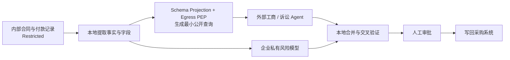
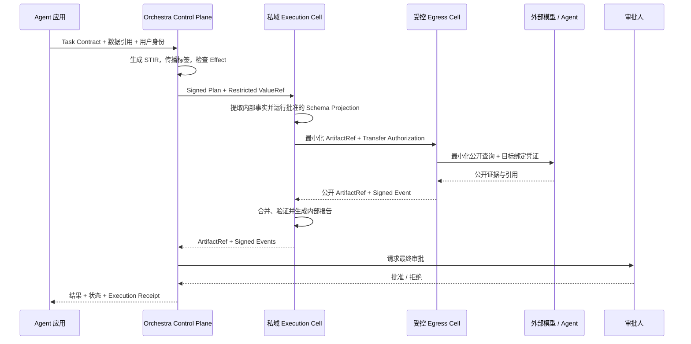
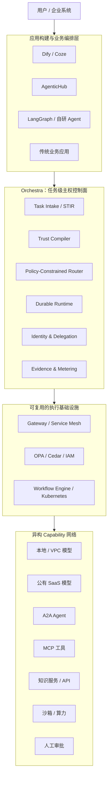
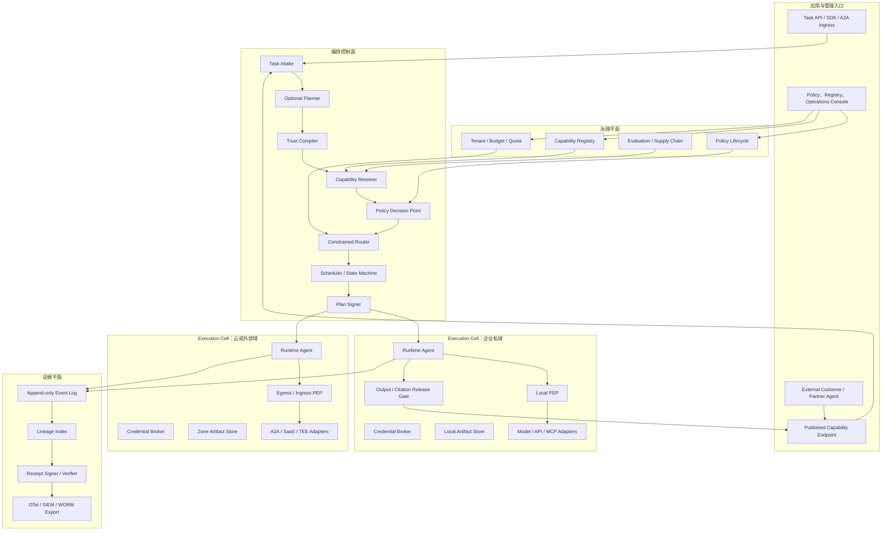
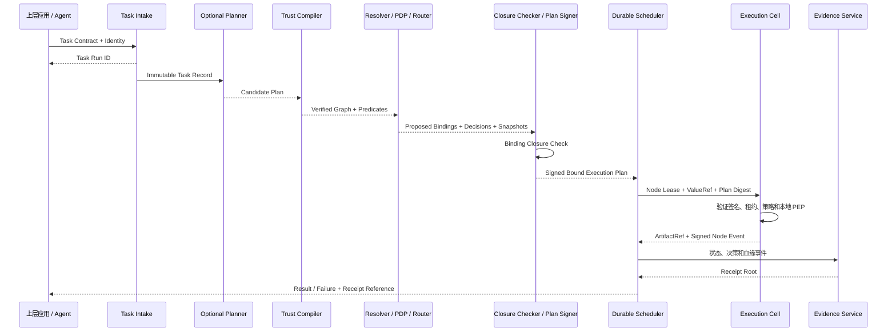
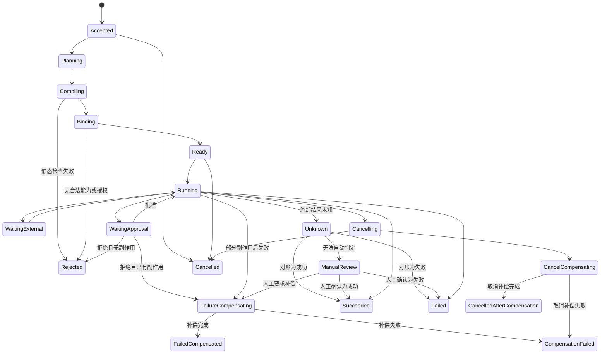
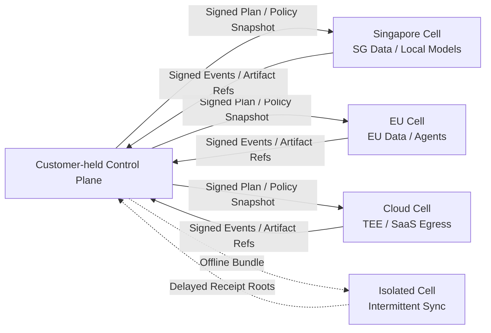
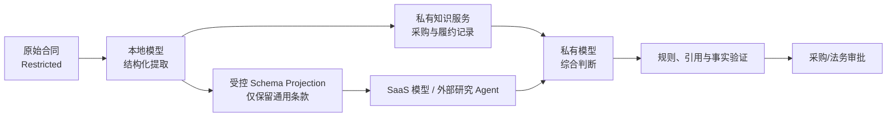
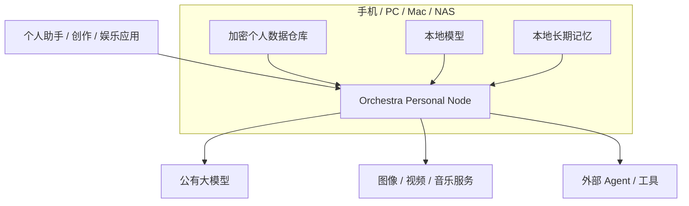

# Orchestra 产品白皮书

## 企业混合智能编排控制面

### Hybrid / Sovereign AI Orchestration Plane

# 执行摘要

## 企业缺少的不是另一个模型入口

过去两年，企业部署生成式 AI 的路径并不一致。互联网、研发和创新团队往往从公有大模型开始，快速验证效果；金融、政务、医疗和大型集团则可能从私有化模型或隔离环境开始，把数据边界放在能力之前。但两条路径有一个共同特征：企业通常在项目或系统层面先做一次“公有还是私有”的选择，随后分别建设模型入口、知识库和 Agent，形成彼此割裂的公有与私有技术栈。这种二选一是当前安全审查、采购和组织分工下的现实做法，却不是复杂业务任务的最终最佳形态。

当这些彼此隔离的 PoC 进入生产，同一个业务任务却不会遵守项目层面的二选一边界。它可能先读取企业数据库中的敏感资料，再调用本地模型提取事实；为了获得更强的推理能力，它还需要使用公有模型；为了完成工作，它又要把结果交给外部搜索 Agent、MCP 工具、代码沙箱或企业 API。最后，某些结果只能由人批准，某些结果可以自动写回业务系统。此时企业需要回答的已经不是“调用哪个模型”，而是：

- 哪些原始数据和派生数据可以离开企业；
- 哪一个 Agent 正在代表哪一个人、以什么权限行动；
- 一个任务被继续委托给外部 Agent 后，权限和责任如何传递；
- 公有能力、本地能力和人工节点应如何分工；
- 中途失败、重复执行或供应商切换时，业务状态如何恢复；
- 任务完成后，企业能否证明谁授权、什么数据去了哪里、实际使用了哪个版本的能力。

今天，这些决定通常散落在应用代码、Prompt、API Gateway、IAM、网络规则、Agent Framework 和人工流程中。每个组件都解决一部分问题，却没有任何一个组件把完整业务任务作为编排、授权和审计对象。其结果不仅是安全团队难以批准，更是企业无法稳定获得混合智能的正向收益：本地小模型能力不足时不会自动升级到适合的大模型，专业 Agent 和工具难以组成可靠任务链，权限容易在多 Agent 之间扩散，成本、时延、失败和结果质量也缺少统一优化与复盘。

Orchestra 要解决的就是这层缺口。

## 一个具体例子

假设企业要建立“供应商尽调 Agent”。输入包含供应商合同、内部付款记录、事故记录和采购负责人的意见；任务还需要查询公开工商信息、诉讼记录与行业数据库，最后生成风险评级并写回采购系统。

如果把所有材料直接交给一个公有模型，效果可能很好，但内部合同、付款金额和人员意见可能越过企业边界。如果完全使用本地模型，数据边界容易管理，却可能缺少最新知识、专业搜索能力和复杂推理质量。如果仅在应用中写一组脱敏规则，系统又无法判断后续 Agent 是否产生新的敏感派生数据，也无法控制外部 Agent 继续调用什么服务。

Orchestra 的处理方式不是在“本地”与“云端”之间做一次选择，而是把任务转化为一张受约束的执行图：



这里真正重要的不是图画得多复杂，而是每条边都有明确含义：数据带有分类和来源，节点声明可接受的数据等级和副作用，外部 Agent 只获得完成公开查询所需的最小信息，写回动作使用一次性的目标绑定凭证，最终审批与产物进入同一份执行证据。若系统找不到符合政策的外部路径，任务应当退回本地、请求人工或失败，而不是让某个模型自行决定绕过限制。

## 产品定义

基于上述问题，本白皮书把 Orchestra 定义为：

> **一个由客户掌控、厂商中立的 Hybrid / Sovereign AI Orchestration Plane。它把业务任务拆解为可执行节点，在本地模型、公有模型、Agent、工具和人工之间进行受政策约束的路由与协作，为每个节点分配独立身份、数据视图和最小权限，并统一协调输入、输出、状态、交互与内部审计；同时支持企业把自己的 Agent、知识和服务受控地提供给客户、合作伙伴或其他 Agent。**

“控制面”在这里不是一个抽象口号。Orchestra 自己不必拥有最强模型，也不负责设计业务应用；它首先负责把任务变成能力图，为不同子任务选择适合的模型、Agent、工具或人工，协调它们之间的输入、输出、消息、Artifact 和运行状态。随后，它为每个执行节点签发目标绑定、用途绑定、短时有效的权限，确保一个 Agent 获得的身份和数据视图不会自动传递给另一个 Agent。最后，它记录选择理由、授权依据、交互过程、成本、时延、版本和副作用，形成企业内部可以复盘的证据。阻断只是找不到合法执行路径时的安全结果，不是产品的核心交互。

因此，Orchestra 的核心可以概括为三个不可分割的能力：**Policy-Constrained Capability Router** 负责“把哪项工作交给谁”；**Interaction Coordinator** 负责“不同模型、Agent 与工具如何交换受控输入输出并完成同一任务”；**Evidence & Audit Plane** 负责“企业内部如何解释、追踪和核验整个过程”。对于企业对外提供的 Agent，它还负责调用者隔离、内部能力投影、输出发布与引用边界。

从产品职责看，它包含六个连续动作：

| 动作 | Orchestra 实际解决的问题 |
|---|---|
| 编译 | 把应用或 Planner 产生的意图转换为类型化任务图 |
| 验证 | 检查数据流、身份、用途、地域、预算和副作用 |
| 路由与授权 | 在合规候选集中选择本地模型、公有模型、Agent、工具或人工，并分配节点级身份、数据视图和最小权限 |
| 协调与执行 | 管理节点间输入输出、消息、Artifact 和状态，处理重试、超时、幂等、补偿和动态子任务 |
| 发布 | 把内部 Capability 投影为面向特定受众的 Published Capability，并控制输出与引用 |
| 证明与审计 | 记录路由理由、委托链、策略与能力版本、输入输出、交互、成本、审批、副作用与产物 |

因此，Orchestra 不是另一个低代码 Agent Builder，也不是把多个模型 API 包装成统一地址的 Gateway。Dify、Coze、AgenticHub 或企业自研应用负责定义用户体验和业务流程；Kong、Service Mesh、IAM 与工作流引擎继续承担网络、身份和持久化等底层职责。Orchestra 位于它们之间，形成双向的任务级智能编排边界：向内协调本地与外部智能，向外受控发布企业智能，并以权限分离和内部审计保证这两类协作可管、可查、可追责。

## 技术判断与安全边界

这个系统不能把安全寄托在一个更聪明的 Planner 或敏感信息分类模型上。Planner 可以私有化部署并加密，但它依然是概率系统：可能误解意图、受到 Prompt Injection，也可能生成结构上合理但不符合企业政策的计划。可靠的权力分离应当是：

```text
Planner 提出计划
→ Trust Compiler 检查结构和信息流
→ Policy Engine 决定是否授权
→ Runtime 在不可绕过的边界内执行
→ Evidence Service 记录强制执行点签发的事件声明
```

学习型 Router 只能在已经通过硬约束的候选集合中优化质量、成本和时延，不能因为“风险分数较低”就解除 Restricted 标签。对于要求零出域的数据，正确实现是不存在通向公有能力的合法路径，而不是期待小模型百分之百识别所有敏感语义。

## 开源与商业结论

Orchestra 位于企业最敏感的控制路径。如果任务中间表示、信息流检查、基本策略执行和 Receipt Schema 全部闭源，企业只能再次把主权交给一个新的供应商。因此，本项目应当把安全执行核心、开放规范、基础 Adapter 与 Benchmark 作为可检查、可自托管的开源基础。

商业化不应依赖 Token 加价，而应来自企业把这套内核运行到生产规模所需的能力：多集群与多地域管理、企业身份和策略生命周期、职责分离、合规证据、HA/DR、SIEM/KMS/数据目录连接器、长期支持与 SLA。Credits 可以作为 Token、Agent Action、Tool Call、计算、存储和人工审批的统一预算层，但底层原始 Meter 必须透明。Salesforce 和 Microsoft 已经分别采用 Action 与复合 Credits 计量 Agent 服务，说明企业 AI 的经济单位正在从单一 Token 向完整任务资源扩展。[I08][I09]

本项目能否成为一个新类别，不能由白皮书自我证明。它必须同时通过三项检验：企业是否确有跨本地与公有环境的生产任务；现有 Gateway 和云套件是否仍无法满足客户自持、跨域信息流与执行证据需求；企业是否愿意为将 Agent 从 PoC 推入生产而付费。后续的开源实现、SovereignBench 和设计伙伴计划，都是为验证而不是掩盖这些问题。

---

# 1. 问题的本质：企业正在运行一个异构智能系统

## 1.1 从“接入模型”到“执行任务”

第一代企业生成式 AI 基础设施围绕模型 Endpoint 建设。平台团队需要统一 API、管理 Key、限制调用频率、记录 Token、屏蔽不同供应商接口差异，并在几个模型之间选择成本或效果更合适的一个。AI Gateway 和 Model Router 正是在这个阶段形成的，它们解决了真实且重要的问题。

Agent 改变的不是接口形式，而是控制对象。一次模型请求通常是短暂、近似无状态的；一项 Agent 任务却可能持续数分钟甚至数天，中途读取不同来源的数据，生成子任务，调用工具，等待人工批准，失败后重试，最终对现实系统产生写入、支付、发布或删除等影响。模型请求的核心问题是“把这段输入发到哪里”，Agent 任务的核心问题则是“一个带状态、会委托、可能产生副作用的计划是否有权这样执行”。

这两类问题不能简单地通过增加几个 Gateway 插件合并。Gateway 能观察经过它的一次请求，但通常不知道该请求位于完整任务的哪一个节点，不知道上游数据经过哪些变换，也不知道下游结果是否会进入支付或发布动作。只有把整项任务及其动态展开过程作为一等对象，系统才能判断一条局部看来合法的调用是否在全局造成非法信息流或越权副作用。

因此，Orchestra 选择 `Task` 而不是 `Request` 作为基本控制单元。模型调用仍然存在，但只是任务图中的一种节点。

## 1.2 企业实际连接的是 Capability 网络

“多模型管理”仍然默认所有资源都具有相似输入输出和相似风险。现实并非如此。企业可调用的智能资源至少包括本地模型、云端模型、A2A Agent、MCP Tool、知识服务、传统 API、代码或浏览器沙箱，以及拥有批准权的人员。它们有不同的协议、运营者、数据保留政策、身份机制、可靠性和副作用。

Orchestra 用 **Capability** 描述一切可被任务委派的执行单元。这个抽象并不是为了把不同资源强行改造成同一种 API，而是为了让控制面能够用统一语言回答几个共同问题：它能完成什么任务，接受什么类型和等级的数据，运行在哪个信任域，需要什么身份，可以产生什么副作用，成本和时延如何，失败是否可重试，结果如何验证。

例如，一个“法律研究 Agent”和一个“付款 API”都可以被任务调用，但二者不能共享同一种信任假设。前者可能接收自然语言、返回不确定结论，并继续委托其他 Agent；后者接受严格 Schema，却会造成不可忽略的资金副作用。Capability Manifest 保留这些差异，使调度器不至于把“接口可调用”误认为“任务可安全委派”。

A2A 和 MCP 的成熟使这类网络更容易形成。A2A 提供 Agent Card、Task、Message、Artifact 和长任务状态，MCP 连接 Agent 与工具、资源和上下文。[S07][S08] Linux Foundation 2026 年披露 A2A 已有超过 150 家支持组织，并进入主要云平台和多个行业场景。[S17] 协议解决了“如何交谈”，却没有自动解决“在某个企业政策下是否允许交谈”。互操作能力越强，统一身份、数据流和委托治理的重要性反而越高。

## 1.3 公有与私有不是二选一

“所有 AI 都上公有云”和“所有 AI 都留在本地”都很难成为大多数企业的最终状态。

这里的“不是二选一”描述的是目标架构，而不是否认企业当前实践。今天，许多企业仍然按项目、部门或数据等级在公有与私有之间做单选：敏感系统全部留在本地，创新应用使用公有模型，两边由不同团队、预算和安全流程管理。Orchestra 的需求正来自这种现实——单选能够建立清晰边界，却会让一个同时需要内部事实和外部智能的任务被迫降低能力、复制数据，或依赖大量人工拼接。

公有模型通常能更快获得前沿能力、弹性算力和专业服务，但企业难以把所有数据、长期记忆和业务权限交给外部供应商。本地模型可以提供数据驻留、确定性成本和更直接的控制，却未必能在每个专业任务上达到最佳质量；企业还要承担模型升级、GPU 利用率、推理优化和运维成本。更重要的是，许多任务天然同时依赖内部事实和外部知识，单纯选择一端会牺牲另一端。

现实中的企业私有化模型还经常受到 GPU 容量、采购预算、许可证、推理时延和运维能力约束，因而采用较小、量化或蒸馏后的模型。这些模型并不必然“能力差”：经过领域微调后，它们可以很好地完成分类、字段提取、固定格式转换和窄领域问答；但在开放任务规划、跨文档长上下文总结、多步推理、复杂工具选择和未知任务泛化上，通常仍可能与前沿公有大模型存在差距。经典 Scaling Law 研究表明，语言模型损失会随模型规模、数据和训练计算增加而呈经验幂律改善；Chinchilla 进一步说明能力不能只看参数量，还取决于参数、训练数据和计算预算是否匹配。[D06][P15]

因此，Orchestra 解决的不是“如何用小模型完全替代大模型”，而是“如何在不把原始企业数据交给公有模型的前提下，仍然调用更强智能”。合理方式不是把整段 Prompt 随机路由到本地或云端，而是对任务按数据依赖和能力要求分层：本地模型或确定性程序读取原始合同，完成敏感字段识别、结构化提取和最小化；公有大模型只接收批准后的 Fact Set，承担更复杂的公开研究、规划或语言综合；结果返回企业后再经过本地验证、政策检查或人工审批。EMNLP 2024 的 AdaSwitch 也以较小本地模型处理较简单步骤、较大云端模型处理复杂推理步骤，提供了这种协作范式的研究证据。[P16]

这并不意味着最终总结必须一律交给私有小模型。如果最终报告需要复杂综合，系统可以选择经过企业评测的更强私有模型、让公有模型只基于已批准且不可回推原文的结构化事实生成草稿，或交由人员完成最终判断。任务节点应依据数据标签和能力评测分别放置，而不是依据“本地可信、云端聪明”的二元标签一次性决定整个任务。

这也解释了为什么“Planner 私有化部署并加密”虽然必要，却不足以构成完整方案。Planner 在企业内运行，可以避免任务意图直接暴露，也可以保护计划和上下文的存储与传输；然而，当计划真正调用公有模型、外部 Agent 或 SaaS 工具时，数据仍会在执行阶段离开边界。加密保护的是静态数据和传输通道，不能替代对接收方、用途、派生数据与后续委托的判断。Planner 还可能出错，因此它只能提出候选计划，不能同时成为授权者。

## 1.4 为什么现有组件各自正确，却仍留下空白

Orchestra 并不是认为现有基础设施失效，而是认为它们观察的是不同局部：

| 现有组件 | 它最擅长控制的对象 | 单独使用时缺少什么 |
|---|---|---|
| AI / Agent Gateway | 请求、连接与协议流量 | 完整任务图、上游数据来源、动态委托和业务补偿 |
| Agent Builder / Framework | 应用逻辑与模型协作 | 跨应用的企业政策、强制出口和统一证据 |
| Workflow Engine | 状态、重试、超时与持久化 | 数据标签、模型风险、Agent 身份和信任域语义 |
| IAM / Policy Engine | 主体对资源的访问授权 | 任务级数据派生、能力选择和长链结果验证 |
| Service Mesh | 工作负载身份与服务通信 | 用户委托、业务目的、自然语言数据与 Agent Effect |
| DLP / 内容分类 | 对输入输出的风险检测 | 无法百分之百理解开放文本，也不负责执行拓扑 |

一个可行的新控制面必须复用这些系统，而不是重新实现它们。Kong、Envoy 或云 Gateway 可以成为网络执行点；OPA 或 Cedar 可以承担确定性授权；SPIFFE 可以提供工作负载身份；Temporal 类引擎可以承担持久化状态。Orchestra 的新增价值是把这些机制绑定到同一张带类型、数据标签和副作用的任务图上，并在动态任务展开时持续重新检查。

所以“Gateway 控制流量，Orchestra 控制任务”不是为了制造概念差异，而是在说明二者的状态范围不同：前者通常围绕单次跨边界通信，后者围绕从用户授权到最终产物的完整执行生命周期。

## 1.5 主权是一种运行时性质

Sovereign AI 经常被缩减为“服务器部署在本国”或“模型权重保存在企业内”。这些条件可能重要，却不足以证明组织保有主权。如果一个本地 Agent 持有可以访问所有 SaaS 的长期 Key，能够把内部数据发送给未知子 Agent，而且完整日志掌握在外部平台手中，那么服务器位于本地也不意味着任务受组织控制。

在 Orchestra 的定义中，主权由一组可检查的控制权共同组成：

- 数据的所有者能够规定原始数据及其派生结果可以流向哪些信任域；
- 身份系统能够区分用户、Agent、工作负载与下游服务，并表达委托链；
- 企业能够制定、签署、回滚和审计实际执行的策略；
- 密钥只在满足身份、环境证明和用途条件时释放；
- 模型、Agent 和云供应商可以替换，任务定义不被单一平台锁死；
- 控制面知道任务运行在哪里、失败后如何恢复，以及由谁承担副作用；
- 组织掌握足以重放和核查的执行记录，而不只是供应商提供的汇总日志。

因此，主权不是采购时给部署方式贴上的标签，而是每一次任务执行都要维持的系统性质。数据从本地派生出摘要、摘要进入云端、云端结果回到本地并触发写入，这条链上任何一个环节失控，主权就不是完整的。

## 1.6 为什么是现在

三个趋势正在同时发生。

第一，AI 使用已经普及，但生产规模化仍不充分。McKinsey 2025 年全球调查显示，88% 的受访组织已在至少一个业务职能中规律使用 AI，而多数组织仍在实验或局部扩展阶段。[I13] 这类调查不能直接证明 Orchestra 的市场规模，却说明企业的主要问题正在从“有没有 AI”转向“如何稳定地进入核心流程”。

第二，企业的供应商依赖正在上升。IBM IBV 与 Oxford Economics 2026 年对 1,000 名全球高管的调查中，只有 9% 自评对自身 AI 依赖有优秀理解，71% 表示若必须更换主要 AI 厂商或模型会很困难。[I14] 这是供应商发起的研究，应谨慎使用；它仍然提供了一个值得设计伙伴访谈验证的信号：企业希望同时使用多种能力，却未必掌握完整依赖关系和退出路径。

第三，基础产品已经验证了 Agent 治理需求。Kong 和 Google 的 Gateway 已支持或治理 LLM、MCP 与 A2A，AWS AgentCore 更进一步覆盖 Runtime、Gateway、Registry、Identity、Policy、Memory、Observability 与 Payments。[I03][I04][I15][I16] 这说明市场并非空白，也说明“统一入口”正在向 Agent 基础设施扩展。

Orchestra 的机会不来自比这些厂商多列几个功能，而来自一个更窄也更难的命题：

> 企业是否需要一个完全由自己持有、能够跨本地、边缘和多云运行，并以任务图级信息流和执行证据为核心的中立控制面？

这仍是假设，不是结论。桌面研究只能证明问题值得验证。真正的证据必须来自跨信任域生产任务、CISO 的上线阻塞原因、付费 Pilot，以及客户是否愿意让该控制面逐步进入强制执行路径。

---

# 2. 产品定义与市场边界

## 2.1 Orchestra 接收什么，又交付什么

从使用者角度看，Orchestra 不是一个让业务人员重新画工作流的界面。它是应用和异构执行资源之间的控制层。上层可以是 Dify、Coze、AgenticHub、LangGraph、自研 Agent，也可以是传统 Java、Python 或业务流程系统；下层可以是本地模型、公有模型、A2A Agent、MCP Server、企业 API、知识服务、沙箱或人工队列。

上层提交给 Orchestra 的不应只是一段 Prompt，而是一份 **Task Contract**。它至少说明任务目标、输入数据引用、发起身份、允许用途、期望输出、时限、预算和可接受的副作用。应用不需要事先指定每个节点必须调用哪一个供应商，但可以提出不可违反的业务约束。

Orchestra 同时从企业环境读取四类上下文：

| 输入 | 内容 |
|---|---|
| 任务上下文 | 目标、数据引用、输出 Schema、预算、SLA、失败语义 |
| 身份上下文 | 发起人、代表其行动的 Agent、组织角色与委托边界 |
| 主权上下文 | 数据分类、用途、地域、保留、供应商和副作用政策 |
| 能力上下文 | 当前可用的模型、Agent、工具、API、人工及其信任与运行状态 |

经过编译和执行后，Orchestra 交付的不只是模型文本，而是三个彼此关联的对象：

1. **受批准的执行图**：哪些节点获准执行，分别放置在哪里，使用什么数据视图和权限；
2. **任务结果与状态**：结构化产物、失败原因、重试和补偿结果；
3. **Execution Receipt**：授权、委托、策略、能力版本、数据流动、资源消耗、审批和产物哈希。

这三个对象共同定义了产品。只有结果，没有执行约束，Orchestra 会退化成 Agent Framework；只有策略，没有持久化执行，它会退化成 Policy Proxy；只有日志，没有事前约束，它会退化成 Observability 产品。

## 2.2 一项任务在系统中如何运行

下面以“合同与供应商审查”为例说明产品行为。法务应用向 Orchestra 提交任务，请求结合内部合同、历史争议和公开司法信息生成供应商风险报告。用户具备 `contract.review` 权限，但不具备自动发布或付款权限；合同被标记为 `Restricted`，公开检索可以使用经过批准的公司标识和案件编号。



第一步，Task Intake 验证调用者身份和 Task Contract 的基本结构。输入数据不会立刻拼入 Prompt，而是先作为带来源、所有者和分类的引用进入任务上下文。

第二步，Planner 可以根据目标提出候选步骤，但其输出只是计划草案。Trust Compiler 把草案转换成 Sovereign Task IR，检查输入输出类型、标签传播、调用目的、地域限制、委托深度和 Effect。如果计划包含“把合同全文交给外部研究 Agent”，编译器应给出明确反例路径，而不是把风险交给 Router 打分。

第三步，Policy-Constrained Router 对每个节点建立可行能力集合。它先排除不能接收当前数据等级、地域不符、身份不可验证或副作用过大的 Capability，再在剩余集合中比较质量、成本、时延、可靠性和历史表现。安全约束决定“可不可以”，学习算法只决定“在允许范围内选哪一个”。

第四步，Identity Broker 为每个执行节点签发独立、短期、面向目标资源的凭证。外部 Agent 不能获得用户的原始 Token，子 Agent 的权限不能超过父任务。若 Agent 在运行中生成新的子任务或请求新的工具，新增子图必须重新进入编译与授权流程。

第五步，Durable Runtime 维护任务状态。对只读查询可以安全重试，对发送邮件、写回采购系统等动作则需要幂等键、审批或补偿语义。外部模型不可用时，系统可以切换到其他合规能力、等待恢复或退回人工，但不能为了可用性绕过数据策略。

最后，Evidence Plane 把全过程形成可验证 Receipt。审计人员应能回答：任务由谁发起，哪个 Agent 代表其行动，哪一个策略版本允许了外部调用，Egress PEP 声明发送了哪些字段、目标是谁并收到何种传输确认，使用了什么模型或 Agent 版本，谁批准了最终写入，以及记录中的产物摘要是否保持一致。对于黑盒外部服务，Receipt 不声称证明其内部实际处理过程。

这就是 Orchestra 的最小完整闭环：

```text
任务进入
→ 形成可检查的计划
→ 只在安全可行域内选择能力
→ 用最小权限可靠执行
→ 交付结果和证据
```

## 2.3 在技术栈中的位置



图中的层次关系很重要。Orchestra 不要求应用放弃原有 Agent 编排，也不要求企业替换 Gateway、IAM 或 Kubernetes。它通过 Adapter 把现有基础设施变成策略执行点和运行资源，同时把原来只存在于单个应用内部的任务意图提升为跨环境可检查的控制对象。

## 2.4 一个产品，两种部署侧重

Orchestra 应保持一个开源内核，而不是拆成企业网关、隐私路由器、Agent Runtime、个人助手等多个产品。统一内核包含 STIR、Capability Manifest、Trust Compiler、Router、Runtime、Identity 与 Receipt；差异由 Deployment Profile 表达。

**Enterprise Profile** 面向组织主权，重点是多租户、多集群、企业身份、数据目录、策略审批、职责分离、WORM/SIEM、HA/DR 和合规证据。控制面的所有关键组件可以部署在企业数据中心、私有云或隔离网络中。

**Personal Profile** 面向个人或家庭主权，使用同一套任务和数据流模型，但将企业角色、KMS 和审批流程替换为设备身份、Secure Enclave/TPM、本地加密仓库、发送预览和生物识别确认。个人设备负责读取私人记忆并生成最小云端上下文，云端负责本地无法高质量完成的推理或创作。

这两个 Profile 的共同命题是：任务可以使用外部智能，但原始数据、长期记忆、授权规则和完整证据由主权主体掌握。企业是首要付费市场，个人节点则更适合作为开发者采用和生态扩散入口。

## 2.5 与应用平台及 OpenCSG 的关系

Dify 官方将自身定义为开源 LLM 应用开发平台，覆盖 Workflow、RAG、Agent、模型、工具和 LLMOps；Coze Studio 也提供 Prompt、RAG、插件、Workflow 以及 Agent/App 的构建和发布能力。[I01][I02] AgenticHub 在本白皮书的假设中承担 Agent 的开发、发布和运营。这些产品回答的是“业务要构建什么应用、用户如何交互、Agent 采用什么业务流程”。

Orchestra 不取代它们。它接收应用提交的 Task Contract 或已有 Workflow 节点，在实际执行时施加跨环境约束。一个 Dify Workflow 可以继续由 Dify 设计，但其中读取内部合同的节点被放在企业私域，公开研究节点被委托给外部 Agent，写回节点需要企业身份和审批，整项任务获得统一 Receipt。

集成必须显式选择执行所有权，不能让两个编排器同时重试同一副作用：`delegate-task` 表示上层平台把完整任务交给 Orchestra，Orchestra 是状态、重试、取消和副作用的权威；`delegate-node` 表示上层平台只委托一个节点，该节点内部由 Orchestra 编排，上层只能按同一幂等键查询或取消；`observe-only` 只导入 Trace 和计划做分析，不接管执行。每个 Task 或 Node Contract 必须记录 `executionOwner`、`idempotencyOwner`、`retryOwner`、取消传播规则和最终状态权威。

与 CSGHub、AgenticHub 的理想分工可以表述为：

```text
CSGHub：模型、Agent、数据集等智能资产的存储、版本与分发
AgenticHub：Agent 应用的构建、发布与运营
Orchestra：这些应用和资产在主权约束下的实际执行
```

这是一种增强集成，不是产品依赖。没有 CSGHub 或 AgenticHub 时，Orchestra 仍可从 YAML、Git、Kubernetes、云 Registry、A2A Agent Card、MCP Schema 或企业 CMDB 注册 Capability。反过来，OpenCSG 产品也不需要为了接入 Orchestra 改写为专有协议，可以通过 OpenAI-Compatible API、Task API、A2A、MCP 和 OpenTelemetry 集成。

## 2.6 与相邻基础设施的边界

| 类别 | 主要控制对象 | Orchestra 如何配合 |
|---|---|---|
| Dify / Coze / AgenticHub | 应用、Prompt、RAG 与业务 Workflow | 接收任务及约束，不重做应用开发 |
| AI / Agent Gateway | LLM、MCP、A2A 和 HTTP 流量 | 将其用作连接、鉴权、限流和 Egress PEP |
| LangGraph 等 Agent Framework | 单个应用内部的状态与推理 | 治理跨框架、跨应用和跨信任域执行 |
| Temporal 等 Workflow Engine | 通用持久化工作流 | 复用重试和状态机，增加 AI 类型、信息流和委托语义 |
| IAM / OPA / Cedar | 身份和资源授权 | 生成并执行节点级最小权限决策 |
| Service Mesh | 工作负载身份与网络通信 | 实施不可绕过的服务间控制 |
| Model / Agent Hub | 资产存储、版本和分发 | 同步 Capability、供应链与评测信息 |

Orchestra 不因调用这些组件而失去独立性。它的核心资产不是自研一个网络代理或工作流数据库，而是开放的任务语义、策略编译、跨节点信息流、受约束放置和执行证据。

这也约束 P0 的工程取舍：P0 复用 OPA、PostgreSQL、OpenTelemetry、既有 Egress Proxy 和 Docker Compose；它不重做 Gateway、IAM、通用 Workflow Engine、Kubernetes 控制面或透明日志。只有当 Router、Coordinator、节点权限和审计时间线已经被真实用户证明有价值时，后续开源控制面 Beta 才把这些外部依赖包裹为更强的执行保证与企业集成。

## 2.7 竞争格局：最接近的产品已经很强

截至 2026 年，Agent 基础设施已进入强竞争阶段。Amazon Bedrock AgentCore 覆盖 Runtime、Gateway、Registry、Identity、Policy、Memory、Observability 与 Payments，支持 MCP、A2A、外部模型以及注册部署在本地或其他云的资源；其 Policy 使用 Cedar，并能从自然语言生成候选策略后检查过宽、过窄和不可达条件。[I15][I16] 这意味着 Orchestra 不能再以“云厂商只做 API 转发”作为成立前提。

| 产品 | 当前主要抽象 | 强项 | Orchestra 仍需证明的差异 |
|---|---|---|---|
| Kong AI Gateway | 协议感知的连接与治理 | LLM/MCP/A2A、鉴权、限流、审计和数据治理 | 完整任务图、动态子图、跨节点信息流和持久状态 |
| Google Agent Gateway | Google 托管的 Agent 治理 | Registry、IAM Policy、语义治理、区域化策略 | 客户完全自持、跨云中立和离线控制面 |
| AWS AgentCore | 完整 Agent 生产平台 | Runtime、Registry、Identity、Cedar Policy、Observability、Payments | 不以 AWS 为控制中心的任务图级主权执行 |
| Microsoft Foundry / Copilot Studio | Agent 构建与 Azure 托管运行 | 多 Agent、企业身份、工具目录和 Azure 生态 | 跨平台客户自持和开放 STIR/Receipt |
| Orchestra | 主权任务编译与执行 | 客户自持、跨域信息流、能力放置、执行证据 | 必须以实现、Benchmark 和生产部署验证 |

真实差异应收敛到五点：客户可以持有完整控制面；控制对象是带类型、标签、身份和 Effect 的任务图；动态新增子图必须重新编译；节点可以跨本地、边缘、TEE 与多云放置；最终形成端到端的委托和执行证据。

“双向”本身也不是独家功能。AWS AgentCore 已同时强调入站和出站身份，A2A 平台也支持企业运行可被外部调用的 Server。[I15][I20] Orchestra 需要证明的差异，是客户自持环境中的双向信息流：不仅验证外部 Caller，还要约束其能够触发的内部 Data View 与 Tool Profile，并对返回正文、Artifact 和 Citation 做任务级发布检查。

这些差异不是自动成立的。AWS 官方文档同样强调，如果调用方可以绕过 Gateway 直接访问 Runtime，Gateway 的 Policy、Guardrail 和 Interceptor 就不会生效。[I17] 这说明“不可绕过的执行拓扑”是所有产品共同面对的硬工程问题。Orchestra 只有真正控制出口、身份签发和任务状态，才有资格作出强保证；如果它只是旁路观察和给出建议，就应明确称为治理辅助模式。

## 2.8 明确不进入的产品领域

产品边界必须通过实际取舍维持。Orchestra 不建设通用低代码 Agent 画布、Prompt Studio、聊天前端、通用知识库编辑器、面向消费者的 Agent 商店，也不重新发明与主权编排无关的业务 Workflow Builder。

这些功能并非没有价值，而是已经由成熟平台承担。把它们纳入 Orchestra 会迫使团队同时竞争应用体验、模型生态和基础设施，最终稀释最需要建立的任务图、安全与证据能力。一个判断新功能是否属于 Orchestra 的简单标准是：

> 如果去掉数据标签、信任域、身份委托和执行证据后，该功能仍然完整成立，那么它大概率不应进入 Orchestra Core。

同样需要说明什么情况下企业不需要 Orchestra。如果任务只处理公开数据、使用单一模型、没有长任务和外部副作用，普通 AI Gateway 加应用日志通常已经足够。如果企业愿意把所有 Agent、数据和运行时完全放在同一个云套件中，也不需要为了“厂商中立”额外引入控制面。Orchestra 只对跨信任域、跨能力、需要强制治理和执行证据的任务产生足够价值。

## 2.9 用户实际安装和使用的是什么

开源项目不能只交付一套概念。一个最小但完整的 Orchestra 发行版应当由六类可运行组件组成：

| 交付物 | 主要用户 | 实际用途 |
|---|---|---|
| Control Plane Service | 平台工程团队 | 接收 Task Contract，编译、调度并维护任务状态 |
| Policy & Trust Console | 安全、数据与合规团队 | 管理 Trust Zone、数据规则、Schema Projection、审批和例外 |
| Capability Registry | AI 平台与应用团队 | 注册模型、Agent、MCP、API、沙箱和人工队列 |
| SDK / Task API / CLI | 应用开发者 | 从 Dify、AgenticHub、自研应用或 CI/CD 提交和查询任务 |
| Evidence Explorer | 运维、审计与财务团队 | 查看任务图、决策原因、成本、失败、Receipt 和数据血缘 |
| Decision Experience / Demo Console | 开发者、业务用户、审批人与审计人员 | 展示任务拆解、能力路由、选择理由、节点权限、输入输出、交互时间线、成本与审计证据；Deny 是正常可审计的政策终态，但不是主展示流程 |

典型落地过程不要求企业一次性重构所有 Agent。平台团队先部署 Control Plane 和 Egress Adapter，把已有模型与工具注册为 Capability；安全团队把现有 Data Catalog、IAM 和网络政策映射到 Orchestra；应用团队只需把高价值 Workflow 的跨域节点改为提交 Task Contract。初期可以运行在 Observe 或 Recommend 模式，确认系统对数据流和调用关系的理解正确，再逐步对低风险和高风险路径实施强制控制。

### 插座式接入：适配系统，不要求系统重写

Orchestra 的集成原则是“**标准协议优先、配置优先、Adapter 兜底**”。它不要求 Dify、AgenticHub、自研 Agent、模型服务或业务系统重写核心逻辑，也不要求它们采用 Orchestra 专有协议：上层通过 Task API、SDK、Task Tool 或现有 API 配置提交任务；下层继续使用 OpenAI-compatible、A2A、MCP、HTTP/gRPC、Webhook、OIDC/OAuth 和 OpenTelemetry 等已有接口。对不符合标准的私有系统，由 Orchestra 编写一次性 Adapter，而不是要求对方重构。

“低侵入”不等于“无接入条件”。要获得强制的授权、数据边界和副作用保证，相关任务入口、模型/Agent 出口或业务副作用出口必须经过 Orchestra 的 Task API、Adapter 或 Egress PEP；系统仍可保留自己的业务状态、Workflow 和用户体验。若某个黑盒系统只能被旁路观察或可绕过 Orchestra，产品只能声明观察和审计能力，不能声明已强制执行数据与权限政策。

因此，目标产品的完整性验收不能只是“统一调用多个模型”。完整闭环最终应覆盖：把同一任务拆给本地小模型、公有大模型、外部研究 Agent、内部工具或人工；按照质量、成本、时延和政策选择能力；为每个节点分配独立身份、数据视图和权限；协调结构化输入输出、消息和 Artifact；动态工具调用重新授权；任务失败后恢复；内部审计可以重建路由理由与完整交互过程；最终 Receipt 能离线验证。若某个节点不存在合法能力或授权路径，系统进入可审计的 `Denied` 政策终态；任何降级、转人工或改用其他能力都必须生成新候选计划并重新经过 Compiler、Resolver/PDP、Binding Closure 与 Plan Signing，不能在原拒绝决定上放宽约束。

产品不应先用完整安全基础设施证明自己“架构完备”，而应先在 **P0** 证明上述协同编排本身为用户创造价值。P0 只实现固定场景、有限节点和基础签名事件；随后在 M0—M4 的开源控制面 Beta 中补齐 Compiler、Binding Closure、可恢复 Runtime、强制 Egress 与可验证证据。两阶段的边界和不可承诺项见第 5.8 节。

## 2.10 双向主权：消费外部智能与发布企业智能

企业不仅是 Agent 的购买者，也会成为 Agent Provider。银行可能向企业客户提供融资咨询 Agent，制造商可能向供应商开放质量与交付 Agent，软件公司可能提供技术支持 Agent，专业服务机构则可能把行业知识和流程封装成付费 Agent。

Orchestra 的两条路径共享同一个 Task、Identity、Policy、Runtime 和 Evidence 内核，但风险方向不同：

| 路径 | 主要问题 | 核心控制 |
|---|---|---|
| 企业调用外部能力 | 内部数据是否被发送给不合适的外部主体 | 数据最小化、目标绑定身份、Egress Policy、外部 Capability 约束 |
| 外部主体调用企业 Agent | 外部输入是否诱导 Agent 越权读取，以及输出是否泄露内部信息 | Caller Policy、隔离执行、内部 Data View、Output/Citation Release Policy |

企业对外发布的不是内部 Agent 本体，而是一个受控投影 `Published Capability`。它可以面向不同受众：完全公开、签约合作伙伴、指定客户租户或受监管联盟。不同投影可以使用同一个内部 Agent，却拥有不同的输入 Schema、数据视图、速率、价格、输出字段、引用规则和 SLA。

```mermaid
flowchart LR
    EXT["外部客户 / Partner Agent"] --> DISC["Signed Agent Card / Discovery"]
    DISC --> INGRESS["Ingress Identity、Rate、Purpose Policy"]
    INGRESS --> QUAR["Input Quarantine / Schema Validation"]
    QUAR --> TASK["Task Contract + Trust Compiler"]
    TASK --> VIEW["Approved Enterprise Data View"]
    VIEW --> AGENT["Internal Agent / Model / Tools"]
    AGENT --> RELEASE["Output + Citation Release Gate"]
    RELEASE --> RESP["Signed Artifact / External Receipt"]
```



这一能力可以称为 **Sovereign Agent Publishing**。它不是 Agent 市场，也不负责替企业设计对外服务；它负责把已经存在的内部 Agent 转换为可发现、可授权、可计量、可撤销和可审计的外部服务。

双向是同一技术内核的两种边界方向，不意味着企业必须在同一销售和上线阶段同时采用。更现实的 Land-and-Expand 路径是：先选择一条需要本地模型、公有能力与 Agent 协作的高价值任务，证明任务质量、成本、时延、可靠性和审计收益，再扩展到更多 Workflow 或企业 Agent 对外发布；若这条任务同时被安全审查阻塞，购买紧迫性会更强。产品保持一个，使用路径和购买触发可以不同。

## 2.11 直观展示编排、权限分离与内部审计

架构复杂不应转嫁给普通用户。普通用户不需要理解 Capability、A2A、MCP、PEP、Node Grant 或任务图；他们只表达目标、选择资料处理范围、查看可理解的执行摘要，并在需要时审批。Demo 和日常界面的主角不是“系统阻断了什么”，而是“系统怎样把任务交给最合适的能力，并让这些能力在受控边界内完成协作”。只有不存在合法路径或涉及高风险 Effect 时，界面才进入拒绝、修复或人工审批分支。

普通用户的稳定心智模型只有四个对象：**任务、资料范围、审批、结果**。推荐的默认交互是：输入“我要完成什么”；选择“仅公司内部 / 可安全使用外部能力 / 每次外发确认”之一；查看“哪些资料留在内部、是否需要外部能力、何时需要确认”的计划摘要；获得结果和可选的“为什么这样处理”说明。系统不得要求普通用户自行选择模型、Agent、协议、凭证、数据标签或路由策略。

同一 Task Run 按角色呈现不同信息，而不是创建不同的安全语义：

| 角色 | 默认看到 | 默认不看到 |
|---|---|---|
| 普通业务用户 | 任务目标、资料处理模式、执行进度、审批点、结果和简短解释 | 任务图、Capability、协议、凭证、策略表达式和敏感审计字段 |
| 业务管理员 | 任务模板、可选资料处理模式、审批规则和业务结果 | 密钥、原始 Token、跨租户细节 |
| 平台/安全/审计人员 | Route、Permission、Interaction、Audit 与 Receipt 详情 | 未经权限的敏感 Payload |

产品需要提供统一的 **Decision Experience**：

| 体验对象 | 用户需要看到什么 |
|---|---|
| Route Preview | 任务图、候选能力、最终选择，以及质量、成本、时延、可靠性和政策理由 |
| Permission View | 每个节点的 Subject、Actor、Data View、Scope、Purpose、Effect 和凭证有效期 |
| Interaction Timeline | 模型、Agent、工具和人工之间的消息、ValueRef、Artifact、回调与状态变化；默认不暴露敏感明文 |
| Runtime View | 节点进度、重试、Fallback、等待、成本、时延和最终产物血缘 |
| Audit View | Planner 版本、计划摘要、路由决策、授权、能力版本、输入输出摘要、副作用和 Receipt |
| Exception View | 无合法路径时的原因、反例、降级方案、人工审批或明确失败 |

这些能力首先应是稳定 API 和结构化 Schema，再由 CLI、Web Console、Dify Plugin 或 AgenticHub Adapter 呈现。同一个决策不应在不同入口产生不同安全语义。

P0 必须包含一个真实后端驱动的可视化 Demo，而不是静态架构图。标准演示使用合成合同、公开合同或数据所有者明确批准的评测集完成“供应商合同与外部风险评审”；不得为了演示全公有基线而把真实 Restricted 合同发送给外部模型。

```text
1. 本地小模型读取合同并提取敏感条款与结构化 Fact Set
2. 公有大模型仅基于批准的 Fact Set 完成复杂规划、比较和总结
3. 外部研究 Agent 查询公开供应商、市场和风险信息
4. 内部校验 Agent 对合同事实、外部引用和结论进行交叉核验
5. 人工审批节点决定是否写入 Mock Procurement Sink
```

每个节点使用独立 Node Grant、最小数据视图和目标绑定的开发凭证，前一个 Agent 的权限不会随上下文自动传给后一个 Agent。界面用颜色和图标区分本地模型、公有模型、Agent、工具和人工；边展示输入输出 Schema、Artifact、数据标签和授权摘要；侧栏展示选择理由、成本、时延与交互时间线。Demo 应支持全本地、全公有基线与受控混合方案的质量、成本、时延和数据暴露面对比，但默认演示受控混合编排。

P0 中必须真实实现固定 Task Template、Capability Manifest、OPA Policy、Eligible Set、确定性 Router、Node Grant、最小 Coordinator、PostgreSQL Event Store、Adapter、Audit Timeline 和基础签名 Receipt；完整 Trust Compiler、Binding Closure、Durable Runtime、Credential Broker、Schema Projection + Egress PEP 和 Merkle Evidence 属于后续 Milestone。P0 的“权限分离”表示 Orchestra Adapter 和 Coordinator 按 Node Grant 限制可见输入和允许动作，不得表述为已经获得生产级密码学或网络强制保证。确定性字段投影只能通过版本化 Schema 生成新 Artifact，不承担自由文本语义零泄漏。拒绝路径保留为回归用例，但不是主展示流程。

Dify 和 AgenticHub 用户不应被迫迁移到新的 Workflow Builder。P0 先用 Dify Task Tool 验证通用应用平台接入，M4 再完成 AgenticHub MCP/API Adapter 和两种入口的一致性测试。普通用户在原平台只看到任务进度、资料处理摘要（内部 / 受控外部 / 等待确认）、审批或异常卡片和结果；所选模型、Agent、节点权限与交互时间线属于可选高级详情。平台、安全和审计人员可以通过深链接进入同一 Task Run，查看完整任务图、节点权限、交互时间线、成本和 Receipt。完整管理控制台可以后置，但这种嵌入式、角色分层的 Decision Experience 是产品可用性和首轮销售演示的一部分。

---

# 3. 产品架构与核心域模型

## 3.1 五个不可混淆的领域对象

Orchestra 的产品架构首先要分开“业务意图、候选计划、验证结果、执行授权和运行事实”。如果同一个 LLM 输出或同一份任务 JSON 同时承担这五种语义，系统就无法回答某个决定是谁作出的、何时获得授权，也无法安全处理运行时新增的 Agent 和工具调用。

完整对象链应当是：

```text
Task Contract
    ↓ Planner（可选、不可信）
Candidate Plan
    ↓ Trust Compiler
Verified Task Graph
    ↓ Policy Decision + Capability Binding
Binding Closure Check
    ↓ Plan Signer
Bound Execution Plan
    ↓ Durable Runtime
Task Run + Execution Receipt
```

| 对象 | 创建者 | 是否具有授权效力 | 是否允许修改 |
|---|---|---:|---|
| Task Contract | 上层应用与发起人 | 只表达请求范围 | 提交前可修改，受理后不可变 |
| Candidate Plan | Planner、模板或应用 Workflow | 否 | 可反复生成和比较 |
| Verified Task Graph | Trust Compiler | 证明结构检查通过，不等于最终授权 | 内容不可变；变更需重新编译 |
| Bound Execution Plan | Resolver / PDP / Router 提议绑定，Closure Checker 验证，Plan Signer 签发 | 在租约和策略范围内有效 | 不可直接修改；需重新绑定和重新闭包检查 |
| Task Run | Durable Runtime | 只能消费已有授权 | 只允许合法状态迁移 |

Planner 因而可以被替换、私有化或加密，但不会因此获得策略修改权、身份签发权和网络出口控制权。

## 3.2 Task Contract：业务与控制面的稳定边界

Task Contract 不应只是一段 Prompt。它表达任务目标、调用主体、输入数据引用、输出类型、预算、时限、用途与允许的副作用。原始数据默认不直接嵌入 Contract，而使用受权限保护的 ValueRef，避免控制面元数据本身成为新的敏感数据副本。

```yaml
kind: TaskContract
metadata:
  taskId: vendor-review-2026-001
  tenantId: acme-sg
  idempotencyKey: procurement-8842

subject:
  principal: user:alice
  actor: agent:procurement-assistant
  purpose: vendor-renewal

inputs:
  - name: contract
    valueRef: vault://legal/contracts/8842
    schema: ContractPDF
    declaredClassification: restricted

requestedOutcome:
  schema: VendorRiskReport/v2
  effects: [read, recommend]

constraints:
  deadline: 2026-07-21T12:00:00+08:00
  budgetCredits: 100
  residency: [sg]
  externalProcessing: controlled
  humanApprovalBefore: [publish, write]
```

调用方声明的密级不是最终事实。数据目录、存储位置、字段策略和 DLP 可以把标签提高；任何自动检测器都不能在未经批准的情况下把 Restricted 降为 Public。

## 3.3 Candidate Plan 与 Sovereign Task IR

Candidate Plan 可以来自 LLM Planner、固定模板、Dify Workflow 或传统业务应用。Trust Compiler 将其规范化为 Sovereign Task IR（STIR）。STIR 是可检查的逻辑计划语言，不是保存 Agent 思考过程的 Trace，也不应记录不必要的 Chain-of-Thought。

STIR 至少包含以下类型：

```text
TaskGraph      = Nodes + Edges + GraphConstraints
Node           = Operation + Inputs + Outputs + Effects + Requirements
ValueRef       = Type + SecurityLabel + OriginSet + Integrity + StorageRef
Requirement    = Skill + Trust + Region + Assurance + SLA
Effect         = Read | Write | Delete | Publish | Pay | Delegate | Execute
ControlNode    = Branch | Join | Retry | Approval | Compensate | Verify
```

一个值不只有密级，还具有来源、用途、租户、地域、保留和完整性；所有对象应引用第 6.3 节定义的统一 SecurityLabel Schema：

```text
Value<Type, SecurityLabel, OriginSet, Integrity, StorageRef>
```

这使系统能够区分“来自企业 ERP 的机密付款记录”和“来自未知网页的公开文本”。前者机密性高但完整性可能高，后者不机密却可能含有 Prompt Injection。信息流与内容可信度必须分别建模。

## 3.4 Verified Task Graph 与 Bound Execution Plan

Trust Compiler 对 STIR 完成类型、数据流、Effect、委托深度、预算上限和基本状态机检查。通过后生成不可变的 Verified Task Graph，其中包含：

- STIR Digest、Compiler 版本和 Schema 版本；
- 推导后的值标签、来源集合与 Source-to-Sink 路径；
- 每个节点必须满足的 Capability Predicate；
- 必经的审批、验证和补偿节点；
- 未通过时可供审计的反例路径。

Verified Task Graph 仍未指定某一家模型或 Agent。Capability Resolver 先求出满足硬约束的候选集，Policy Engine 对主体、资源、用途和 Effect 做授权，Router 再在候选集中优化。最终生成 Bound Execution Plan，记录：

```text
Logical Node
→ Capability ID + Version + Manifest Digest
→ Trust Zone + Region + Network Path
→ Policy Decision ID + Policy Bundle Digest
→ Node Authority Template: Subject + Actor + Authorized Party + Resource + Data View + Action + Effect + Purpose + Audience + Scope + Region/Residency + NotBefore/Expiry
→ tenantId + taskRunId + nodeId + planDigest + graphEpoch + authorityEpoch
→ Timeout + Retry + Idempotency + Compensation
→ Evidence Requirements + Plan Lease
```

具体资源绑定完成后，系统必须执行 **Binding Closure Check**。它以 Verified Graph、Capability Manifest Snapshot、Policy Bundle、Data Label Epoch、Trust Zone、Credential Scope、Attestation 和实际网络路径为输入，验证图级 Obligation 已被具体绑定满足。只有闭包检查通过的计划才能由 Plan Signer 签名；Router 的输出本身不具有授权效力。

Execution Plan 必须有过期时间，并绑定 Registry Snapshot Digest、Policy Bundle Digest、Label Epoch 和必要的 Attestation Freshness。策略、数据标签、Capability 版本、健康状态或 Attestation 发生关键变化时，尚未执行的节点必须重新绑定或重新授权，不能继续消费旧计划的无限期授权。

## 3.5 Capability Manifest：声明与证据分离

Orchestra 不重新发明 A2A Agent Card、MCP Tool Schema 或模型 API，而是在内部规范化为 Capability Manifest。

```yaml
kind: Capability
metadata:
  id: finance.vendor-risk-agent
  version: "1.4.2"
  digest: sha256:...

interface:
  protocol: a2a
  endpointRef: secret://endpoints/vendor-risk
  inputSchema: VendorReview/v2
  outputSchema: RiskReport/v1

declared:
  operator: finance-department
  skills: [vendor-risk-analysis]
  retention: none
  trainingUse: prohibited
  allowedRegions: [sg]

enforced:
  trustDomain: spiffe://acme.internal
  trustZone: enterprise-private
  networkPath: egress-pep-sg-1
  authProfile: oauth-token-exchange
  maximumClassification: confidential
  allowedEffects: [read, recommend]

observed:
  p95LatencyMs: 4200
  successRate30d: 0.987
  lastEvaluatedAt: 2026-07-20T08:00:00Z

assurance:
  artifactSignature: verified
  attestationProfile: nvidia-cc-v1
  evaluationReport: eval://vendor-risk-2026q2
```

`declared` 只是供应方声明，不能直接成为安全事实；`enforced` 是 Orchestra 与企业基础设施可以实际强制的属性；`observed` 来自运行历史；`assurance` 来自签名、评测或远程证明。Router 在安全判断中必须优先使用可强制和可验证的字段，而不是依赖 Agent Card 的自我描述。

## 3.6 Trust Domain 与 Trust Zone

Trust Domain 表示身份和管理边界，Trust Zone 表示执行环境提供的安全属性。二者不能混成一个从 Z0 到 Z6 的简单全局排名。同一个企业 SPIFFE Trust Domain 中可以同时有核心区、普通 VPC 和 TEE；两个组织也可以在不同 Trust Domain 之间建立有限 Federation。

Zone 应由可检查属性组成：

```text
Zone = {
  operator,
  networkIsolation,
  region,
  hardwareIsolation,
  attestation,
  keyCustody,
  retentionControl,
  auditControl
}
```

Z0—Z6 可以作为企业配置模板，但实际策略必须检查具体属性。否则，同一个签约 SaaS 可能在数据保留方面合格，却在密钥托管或地域方面不合格，单一等级会掩盖差异。

## 3.7 Task Run、Artifact 与 Execution Receipt

Task Run 是 Execution Plan 的一次实例化。每个 Node Run 只保存必要状态和 Artifact 引用，不把全部敏感 Payload 集中复制到控制面数据库。Artifact 应保存在其原信任域，控制面只记录 Digest、Schema、Label、Origin 和 StorageRef。

任务完成后，Orchestra 生成结构化执行凭证：

```yaml
kind: ExecutionReceipt
taskRunId: run-20260721-001
subject:
  principal: user:alice
  actorChain: [procurement-agent, public-research-agent]

plan:
  verifiedGraphDigest: sha256:...
  executionPlanDigest: sha256:...
  compilerVersion: 0.3.0

decisions:
  - decisionId: pdp-88231
    policyBundleDigest: sha256:...
    result: allow

transitions:
  - inputDigest: sha256:...
    fromLabel: restricted
    toLabel: public
    declassifierDigest: sha256:...

execution:
  capabilityDigests: [sha256:..., sha256:...]
  attestationEvidenceDigests: [sha256:...]
  approvalDigests: [sha256:...]

nodeExecutions:
  - nodeId: public-risk-research
    nodeRunId: nr-0042
    subject: user:alice
    actor: agent:public-research
    capabilityDigest: sha256:...
    decisionId: pdp-88231
    credentialDigest: sha256:...
    dataViewDigest: sha256:...
    action: a2a.task.send
    effect: read_public_sources
    purpose: supplier-risk-review
    audience: capability:research-agent
    inputCommitments: [sha256:...]
    outputCommitments: [sha256:...]

result:
  artifactHash: sha256:...
  verifierResult: passed

evidence:
  checkpointId: cp-20260721-42
  aggregateRoot: sha256:...
  cellRoots:
    - cellId: private-sg-1
      root: sha256:...
  inclusionProofRefs: [proof:...]
  witnessSignatures: [cose:...]
signature: cose:...
```

Receipt 是可验证索引，不是把全部 Trace 复制成一个巨大 JSON。在签名根、密钥状态、Inclusion / Consistency Proof 和 Witness 验证成立时，它可以证明所引用的计划、策略决策、能力版本、审批、事件声明和 Artifact Digest 与检查点保持一致；它不能单独证明事件没有遗漏、外部服务内部行为、现实事实或 AI 结论正确，也不应暴露原始敏感数据。

企业内部审计不能只在任务结束后下载一张 Receipt。Evidence Explorer 应以 Task Run 为主线重建：谁发起任务，Planner 产生了什么候选图，Router 为什么把每个节点分配给特定模型或 Agent，节点获得了什么身份、Data View、Scope 和凭证，实际交换了哪些输入输出引用，使用了哪些模型、Agent、工具与策略版本，发生了哪些重试、Fallback、审批和副作用，以及成本、时延和最终 Artifact 的来源。敏感 Prompt 与 Payload 默认仍留在原信任域，审计界面优先展示 Schema、Digest、标签和受控摘要；拥有额外权限的审计者访问明文时，也必须使用独立 Subject、明确 Purpose 和限时 Artifact Access Grant，并把本次读取作为不可删除的审计事件记录，不能让 Evidence Explorer 成为绕过 Data View 的高权限出口。

## 3.8 产品模块与职责分离

| 产品模块 | 主要使用者 | 可以修改的对象 | 不应拥有的权力 |
|---|---|---|---|
| Developer Portal / SDK | Agent 与应用开发者 | Task Contract、Schema、Adapter | 降低数据标签或修改生产策略 |
| Decision Experience | 业务用户、开发者、审批人与审计人员 | Route Preview、Permission、Interaction Timeline、Audit、Exception 与 Run View | 修改 PDP 决策或绕过 Plan Digest |
| Capability Registry | AI 平台团队 | Capability 版本、接口、健康和评测 | 无证据提升 Trust 属性 |
| Exposure Controller | Agent 产品与合作伙伴团队 | Published Capability、Audience、服务合同与发布状态 | 直接扩大内部 Data View 或绕过 Release Policy |
| Policy & Trust Center | CISO、数据和合规团队 | Policy、Zone、Schema Projection、例外和审批 | 直接修改业务结果 |
| Operations Console | SRE / 平台运维 | 任务暂停、恢复、调度和健康 | 绕过策略强制重试高风险动作 |
| Evidence Explorer | 审计、安全与 FinOps | Receipt、Lineage、Decision 和 Meter | 篡改原始事件和签名记录 |

职责分离是产品架构的一部分。例如，新的 Schema Projection 配置应由开发者提交、数据所有者批准、平台运维发布，不能由一个 Agent 在运行时生成并自我批准。

## 3.9 Published Capability 与 Citation Manifest

内部 Capability Manifest 可能包含真实 Endpoint、内部 Trust Domain、模型版本、数据源和工具拓扑，这些信息不能直接发布。Exposure Controller 应从内部 Capability 生成单独、签名和版本化的 Published Capability：

```yaml
kind: PublishedCapability
metadata:
  id: acme.vendor-advisory
  version: "2026-07"
  sourceRef: capability://internal/vendor-advisor

audience:
  mode: partner
  allowedOrganizations: [partner-a, partner-b]
  authProfile: oauth-b2b

contract:
  skills: [vendor-advisory]
  inputSchema: ExternalVendorQuestion/v1
  outputSchema: ExternalAdvisory/v1
  allowedPurposes: [supplier-evaluation]
  allowedEffects: [read, recommend]

internalBinding:
  dataView: dataproduct://partner/vendor-public-view
  toolProfile: tools://partner/read-only
  memoryScope: per-tenant-session

release:
  outputPolicy: policy://external-advisory-v3
  citationPolicy: policy://partner-citations-v2
  maximumClassification: public

service:
  rateLimit: 60/hour
  retention: 30d
  pricingPlan: partner-standard
  killSwitch: enabled
```

A2A Agent Card 可以由这个对象生成，但只能公开对调用者有用的技能、协议、认证和 Schema，不能暴露内部 Agent 编排、私有工具、模型供应商或数据位置。[S08] Published Capability 的发布、变更和撤销应经过审批；外部调用者看到的版本必须能够映射到内部执行计划和 Receipt。

引用也需要独立的数据结构。企业 Agent 返回的内部文档路径、知识库 ID、员工姓名、文件标题和原文片段本身都可能泄密。`Citation Manifest` 为每个 Claim 记录内部 SourceRef 和允许的外部表达：

| Release Class | 对外表现 |
|---|---|
| Public Source | 返回公开 URL、标题、时间和片段 Hash |
| Partner Source | 返回受众绑定的签名链接或合作方可访问的文档 ID |
| Attested Internal Source | 只返回“基于已验证内部证据”的证明和 Evidence Digest，不披露内容 |
| Restricted Source | 不得引用或输出由其直接支持的外部 Claim，除非经过批准的 Schema Projection + Egress PEP |

Citation Release 不能由生成答案的同一个 LLM 自行批准。确定性的可访问性、密级、字段和受众检查先决定可发布集合，引用质量模型只用于发现遗漏、无效链接或引用不匹配。

---

# 4. 技术架构：控制面不接管数据，执行单元不拥有策略

## 4.1 逻辑平面与信任边界

Orchestra 采用四个逻辑平面和多个区域执行单元。逻辑平面可以合并部署，但职责和权限不能合并。



架构的关键不是画出四个框，而是保持两条边界：

1. **控制面默认只处理元数据和 ValueRef，不集中复制业务 Payload。** 数据尽量在原 Trust Zone 内读取、处理和保存，跨域时由执行单元完成显式转换和传输。
2. **执行单元只能执行经过签名且未过期的 Bound Execution Plan。** Runtime Agent 无权修改策略、扩大 Scope 或自行选择一个不在候选集中的外部服务。

## 4.2 四个逻辑平面的职责

### 治理平面

治理平面管理相对低频、需要审批和版本化的配置：Capability、Policy Bundle、Trust Zone、Schema Projection、评测报告、租户、预算和供应链规则。生产配置必须具有版本、Digest、审批记录和回滚路径。治理平面不直接调度单个 Node Run。

### 编排控制面

编排控制面负责接收 Task Contract、生成或读取 Candidate Plan、编译 STIR、求解候选集、获得策略决策、绑定 Capability，并驱动任务状态机。它保存任务元数据和决策引用，但不应成为所有敏感数据的中转站。

### 执行平面

执行平面由部署在不同 Trust Zone 的 Execution Cell 构成。每个 Cell 包含 Runtime Agent、本地 PEP、Credential Broker、Adapter 和区域 Artifact Store。Cell 在靠近数据和 Capability 的位置执行节点，验证 Plan 签名和租约，并把最小事件发送到证据平面。

### 证据平面

证据平面接收只追加、不可原地修改的运行事件，建立数据血缘和任务索引，生成 Receipt，并导出到 OTel、SIEM 或 WORM。OpenTelemetry 用于互操作的 Trace、Metric 和 Log；Receipt 用于对授权与执行事实进行稳定、可签名的归档，二者不能互相替代。[S14]

## 4.3 可信计算基

不是所有 Orchestra 组件都需要被信任。缩小 Trusted Computing Base（TCB）能够降低系统的审计和攻击面。

| 组件 | 信任定位 | 被攻陷后的最大允许影响 |
|---|---|---|
| Planner | 默认不可信 | 产生错误或恶意候选计划，但不能获得授权 |
| 学习型 Router | 不可信优化器 | 影响质量、成本和时延，不能扩大安全可行域 |
| 外部模型、Agent、MCP | 默认不可信 | 影响其输出；只能使用已授予的数据和能力 |
| Trust Compiler | TCB | 负责图类型、信息流和 Effect 不变量 |
| Policy Engine / Bundle Signer | TCB | 决定节点级授权与策略版本 |
| Plan Signer / Runtime Plan Verifier | TCB | 保证执行内容与批准计划一致 |
| Local PEP / Egress PEP | TCB | 保证调用无法绕过策略路径 |
| Credential Broker | TCB | 签发最小权限、目标绑定的短期凭证 |
| Schema Projection Registry / Runner | TCB | 按批准的 Schema 生成新 Artifact 并受控降低数据标签 |
| Label Authority / Registry Snapshot Signer | TCB | 保证输入标签与能力快照的来源、版本和签名 |
| Scheduler Lease / Fencing Verifier | TCB | 阻止过期 Worker、旧 Region 或旧计划继续提交 |
| Output / Citation Release Gate | TCB | 对所有已声明并纳管的外部发布通道实施政策 |
| Identity Root / KMS / Key Verifier | TCB | 保护身份、计划、事件与制品签名根 |
| Evidence Signer | TCB | 保护 Receipt 和日志根完整性 |

TCB 组件应尽量确定性、小型化、独立发布并接受更严格的代码审计。Planner UI 和复杂推荐算法不应进入 TCB。Connector / Adapter 可以按不可信工作负载设计，但必须被独立 PEP、网络沙箱、目标白名单、最小凭证和 Artifact 访问控制包围；任何能够直接读取明文并绕过这些边界的 Connector 都事实上属于 TCB，不能仅靠架构声明将其排除。

## 4.4 核心服务的责任与接口

| 服务 | 输入 | 输出 | 权威边界 |
|---|---|---|---|
| Task Intake | Task Contract、身份令牌 | Immutable Task Record | 只验证受理条件，不规划和授权 |
| Planner Adapter | Task Contract、允许的规划 Schema | Candidate Plan | 不能访问生产凭证和修改标签 |
| Trust Compiler | Candidate Plan、Schema、标签与图规则 | Verified Graph 或反例 | 不选择供应商，不签发凭证 |
| Capability Resolver | Node Predicate、Registry Snapshot | Eligible Capability Set | 只做硬约束过滤 |
| Policy Decision Point | Subject、Resource、Action、Context | Allow/Deny + Decision ID | 默认拒绝；决策必须可解释和版本化 |
| Capability Router | Eligible Set、SLO、历史指标 | 排序或绑定建议 | 无权加入集合外 Capability |
| Plan Builder / Signer | Graph、Decisions、Bindings | Signed Execution Plan | 绑定租约和不可变 Digest |
| Scheduler | Execution Plan、Task State | Node Lease / Control Event | 只调度已授权节点 |
| Runtime Agent | Node Lease、ValueRef | ArtifactRef、Node Event | 在 Cell 内执行，不改变全局政策 |
| Credential Broker | Delegation Context、Node Authority、Target、Node Lease | 短期目标绑定凭证 | 完整 Authority 只能按交集收窄；凭证不得跨 Node Run 复用且有效期不超过 Lease |
| Schema Projection Runner | 输入 ArtifactRef、已签名投影配置 | 新 ArtifactRef 与标签证据 | 只执行已批准版本，不原地修改标签 |
| Result Verifier | ArtifactRef、验证规则 | Pass / Fail / Review | 不把模型自评当作唯一证据 |
| Evidence Service | 签名事件、Artifact Digest | Lineage、Receipt | 不保存不必要的明文 Payload |

## 4.5 状态与存储架构

把所有状态放进一个关系数据库会破坏数据域隔离，也难以支持长任务恢复。建议区分六类存储：

| 存储 | 保存内容 | 一致性与安全要求 |
|---|---|---|
| Metadata Store | Task、Graph、Plan、Node Run、租户和索引 | 强一致；多租户隔离；不保存大 Payload |
| Durable Event Log | 状态迁移、决策引用、调用和审批事件 | 追加写；可重放；在线域按 Task Run / Authority Epoch 有序，离线 Cell 按本地子序列记录并保留因果边 |
| Zone Artifact Store | 输入、输出、模型结果和文件 | 留在所属 Zone；对象加密；按 ValueRef 访问 |
| Registry Store | Manifest、Digest、评测和健康快照 | 版本化；签名；支持历史快照 |
| Policy Store | Policy Bundle、Schema、审批和测试结果 | GitOps 或等价版本控制；发布签名 |
| Secrets / KMS | Endpoint、API Key、签名密钥、数据密钥 | 不进入 Metadata；短期取用；HSM/KMS 保护 |

Task Run 的恢复依据应是 Durable Event Log 和不可变 Plan，而不是依赖进程内存。Artifact 的真实位置由 StorageRef 指向，控制面只在得到节点授权时请求所在 Zone 的数据访问能力。

## 4.6 编译期、绑定期与运行期策略

仅在任务开始时做一次策略判断不足以处理长任务和动态 Agent。Orchestra 需要三阶段策略执行：

1. **编译期**检查图是否存在结构性违规，例如 Restricted 数据未经 Schema Projection + Egress PEP 到达 Public Sink、支付节点没有审批、委托深度无上限；
2. **绑定期**根据当时的用户身份、Capability 版本、地域、供应商状态和预算决定具体资源；
3. **运行期**在每个高风险节点执行前重新验证租约、主体、数据标签、Attestation、预算和策略撤销状态。

运行期不是重新让 LLM 判断一次，而是验证确定性条件。动态新增子图必须回到编译期；只是健康故障导致的同类 Capability 替换，可以在预先批准的候选集和租约内重新绑定。

## 4.7 数据路径与跨域传输

数据跨 Trust Zone 时必须经过明确的 Cross-Domain Transfer：

```text
Source ValueRef
→ Local Read Authorization
→ Approved Schema Projection
→ Output Schema Validation
→ Label and Purpose Recalculation
→ Destination Authorization
→ Target-bound Encryption / Credential
→ Egress PEP
→ Destination Receipt Event
```

Schema Projection 的输出必须是新的 Artifact，拥有独立 Digest、Schema、标签和来源边。系统不能原地修改原始对象的标签。若自由文本无法证明已经安全降级，输出继续继承原标签。

## 4.8 北向和南向协议

北向接口用于应用提交任务和查询状态，核心是 Task API；OpenAI-Compatible Endpoint 只适合兼容简单、近似无状态的模型调用，不应承载全部任务语义。A2A Server 可以接收其他 Agent 委托，MCP Server 可以向上层暴露受控工具，但二者都应转换为 Task Contract 或受约束 Node Request。

南向 Adapter 支持模型 API、A2A、MCP、HTTP/gRPC、消息队列、Workflow Engine、Sandbox 和 Human Queue。Adapter 的职责是协议转换、Schema 验证、调用事件和错误标准化；授权、标签降级与凭证决策必须由核心服务完成，不能散落在各 Adapter 的自定义代码中。

每个 Adapter 必须声明其集成等级：`Enforce` 表示任务与出口均受控、可以执行政策；`Recommend` 表示可返回路由建议但不能阻止旁路；`Observe` 表示仅采集调用与证据。Dify、AgenticHub、OpenAI-compatible、A2A 和 MCP 的标准接入优先采用配置、Task Tool、Endpoint 替换、Proxy 或 Sidecar；只有专有协议、缺失幂等/回调语义或需要高风险副作用对账的系统才需要定制 Adapter。Adapter 不得改变被接入系统的业务状态权威，也不得要求对方迁移到 Orchestra Workflow Builder。

## 4.9 可插拔证据后端

证据平面应先定义稳定事件格式，再选择存储或分布式账本。每个事件至少包含 Tenant、Task Run、Cell、本地序号、因果父事件、Authority / Graph Epoch、事件类型、主体、Plan Digest、Policy Decision、Artifact Commitment、时间和签名者。事件使用确定性序列化和签名，原始 Prompt 与敏感 Payload 只以受控引用或带租户域分离的 Commitment 出现。

```text
EvidenceEvent = {
  tenantId, taskRunId, nodeId, nodeRunId, edgeId, eventId,
  cellId, localSequence, causalParents,
  authorityEpoch, graphEpoch,
  eventType, subject, actor,
  capabilityId, capabilityVersion, planDigest, decisionId,
  credentialDigest, dataViewDigest, action, effect, purpose, audience,
  sourceNodeRunId, destinationNodeRunId, direction,
  schemaDigest, securityLabel, fieldManifestDigest,
  endpoint, requestId, ackType, externalTraceId,
  artifactCommitment, intentId, outcomeOf,
  timestamp, signer, keyId, signature
}
```

I/O 事件必须区分 `IOIntent`、`IOSent`、`TransportAccepted`、`IOReceivedAtBoundary`、`NodeOutputCommitted` 与 `ExternalOutcomeDeclared`。其中 `TransportAccepted` 只证明目标边界或传输层给出了确认，`ExternalOutcomeDeclared` 只记录外部主体的声明；任何事件都不能被解释为证明黑盒服务内部实际如何处理数据。

核心服务只依赖 `EvidenceBackend` 抽象，不假设后端是数据库、Merkle Transparency Log、WORM 还是许可链。Backend 负责追加、检查点、Inclusion Proof、Consistency Proof、Receipt 验证和外部见证；它无权决定任务是否允许执行。默认开源实现与许可链 Additional Feature 的具体边界见第 10.5 节。

Merkle Inclusion Proof 只能证明某事件包含在某个日志根中，不能单独证明所有应记录事件都已记录，也不能阻止单一日志控制者提供 Split View。高保证部署应要求外部副作用执行前记录签名 Intent、执行后记录 Outcome，进行序列缺口与目标系统对账，并把 Checkpoint 交给独立 Witness 保存或交叉签名。离线 Cell 使用 (cellId, localSequence) 建立子日志，再通过因果边和聚合 Root 合并；Receipt 证明的是强制执行点签发的事件声明及其日志一致性，而不是事件陈述在现实世界中必然真实。

Evidence Signer、Witness 和制品签名必须定义密钥轮换、吊销、算法迁移和失陷恢复。对短字段、文档 ID、小枚举值或其他低熵对象，不应公开裸 Hash；可使用 tenant-keyed HMAC、带盐 Commitment 或只在授权验证器内解析的引用，避免字典攻击和成员推断。

## 4.10 对外 Agent 的受控发布路径

外部请求不能直接进入内部 Agent Runtime。Published Capability Endpoint 需要把每次调用转换成包含外部主体、组织、用途、租户和服务合同的 Task Contract，再进入正常的 Compiler、Policy 和 Runtime 链路：

```text
Agent Discovery
→ Caller Authentication
→ Audience / Contract / Purpose Authorization
→ Quota、Abuse 与 Cost Controls
→ Input Schema Validation + Untrusted Label
→ Internal Task Compilation
→ Tenant-scoped Data View + Tool Profile
→ Isolated Task Run
→ Output Schema / Data-flow Validation
→ Citation Release Policy
→ Signed External Artifact + Redacted Receipt
```

外部输入即使通过恶意内容检测，也仍然保持 `untrusted-origin`；它不能修改系统指令、扩大工具列表或访问调用合同之外的内部数据。内部执行身份应是为 Published Capability 创建的服务主体，而不是直接模拟外部用户成为企业员工。外部用户身份只作为委托链中的 Subject 和审计属性进入策略。

输出路径与普通内容过滤不同。Release Gate 必须同时检查输出值的来源标签、外部受众、Schema、Citation Manifest、租户边界和保留政策；其范围覆盖最终正文、结构化字段、流式 Token、状态与错误信息、Webhook、Artifact、文件元数据、链接、计量和外部 Receipt。高保证模式默认先缓冲、检查、再放行；流式模式必须明确不可撤回泄漏风险和增量放行条件。

Citation Manifest 是发布元数据和证据体验，不是安全的 Schema Projection + Egress PEP。模型生成的 Claim—Source 关系可能缺失、错误或伪造；任何概率模型读取 Restricted 输入后产生的自由文本默认继承 Restricted 标签。自动发布只适用于结构化 Claim、批准的 Data View、Allowlisted Fact Set、受控模板或其他能够建立确定性 Lineage 的产物。无法证明来源的高风险自由文本必须拒绝或转人工审批，不能仅删除引用后保留相关结论。

响应时间、拒绝差异、结果长度、Token Usage、引用数量、HTTP Header、状态码、重定向、A2A / MCP 扩展字段、DNS / SNI 和流量大小还可能形成存在性或网络元数据侧信道。高保证 Profile 应定义 Side-channel Policy，对可归一化字段采用固定错误、长度分桶、最小统计披露或延迟抖动；无法纳管的侧信道必须写入威胁模型和剩余风险，不能包含在“零泄漏”保证中。

---

# 5. 运行时、故障语义与部署架构

## 5.1 端到端执行生命周期



Task Intake 应尽快返回 Task Run ID，长任务通过事件、回调、轮询或 A2A 状态更新继续。同步 HTTP 等待只能作为短任务优化，不能成为核心运行模型。

## 5.2 Task Run 与 Node Run 状态机

任务状态必须是显式、可重放的有限状态机，不能依赖 Agent 自然语言描述“我做到哪一步了”。



Node Run 还需要区分 Scheduled、Leased、Started、Committed 和 Unknown。每个 Lease 携带单调递增的 Fencing Token；目标原生支持 Fencing 时，过期 Worker 的提交必须被拒绝。Idempotency Key 只能去重同一业务操作，不能替代 Epoch Fencing。目标不支持 Fencing 时，系统只能通过短期凭证、PEP 的当前 Epoch 校验、结果查询和 Unknown 降低重复风险，不能承诺旧 Worker 绝对无法产生效果。

Artifact 先写入暂存态，只有 Node Commit 成功后才成为下游可见的 ValueRef。Metadata 状态迁移、Artifact 可见性和 Event Append 应通过 Transactional Outbox / Inbox 或等价协议形成可恢复提交；不能让“业务状态成功但证据丢失”或“事件已发布但状态未提交”静默发生。对于存在副作用的节点，Runtime 不能因为超时就直接重试：一次网络超时可能意味着目标系统已经完成写入但响应丢失。系统应先由 Reconciler 查询目标结果；无法证明幂等或无法判定结果的高风险节点进入 Unknown，不得自动重试。补偿是带明确 Cause 的新业务动作，不是数据库意义上的回滚。

## 5.3 动态子图与 Agent 再委托

Agent 在运行时经常发现新的工具或生成子任务。Orchestra 不应禁止动态性，但必须把动态扩展视为新的受控编译单元：

```text
Running Node 提交 Subgraph Proposal
→ Scheduler 暂停相关分支
→ Trust Compiler 检查新增类型、数据边和 Effect
→ Delegation Policy 检查主体、Scope、深度和预算
→ Resolver / PDP / Router 绑定新增节点
→ Amendment Binding Closure Check
→ Amendment Commit 原子保留预算、推进 Graph Epoch、撤销旧 Lease
→ Plan Signer 生成 Parent Plan 的 Append-only Amendment
→ Execution Cell 验证 Amendment 后继续
```

子图不能覆盖父计划，只能追加带父 Digest 的 Amendment。委托权限满足单调收敛：

\[
Scope_{child} \subseteq Scope_{parent}
\]

\[
Budget_{child} \leq Budget_{remaining}
\]

并发子任务还必须满足资源守恒：

\[
\sum_i ReservedBudget(child_i) \leq Budget_{remaining}
\]

\[
DataAccess_{child} \subseteq DataAccess_{parent} \cap PolicyAllowed
\]

预算、调用次数、支付额度、外发额度和高风险 Effect 必须通过原子 Reservation 分配，不能让多个并发 Child 分别读取同一个 remaining 值。Amendment Commit 应以 CAS 或事务边界原子完成 Reservation、Graph Epoch 推进、Amendment 持久化和旧 Lease 撤销；失败时全部回滚或进入可对账的 Pending 状态。每次 Amendment 都记录父计划摘要、受影响节点和 Barrier。若无法完成 Fencing，旧分支必须停止而不能与新图并行提交。

如果外部黑盒 Agent 在自身内部继续调用其他服务，而这些调用不经过 Orchestra，系统无法对子调用逐节点证明，只能把整个外部 Agent 作为 opaque Capability，在输入、凭证、合同和输出边界上控制。

## 5.4 故障和降级语义

安全系统不能把“高可用”解释为策略服务失效后自动放行。不同故障需要不同处理：

| 故障 | 新任务 | 已签名计划中的低风险本地节点 | 外部或高风险节点 |
|---|---|---|---|
| Planner 不可用 | 使用固定模板或失败 | 不受影响 | 不受影响，若无需新规划 |
| Compiler 不可用 | 不接受新计划 | 已验证节点可在租约内继续 | 新子图停止 |
| Policy / Plan Signer 不可用 | 停止绑定 | 可按短期签名租约继续 | 需要重新授权的节点 Fail Closed |
| Identity Broker 不可用 | 可受理但不能执行需凭证节点 | 无凭证本地计算可继续 | 停止 |
| Registry 不可用 | 使用已签名快照或停止绑定 | 已绑定节点可继续 | 不允许选择新 Capability |
| Evidence Service 暂时不可用 | 可按策略拒绝或进入受限模式 | Cell 本地缓存签名事件 | 缓存上限或证据要求到期后停止 |
| Execution Cell 与控制面分区 | 不调度新节点 | 租约内已下发节点可完成 | 租约到期停止，不自行扩展 |
| 外部 Capability 超时 | 不影响其他任务 | 尝试批准候选或等待 | 有副作用且结果未知时不得盲目重试 |
| 预算服务不可用 | 使用已签名预算快照 | 不超过本地保留额度 | 额度耗尽后停止 |

控制面故障时允许继续的前提是已有不可变 Execution Plan、短期租约和明确的离线预算。任何继续执行都不能新增数据出口、Capability 或 Scope。

## 5.5 部署拓扑

### 单节点开发模式

所有逻辑服务和一个 Execution Cell 运行在单机或 Docker Compose 中，使用本地数据库和 Artifact Store。它用于开发、演示和个人场景，不提供企业级隔离与高可用保证。

### 企业单地域模式

控制面运行在企业 Kubernetes 集群，私域 Execution Cell 与内部数据同地域部署；外部调用统一经过 Egress PEP。Metadata、Event Log、Policy 和 KMS 采用企业托管服务。这是首个生产版本最现实的拓扑。

### 多地域 Hub-and-Cell 模式



数据留在区域 Cell，中心控制面保存全局任务和证据索引。跨区域传输必须成为显式 Transfer Node，而不是由数据库复制或 Trace 系统隐式带走 Payload。

### 完全隔离模式

治理 Bundle、Capability Snapshot 和软件制品经离线签名介质导入。Cell 在本地完成编译、授权和执行，Receipt Root 可延迟导出。该模式不能依赖在线许可证校验、云端 Policy 服务或外部遥测。

### 托管控制面、客户自管执行面

该模式适合降低运维门槛，但主权保证弱于完整客户自持。托管控制面只能接触最小任务元数据和脱敏证据；客户 Cell 必须独立验证 Plan，KMS 和 Artifact 留在客户环境。若客户要求控制面也不可被供应商观察，应采用完全私有化部署。

## 5.6 多租户隔离

每一个领域对象必须带 Tenant ID，且 Tenant 不是 UI 过滤字段，而是数据库键、Policy Namespace、KMS Key、Artifact Prefix、预算账户和审计范围的一部分。企业版至少需要：

- 租户级加密密钥和密钥轮换；
- Policy、Registry 与 Receipt 的命名空间隔离；
- 执行队列、并发、预算和模型配额隔离；
- 禁止跨租户共享明文 Prompt Cache、Agent Memory 和 Embedding；
- 共享模型服务时使用独立会话、上下文清除和调用归因；
- 高保证客户可使用独立 Execution Cell 或独立集群。

多租户控制面的系统管理员仍是高权限主体，应通过职责分离、Break-glass、短期提权和完整审计降低内部人员风险。

## 5.7 高可用与一致性选择

控制面 API、Compiler 和 Router 可以无状态横向扩展；Metadata Store 需要对 Task State 和 Plan Binding 提供强一致更新；Event Log 需要按 Task Run 有序并支持至少一次投递。因为至少一次投递会产生重复事件，所有状态转换必须使用 Event ID、Node Attempt 和 Compare-and-Swap 去重。

Execution Cell 应能在中心控制面短暂不可用时完成租约内节点，并在恢复后上传签名事件。跨地域不要求所有 Trace 实时强一致，但以下对象必须具备唯一权威版本：Task Contract、Verified Graph、Bound Plan、Policy Bundle 和 Receipt Root。

每个 Task Run 必须指定唯一 Home Region 和 Authority Epoch。跨地域 Cell 只能接受当前 Epoch 签发的 Lease；控制面故障转移必须通过共识更新 Authority Epoch，并用 Fencing 阻止旧 Region 继续签发或提交。Orchestra 不承诺网络分区期间的双主执行。

RPO、RTO、P95 开销和最大离线时长必须在具体部署与 SovereignBench 中测量，白皮书不预先声称不现实的数值。企业发行版应提供备份恢复演练、Plan 重放、Policy 回滚和 Cell 灾难迁移工具。

## 5.8 最小可实现架构

项目不应同时建设全球多云调度、复杂强化学习 Router、区块链结算和完整个人端。更重要的是，团队不能在证明“混合能力编排”有用户价值之前，先造完一个生产级安全 Runtime。因此路线按可证伪的 Milestone 推进：P0 证明品类；M0—M2 分别固定语义、验证计划合法性和运行时持久性；M3—M4 建成可集成的开源控制面 Beta；M5 验证对外发布；M6—M7 才进入企业生产与商业复制。

**P0：Category Proof（品类验证）**

1. 一个固定的供应商合同与外部风险评审 Task Template，不建设通用 Planner 或动态子图；所有输入来自合成、公开或经数据所有者批准的评测集；
2. 一个逻辑私域与一个逻辑外部出口，可在同一 Docker Compose 环境运行，不承诺生产级 Cell 隔离；
3. Local Model、OpenAI-compatible Model 与 A2A Agent 三个 Reference Adapter；A2A 默认连接仓库内可复现的 Reference Agent，外部在线 Agent 只作为可选演示；
4. 静态 Capability Manifest、单一 OPA 策略、Eligible Set 和确定性 Capability Router；
5. 本地签发的短期 Node Grant，至少绑定 Task、Node、Capability、Data View、Purpose 和有效期；
6. 最小 Interaction Coordinator，只支持顺序节点、有限 fan-out、一个预批准 Fallback、一个人工审批、基础取消/超时和 Mock Procurement Sink，不执行真实业务副作用；
7. PostgreSQL Event Store、OpenTelemetry Trace、Route/Audit Timeline 与基础签名 Receipt；
8. 同时对比全本地、全公有和受控混合三种基线的质量、成本、时延和数据暴露面；
9. 一个 Dify Task Tool Reference Entry；AgenticHub 在 M4 验证，不成为 P0 前置依赖。

P0 不承诺多租户、跨地域、生产级零泄漏、Exactly Once、通用自由文本降密、Merkle 完整性、离线 Cell、完整 Credential Broker、Kubernetes、区块链或企业级 HA。其目标是让用户亲眼看到：为什么某个子任务被交给某个能力、每个节点有什么权限、它们如何协作，以及混合方案是否比单一路径更有价值。

**P0 证据协议**

P0 不是“做出一个看起来合理的 Demo”即通过。团队必须在运行前冻结 Benchmark Manifest，记录评测集版本、模型和 Agent 版本、Prompt、采样参数、价格快照、重复次数、评分人和成功阈值。至少分别测量：结构化事实正确率、引用可验证率、最终报告盲评得分、端到端成功率、调用成本、P50/P95 时延、外发字段/字节数和人工介入次数。

受控混合方案不要求在所有指标上取胜，但不能被全本地或全公有方案帕累托支配。每个设计伙伴场景应在运行前声明至少一个可证伪假设，例如：

\[
Q_{hybrid} \ge Q_{cloud}-\delta
\quad\land\quad
Exposure_{hybrid} \le \alpha \cdot Exposure_{cloud}
\]

或：

\[
Q_{hybrid} \ge Q_{local}+\Delta
\quad\land\quad
Cost_{hybrid} \le Budget
\]

其中 \(\delta\)、\(\alpha\)、\(\Delta\) 和 Budget 必须在运行前写入 Benchmark Manifest，不能看到结果后再调整。P0 通过还要求至少五名来自不少于两个组织的目标用户，在不阅读架构文档的情况下理解节点选择、权限和数据流；并且至少一家设计伙伴愿意提供第二个真实任务或进入付费 Pilot 讨论。

**M0—M4：Open-source Governed Hybrid Control Plane Beta**

1. 一个客户自持 Control Plane 和私域/受控外部 Execution Cell；
2. Task Contract、Candidate Plan、Verified Graph、Binding Closure、Bound Plan、Task Run 和 Receipt 七类对象；
3. Trust Compiler、完整 Resolver/PDP、Binding Closure 与 Plan Signer；
4. Restricted 标签传播和一个版本化 Schema Projection；
5. Plan Digest、短期 Lease、Fencing Token、目标绑定凭证以及可恢复状态机、Unknown / Reconciler；
6. 签名事件、Merkle Evidence Log、离线 Receipt 验证和安全回归；
7. 约束优先、规则与统计驱动的基础 Router，以及完整的 Interaction Coordinator；
8. Local/OpenAI-compatible/A2A Adapter、Dify 和 AgenticHub Reference Adapter、Docker Compose 与 Kubernetes/Helm 安装；
9. 通过真实端到端场景验证数据投影、故障恢复、权限分离、审计与可复现安装。

**M5：Inbound Published Capability Developer Preview**

1. 一个单合作伙伴、隔离测试环境中的 Published Capability；
2. 外部 OIDC / OAuth 身份、固定受众和合同；
3. 单租户或严格命名空间隔离；
4. 固定 Data View、Tool Profile 和结构化 Output Release；
5. Public / Partner Citation、版本固定、撤销与 Kill Switch；
6. 外部 Receipt 的受控投影。

M5 不应承诺通用自由文本自动降密或多租户生产发布。M6—M7 分别承担企业生产验证与可复制商业交付；只有前序 Gate 均稳定后，才扩展四类完整 Adapter、多集群 Fleet、TEE、Conformal Router、PIR、FHE、zkML 和开放结算。否则产品会在尚未证明核心价值前，被大量前沿功能拖成无法审计和运维的研究集合。

## 5.9 Published Capability 生命周期

对外 Agent 需要独立于内部 Agent 的发布状态机：

```text
Draft → Validated → Staged → Active → Draining → Revoked
```

`Validated` 必须完成 Schema、身份、Data View、Tool Profile、Output Policy、Citation Policy 和租户隔离测试；`Staged` 只允许测试受众调用；`Draining` 拒绝新任务但允许符合政策的在途任务完成；`Revoked` 使 Agent Card、Endpoint 和新 Token 全部失效。紧急 Kill Switch 可以直接停止新调用，并根据风险选择取消或隔离在途任务。

每个外部长任务固定到一个 Published Capability 版本和内部 Execution Plan Digest。发布新版本不能静默改变正在执行的合同。外部 Receipt 应当是内部 Receipt 的受控投影，只公开调用者、服务版本、SLA、计量、可发布引用和结果 Digest，不暴露内部拓扑、策略内容、模型或数据源。

---

# 6. 安全与主权模型

## 6.1 威胁模型

Orchestra 至少要防御：

| 威胁 | 示例 |
|---|---|
| 数据外泄 | 敏感合同被发送给公有模型 |
| 间接 Prompt Injection | 网页内容诱导 Agent 发送内部文件 |
| 身份与权限滥用 | 子 Agent 继承父 Agent 的全部权限 |
| 工具副作用 | Agent 自动付款、删库、发信 |
| Confused Deputy | MCP Server 错把上游 Token 用于下游 |
| 供应链攻击 | Agent Card、插件、容器镜像被篡改 |
| 黑盒 Agent 风险 | 外部 Agent 内部继续调用未知服务 |
| 多租户泄漏 | 一个租户读取另一个租户的上下文 |
| 对外 Agent 越权读取 | 外部问题诱导企业 Agent 查询未发布的内部知识或工具 |
| 输出与引用泄漏 | 回答正文、内部文件名、引用 URL 或文档 ID 暴露企业信息 |
| 会话与记忆串租户 | 客户 A 的 Prompt、记忆或检索结果进入客户 B 的回答 |
| 服务滥用与模型提取 | 外部调用者批量探测、消耗资源或重建内部能力行为 |
| 发布身份伪造 | 未批准版本或假 Agent Card 冒充企业对外 Agent |
| 证据篡改 | 事后修改日志或隐藏真实模型版本 |
| 预算攻击 | 恶意输入触发递归任务与高额消耗 |
| 可用性故障 | 外部模型中断导致业务任务卡死 |

OWASP 的 Agentic AI 风险已覆盖行为劫持、工具滥用以及身份和权限滥用，说明传统 Web 安全无法单独覆盖 Agent 系统。[S16]

## 6.2 二十六条安全不变量

这些不变量应进入自动化测试和发布门禁，而不是停留在产品文案：

1. Restricted / Zero-Egress 数据不存在通向 Public Sink 的合法执行路径；
2. 所有跨信任域调用必须经过不可绕过的 PEP；
3. Planner、Agent 和 Tool 无权降低数据标签、修改策略或扩大权限；
4. 所有凭证必须目标绑定、最小权限、短期有效；
5. 子 Agent 的权限只能收敛，不能扩张；
6. 动态新增 Agent、Tool 或任务边时必须重新编译与授权；
7. 高风险副作用必须满足确定性规则、职责分离或人工审批；
8. 策略、身份或证明服务不可用时默认拒绝，不能静默降级；
9. 每次跨域流动、委托、授权、拒绝与副作用都必须产生证据；
10. 找不到安全可行路径时可以失败或退回本地，但不能自动绕过约束。
11. Published Capability 默认无权访问任何内部数据和工具，只能使用显式绑定的 Data View 与 Tool Profile；
12. 所有对外正文、结构化字段、Artifact 和 Citation 必须经过 Output Release Gate；
13. 外部输入始终携带不可信来源标签，租户会话、记忆、缓存、Embedding 和 Artifact 必须隔离；
14. Published Capability 的撤销、Kill Switch 和 Policy 更新必须在可测试的有界时间内生效。
15. 所有安全决策使用多维标签；调用方或模型自报的标签不能直接成为可信事实；
16. 读取 Restricted 输入的概率模型输出默认继承其标签，Citation Manifest 无权降密；
17. 流式数据、状态、错误、计量、链接和外部 Receipt 与最终正文适用同一 Release Policy；
18. 每个外部缓存键必须包含 Tenant、Subject、Purpose、Policy Version、Capability Version 和数据标签；
19. 下游数据源必须独立实施租户级 RLS / ABAC，Data View 名称本身不构成授权；
20. 委托后的有效权限必须是父权限、任务合同、当前策略和目标 Capability 的交集，禁止 Ambient Authority。
21. Adapter 或 Runtime 被攻陷时也不能访问计划外网络目标、凭证或 Artifact；
22. 高风险副作用必须具有可对账的 Intent / Outcome，证据缺口必须进入隔离、拒绝或人工处置状态；
23. Break-glass 不得降低标签或绕过 Zero-Egress，且必须双人批准、限时、限资源并触发独立告警；
24. 所有签名对象必须定义密钥轮换、吊销、算法迁移和密钥失陷恢复；
25. 生产制品、Policy Bundle、Adapter、Manifest 和 Agent Card 必须验证签名、来源与撤销状态；
26. 删除、保留和 Legal Hold 必须覆盖 Artifact、Memory、Embedding、Cache、Receipt、日志与备份。

## 6.3 信息流控制

单一密级仍可作为机密性维度：

```text
Public ≤ Internal ≤ Confidential ≤ Restricted
```

但企业信息流不能被压缩为一条全序。Orchestra 的安全标签应至少包含：

```text
SecurityLabel = {
  classification,
  compartments,
  tenant,
  originTrust,
  allowedPurposes,
  residency,
  retention,
  consent,
  legalBasis
}
```

机密性使用 lattice join；Audience / Compartment、Tenant、Purpose、Residency、Retention 和 Legal Basis 分别使用集合交、约束合取或独立 Policy 检查。公开但不可信的网页与机密但权威的内部记录不能被同一个“高低风险分数”混为一谈。

派生数据的机密性默认取输入标签的上界：

\[
Classification(y)=\bigvee_{x\in Inputs(y)}Classification(x)
\]

所以：

```text
Restricted + Public = Restricted
Confidential 摘要 = 默认仍为 Confidential
Restricted 数据生成的 Embedding = 默认仍为 Restricted
```

只有经审核、版本化和测试的 Schema Projection + Egress PEP 才能降低密级；Purpose、Tenant、Residency 等维度不能因降密而自动放宽。

## 6.4 为什么小模型不能独立批准外发

NAACL 2025 的 PAPILLON 正式提出 Privacy-Conscious Delegation，用本地模型保护隐私、远程模型提供更强能力。其最佳实验仍存在剩余泄漏，这支持本地—云端协同的价值，也提供了模型脱敏不足以单独作为零泄漏安全根的实证证据。[P01]

ACL 2026 的 Privacy-R1 将隐私委托转化为序列决策和强化学习问题，动态决定文本块由本地还是远程模型处理。[P02] 这类算法可以优化隐私—效用前沿，但在 Orchestra 中只能：

- 提议切分和替换；
- 提高数据风险等级；
- 发现潜在敏感信息；
- 建议人工复核。

不能：

- 单独降低密级；
- 单独批准 Restricted 数据外发；
- 单独批准支付、删除、发布等高风险动作。

## 6.5 两种关键运行模式

### Strict Zero-Egress

- Restricted 数据不得进入公有模型或外部 Agent；
- 不接受分类模型“认为安全”后的自动放行；
- 能力不足时失败、降级到本地或请求人工；
- 企业通过防火墙、Egress Gateway 和 NetworkPolicy 禁止绕行。

在“所有出口均受控、标签正确、策略执行点不可绕过”的前提下，系统可以保证受控 Restricted 数据不出域。

### Controlled Declassification

```text
原始数据
→ 本地确定性提取
→ 字段白名单 / 令牌化 / 聚合 / 泛化
→ 策略检查
→ 公有模型或外部 Agent
```

适用于允许在最小化后调用外部智能的场景。

## 6.6 Prompt Injection：模型不是信任根

CaMeL 的研究将可信控制流与不可信数据流分开，并通过 Capability 限制未授权数据流。[D01] Orchestra 应采用相同原则：

> 不可信内容可以影响模型的分析结果，但不能直接改变控制流、权限和数据出口。

因此：

- 网页、邮件和文档默认是不可信数据；
- 模型生成的工具参数必须经过 Schema 与策略检查；
- 数据内容不能添加新的高权限 Capability；
- 动态子任务必须重新编译；
- 写入、删除、支付和发布动作必须单独授权。

StruQ 在 USENIX Security 2025 进一步验证了结构化分离 Instruction 与外部 Data 的模型级防御价值。[P14] 但模型级防御仍不能替代 Capability 限制、工具授权和信息流控制。

## 6.7 身份委托

MCP 授权规范基于 OAuth 2.1，要求资源指示和目标绑定，并明确禁止 Token Passthrough，以防止 Token 被错误用于下游服务。[S07]

Orchestra 建议采用：

- 人类身份：OIDC / SAML；
- 工作负载身份：SPIFFE / SPIRE；
- 跨服务委托：OAuth 2.0 Token Exchange；
- 每节点授权：短期、Audience-bound Token；
- 高风险委托：用户或审批人签名的授权对象。

SPIFFE 支持跨 Trust Domain 验证工作负载身份，适合多集群、多地域和多组织协作。[S05]

权限收敛必须以完整 Authority 而不是单一 Scope 表达：

\[
ChildAuthority \subseteq ParentAuthority \cap TaskContract \cap CurrentPolicy \cap TargetCapabilityManifest
\]

其中至少包括 Subject、Actor、Authorized Party、Action、Resource、Data View、Purpose、Tenant、Audience、Region 和 Time。实现还应验证 `iss`、`aud`、`jti`、`nonce`、`exp`，使用 mTLS 或 DPoP 等持有者证明，维护重放缓存与撤销状态，并禁止把长期 Ambient Credential 注入 Agent 运行环境。下游资源仍须执行自身的 RLS / ABAC，不能只信任 Orchestra 的入口判断。

## 6.8 黑盒 Agent 的保证边界

Capability 应标记可提供的控制等级：

| 等级 | 含义 |
|---|---|
| `mediated` | 所有子调用经过 Orchestra |
| `attested` | 运行环境与软件身份可证明 |
| `declared` | 供应方声明内部行为和政策 |
| `opaque` | 黑盒服务，只能控制输入、凭证和边界 |

对于 `opaque` Agent，Orchestra 不能证明其内部每一步行为；只能限制交给它的数据、任务、预算和凭证，并根据合同与历史表现管理风险。

## 6.9 机密计算

远程证明的正确用途是：

```text
TEE 生成硬件与软件证明
→ 企业验证镜像、固件和策略
→ KMS 在验证通过后释放密钥
→ TEE 内解密和执行
```

NVIDIA 已提供 CPU/GPU、Guest、工作负载镜像和运行策略的联合证明与条件密钥释放参考架构。[S12] Apple Private Cloud Compute 则采用无状态处理、无特权运行时访问、远程证明和可验证透明日志，证明“设备/本地优先，复杂任务进入可证明云环境”已经成为前沿架构路线。[I10]

TEE 能降低基础设施运营者和宿主机风险，但不能解决错误业务策略、Prompt Injection 或模型语义错误。

## 6.10 形式化检查与密码学证据

“形式化验证 AI 系统”过于宽泛。Orchestra 只对可形式化的系统性质做机器检查：

- STIR Schema、类型和 Effect 是否正确；
- 是否存在未经 Schema Projection + Egress PEP 的 `Restricted → Public` 可达路径；
- 委托 Scope 是否只收窄；
- 支付、发布、删除等 Effect 是否必经审批；
- 地域、用途、预算和委托深度是否满足约束；
- Durable Runtime 状态机是否存在非法迁移、死路或缺失补偿；
- Receipt 的签名、哈希链、策略版本和时间窗是否有效。

Nickel 在 OSDI 2018 展示了使用 SMT 验证信息流非干扰并在失败时生成反例的方法；Cedar 则提供类型化、可分析的授权语言，并对关键语义进行形式化建模。[P12][P13] 项目可以据此采用：

```text
Cedar / OPA         → 节点级授权
SMT / Z3            → 有限任务图约束与反例
TLA+ / Model Check  → Runtime 状态机
Property Testing    → Policy、Adapter 与 Schema Projection
```

执行证据可复用 IETF RATS/EAT 的环境声明语义、Sigstore 的软件身份与签名材料，以及 SLSA Provenance 的构建来源描述。[S18][S19][S20][S21] 只有这些材料与可信身份、不可绕过的执行点、计划摘要、事件签名和日志检查点正确绑定时，Receipt 才能支持核验某次受控执行使用了哪些已声明组件；它们不能单独证明现实主体、事件完整性、自然语言结论或业务判断正确。

## 6.11 明确不可保证的事项

Orchestra 必须公开列出保证边界：

- 无法用分类模型保证任意自由文本语义零泄漏；
- 无法控制绕过 Orchestra 的网络路径；
- 无法观察黑盒 Agent 未披露的内部委托；
- TEE 不能证明业务逻辑、策略或模型答案正确；
- Receipt 的签名不能证明输入事实和输出结论真实；
- SPIFFE 身份不能自动映射为现实法律主体；
- OAuth 协议提供委托表达，不自动产生正确授权策略；
- DLP、Prompt Injection 检测和异常检测均可能出现假阴性；
- 合规取决于司法辖区、业务目的、合同和组织配置；
- 更严格的安全模式会增加失败、时延、成本和人工介入。

这不是削弱产品，而是把可测试的系统保证与开放世界中无法证明的语义风险分开。

---

# 7. 核心调度算法

## 7.1 先约束，后优化

这里的 Router 不是“为一次 Prompt 选择一个模型”的轻量 Model Router，而是面向完整任务图的 **Capability Router**。Resolver 与 PDP 先决定合法候选集、节点 Authority 和允许的交互约束；Router 只能消费这些结果，按质量、成本、时延和可靠性排序，提出 Capability Binding 与预批准 Fallback 顺序，不能自行授权、扩大数据视图或加入集合外能力。Interaction Coordinator 再依据已签名计划协调 ValueRef、Artifact、消息和状态。每一次候选、约束、评分和选择摘要都进入内部审计事件。

对节点 \(v\) 和 Capability \(c\)，只有满足硬约束才能进入候选集合：

\[
Eligible(v,c)=
SchemaCompatible
\land TrustCompatible
\land RegionAllowed
\land PurposeAllowed
\land AuthorizationValid
\land EffectAllowed
\land BudgetFeasible
\]

在安全候选集中再计算：

\[
Score(v,c)=
w_q\hat{Q}(v,c)
-w_cCost(c)
-w_lLatency(c)
+w_rReliability(c)
-w_sResidualRisk(c)
\]

整个任务图求解：

\[
\max \sum_{v\in V} Utility(v,c_v)
\]

约束：

\[
\sum_{v\in V} Cost(v,c_v)\le Budget
\]

\[
LatencyCriticalPath(G)\le SLA
\]

\[
InformationFlow(G)\models Policy
\]

安全与合规约束不是权重，不能因为质量高或价格低被抵消。

运行期 Fallback 只能在 Signed Bound Plan 的预批准候选集、Authority、Data View、Purpose、Effect 和租约范围内发生，并为新的 Node Run 签发独立凭证。若替代能力不在原候选集内，或需要改变任一权限与交互约束，必须生成 Plan Amendment，重新经过 Resolver/PDP、Router、Binding Closure 与 Plan Signing；不能把“降级”实现为绕过原 Deny 或静默放宽政策。

## 7.2 路由算法演进

| 阶段 | 方法 | 适用性 |
|---|---|---|
| v0 | 规则、静态优先级、健康检查 | 可解释、适合 P0 |
| v1 | 历史评测与回归模型 | 任务类型相对稳定 |
| v2 | Contextual Bandit | 在线探索不同能力 |
| v3 | Constrained MDP | 多步任务、预算与状态依赖 |
| v4 | Heterogeneous Graph Router | 模型、Agent、工具和协作模式联合选择 |
| v5 | Conformal Risk Gate | 给特定失败率提供统计界限 |

EACL 2026 的研究发现 Router 可能把 Jailbreak 输入路由到更弱、更不安全的模型，说明成本路由必须同时接受隐私和安全评测。[P05]

Conformal LLM Routing 的研究尝试给便宜模型路由的 violation rate 提供分布无关统计保证。[P06] Orchestra 可将其用于质量或可量化风险控制，但不能用它解除 Restricted 数据的硬约束。

## 7.3 长链任务评测

单步准确率不足以描述 Agent 任务。Orchestra 需要记录：

- 节点成功率；
- 端到端完成率；
- 重试与恢复次数；
- 关键约束保持率；
- 子任务扩张；
- 预算偏差；
- 安全违规和近失事件；
- 外部供应商漂移。

Router 的学习目标应以端到端业务结果为主，而非只优化单次 LLM Judge 分数。

---

# 8. 企业场景

## 8.1 合同与供应商审查



外部模型可以获得一般化的条款问题，但不会获得客户身份、合同原文、内部金额、联系人和企业批注。

## 8.2 软件研发与运维

- 本地 Agent 读取私有代码；
- 公有模型只处理抽象错误和公开依赖；
- 代码执行进入沙箱；
- 生产部署必须经过测试和审批；
- Agent 无权自行扩大云权限；
- 所有 Shell、Git、CI 和云动作进入同一证据链。

## 8.3 金融、医疗与政务

高敏感业务可以采用：

- Strict Zero-Egress；
- 只使用本地或批准的专属能力；
- 对外只发送经过业务批准的统计或公共问题；
- 对不可逆动作采用职责分离；
- 必要时使用 TEE 和条件密钥释放。

这些行业不是因为“更喜欢私有模型”，而是因为需要证明数据、身份、责任和执行边界。

## 8.4 企业对外 Agent 服务

双向能力带来一组不同于内部 Copilot 的场景：

- 银行向企业客户提供授信材料预审和产品咨询 Agent；
- 制造企业向供应商提供质量规范、交付计划和故障诊断 Agent；
- 软件企业向客户提供技术支持、配置检查和升级建议 Agent；
- 律所、咨询和数据公司把专业知识封装成签约客户可调用的 Agent；
- 集团公司向子公司或渠道伙伴发布共享采购、法务和品牌合规 Agent。

这些服务的难点不是生成一个 A2A Endpoint，而是让同一个内部 Agent 面向不同客户时，只读取其有权访问的数据，只使用允许的工具，并返回该受众可以获得的内容和引用。Orchestra 应为每个外部租户生成独立 Subject、Memory Scope、Data View、Tool Profile、Budget 和 Receipt。

“引用筛查”本身可以成为可见的企业级特性。调用方不仅得到答案，还能看到哪些依据是公开来源、哪些是合作方可访问资料、哪些结论只获得企业内部证据证明而不能披露原文。系统不得通过伪造公开引用来掩盖内部来源，也不能在移除引用后继续输出由 Restricted 证据直接支持的敏感结论。

---

# 9. 个人与泛娱乐场景

## 9.1 同一内核，不同配置

个人场景不是另一个产品，而是 Orchestra Core 的 Personal Deployment Profile：



个人数据仓库可以保存照片索引、消息、日历、偏好、个人文档和长期记忆；云端只接收完成当前任务所需的最小上下文。

Google 的 AICore / Gemini Nano 支持设备端生成式 AI，使输入、推理和输出留在本地；Apple PCC 则展示了端侧优先与可证明云计算的结合。[I10][I11]

## 9.2 三种隐私模式

### Private

- 只使用本地能力；
- 数据不离开设备；
- 能力不足时明确失败或询问用户。

### Balanced

- 本地读取私人数据；
- 本地模型提取最小信息；
- 云端只处理抽象化问题；
- 用户可查看将要发送的内容。

### Creative Cloud

- 允许使用公有图像、视频、音乐和游戏服务；
- 发送照片、声音或形象前清楚提示；
- 购买、发布和身份模拟需要单独确认。

## 9.3 个人权限模型

借鉴移动操作系统的授权体验：

```text
仅本次允许
使用期间允许
始终允许
永不允许
```

高风险动作增加：

- 生物识别；
- 单笔和每日额度；
- 预览后发布；
- 可撤销授权；
- 家长与未成年人策略；
- 订阅持续扣费提示。

个人市场具有更高适配性，但企业和消费市场的渠道完全不同。建议以企业为首个商业落点，以开源个人节点获取开发者和高级用户，而不是同时建设两个独立产品团队。

---

# 10. A2A、MCP、可验证审计与区块链

## 10.1 A2A 是核心协议

Orchestra 应同时充当：

- A2A Client：将任务委托给其他 Agent；
- A2A Server：接收 Dify、AgenticHub 或其他 Agent 的任务；
- A2A Mediation Layer：在两个 Agent 之间实施策略、身份和证据控制。
- A2A Publishing Controller：从 Published Capability 生成可发现的 Agent Card、Endpoint 和外部服务合同。

A2A Agent Card 可映射为 Capability Manifest，A2A Task 可映射为 Task Contract，Artifact 可进入 Execution Receipt。

A2A 本身天然是双向协议：企业既可以作为 Client 调用外部 Agent，也可以运行 A2A Server 对外提供能力。AWS 已公开支持部署 A2A Server，并在 AgentCore 中提供入站、出站身份能力；Google Agent Registry 也可以从 A2A Agent Card 注册和发现 Agent，说明“企业发布 Agent”正在成为基础设施的正式使用方式。[I15][I20][I21]

但认证通过不等于任务有权访问内部数据。Orchestra 的 Publishing Controller 需要在 A2A Endpoint 后继续执行受众、用途、Data View、Tool Profile、输出与引用政策。Agent Card 是发现与接口对象，不是内部信任和数据授权的来源。

但 Orchestra 必须保持：

> A2A-native，而不是仅做 A2A Gateway。

## 10.2 MCP 是工具与数据协议

MCP 用于标准化工具、资源和上下文访问。Orchestra 负责在 MCP 之上增加：

- 数据标签；
- 任务级目的约束；
- 委托身份；
- 副作用审批；
- Tool Call 证据；
- Token 不透传。

同一发布模型也可以用于企业对合作伙伴提供 MCP Server：公开 Tool Schema 只描述允许的外部操作，实际调用仍转换为带 Subject、Purpose、Tenant 和 Effect 的节点请求。MCP Enterprise-Managed Authorization 已验证企业需要通过现有 IdP 集中管理 MCP 访问，但用途、数据视图和输出发布仍需要任务级政策。[S25]

## 10.3 私有区块链是否适合企业审计

先要区分“审计”实际需要的性质：事件不能被静默修改；能够证明一条记录在某个时点已经存在；能够验证记录属于某一条连续日志；明确谁签发和批准；按策略保留或删除；审计方能够独立验证。区块链只是实现其中部分性质的一种方法。

NIST 将区块链定义为分布式维护的 tamper-evident、tamper-resistant ledger，并明确指出常见的“绝对不可变”说法并不严格成立。[S22] 区块链也不能自动证明写入事件是真实的，更不能发现从未被提交到链上的遗漏事件。因此，Orchestra 审计可信度的第一前提仍然是调用和副作用必须经过不可绕过的 PEP，并由 PEP、Runtime 和审批服务分别签发事件。

对一家企业内部的 Orchestra 部署，如果 Fabric/Besu 的验证节点、成员 CA、运维权限和恢复流程最终都由同一管理团队控制，私有链没有创造新的独立信任主体。它提供了多副本、排序和防篡改检测，却同时引入节点治理、证书、共识、升级、备份和数据清理复杂度。相同审计目标通常可以用签名事件、哈希链或 Merkle Transparency Log、HSM 签名检查点以及 WORM 存储更简单地完成。RFC 9162 展示了如何利用 Merkle Tree 提供 Inclusion Proof 与 Consistency Proof；Sigstore Rekor 也是可独立部署、可由审计者监控一致性的追加式透明日志。[S23][S20]

WORM 与透明日志解决的问题也不同。WORM 防止保留期内覆盖或删除对象；例如 S3 Object Lock 的 Compliance Mode 在保留期内连账户 Root 也不能缩短保留期限。[I18] Merkle Log 则让验证者证明记录已经包含在某个日志版本中，并检查新日志是否为旧日志的一致扩展。企业级实现可以同时使用二者。

## 10.4 什么时候许可链有真实必要性

许可链适用于“账本不应由单一参与方控制”的场景，而不只是“企业希望日志更安全”。Hyperledger Fabric 的安全模型基于许可成员身份、Policy、Peer 与 Ordering Service，适合多个已知组织共同维护账本。[I19]

| 场景 | 是否建议许可链 | 原因 |
|---|---:|---|
| 单一企业内部 Agent 审计 | 否 | 同一信任主体，Merkle Log + WORM 更简单 |
| 企业内部多个部门 | 通常不需要 | 可用独立审计域、HSM 和职责分离建立制衡 |
| 母子公司但由统一 IT 控制 | 通常不需要 | 验证节点仍可能属于同一控制主体 |
| 银行、保险、医院与外部 Agent 供应商共同确认履约 | 可以考虑 | 多个法律主体需要共同排序、背书和核验 |
| 监管机构或行业联盟共同见证 | 可以考虑 | 审计根不由被审计企业单独控制 |
| 开放 Agent 市场的履约、信誉和结算 | 可以考虑 | 存在跨组织状态、争议与价值转移 |
| 只需要证明内部日志未被修改 | 不需要 | 透明日志、外部见证和 WORM 已足够 |

即使使用许可链，也只写入 Receipt Digest、Checkpoint、参与方签名、结算状态和必要的公开元数据。Prompt、合同、个人信息、完整 Trace、访问令牌和模型上下文不能写入账本。不可删除的账本与隐私删除、数据最小化和密钥轮换存在天然张力；NIST 也指出不可修改数据结构可能与删除敏感信息的法律或安全要求冲突。[S24]

## 10.5 开源项目中的正确产品形态

Orchestra Core 应定义厂商中立的 `EvidenceBackend` 接口，而不依赖任何区块链：

```text
AppendSignedEvent(event) -> sequence, commitment
SealCheckpoint(range) -> signedRoot
GetInclusionProof(eventId, root) -> proof
GetConsistencyProof(oldRoot, newRoot) -> proof
VerifyReceipt(receipt, root) -> result
ExportCheckpoint(target) -> externalWitness
```

建议的产品分层是：

1. **Core Default：Signed Merkle Evidence Log**  
   签名事件、单调序号、前序 Hash、Merkle Root、Inclusion/Consistency Proof 和 Receipt；完全开源，可单机和企业私有化部署。
2. **Enterprise Storage Adapter：WORM / SIEM / Independent Witness**  
   把事件包或周期 Checkpoint 写入企业 WORM、独立安全账户、审计机构或时间戳服务。
3. **Additional Feature：Consortium Ledger Adapter**  
   对接 Hyperledger Fabric、Besu 等许可链，只用于多组织共同见证、履约和争议场景。
4. **Experimental Adapter：Public Chain Anchor**  
   只周期性锚定 Merkle Root，不公开企业任务内容，不作为 Core 运行依赖。

这样设计对开源项目更合理：普通用户不必安装区块链即可获得密码学可验证审计；有联盟需求的企业可以自行选择 DLT；核心 Receipt Schema、Hash 和验证工具保持开放，不被某条链或某个 Token 绑定。

## 10.6 区块链与 Agent 结算

区块链或链上支付在跨组织、低信任、自动结算场景中仍有价值，例如外部 Agent 的机器微支付、任务托管、多方履约和开放 Agent 市场。x402 通过 HTTP `402 Payment Required` 支持程序或 Agent 按请求支付 API 和数字服务费用，可作为未来的 Settlement Adapter。[I12]

第一阶段不应强制企业内部 Agent 配置钱包，不把 Prompt、数据或完整轨迹写入公链，不用区块链代替 IAM、审计数据库和策略引擎，也不把“AI + 区块链”作为产品主叙事。

最终原则仍然是：

> **A2A is core. Blockchain is optional. Cryptographic evidence is mandatory.**

---

# 11. 前沿技术与研究路线

## 11.1 分层采用

| 技术 | 当前成熟度 | Orchestra 中的位置 |
|---|---|---|
| OAuth/SPIFFE/OPA/OTel | 生产级 | 当前安全底座 |
| A2A/MCP | 快速成熟 | 核心协议适配 |
| TEE 与远程证明 | 可生产但有条件 | 高敏感云执行 |
| Privacy-Conscious Delegation | 活跃研究 | 路由建议与实验 |
| Conformal Routing | 早期研究 | 质量与风险校准 |
| 图能力路由 | 早期研究 | 大规模 Agent/工具选择 |
| 私密 RAG / PIR | 研究原型 | 个人与跨组织检索 |
| FHE 大模型推理 | 研究和特定场景 | 未来高价值小规模任务 |
| zkML / zkGPT | 研究原型 | 外部服务履约证明 |
| Agent Delegation Receipt | 协议草案 | 保持兼容、参与标准化 |

## 11.2 FHE、PIR 与 zkML 的真实边界

ICML 2025 的 EncryptedLLM 研究 GPU 加速的全同态大模型推理，说明密文推理正在从理论走向系统研究；EuroSys 的 ZKML 和 USENIX 的 zkGPT 则研究如何证明某个模型计算确实被执行。[P08][P09][P10]

但：

- FHE 当前不适合所有超大模型、低延迟 Agent 工作流；
- zkML 证明计算被执行，不证明模型结论适合业务；
- TEE 证明环境状态，不证明模型不会犯错；
- 密码学技术应优先进入高价值、可限定的节点。

## 11.3 拟议研究课题

1. **Hierarchical Privacy-Conscious Delegation**：在任务图而非整段 Prompt 上做本地—云端分工；
2. **Policy-Constrained Heterogeneous Graph Routing**：联合选择模型、Agent、工具和协作模式；
3. **Dynamic Information-Flow Compilation**：对 Agent 运行时创建的子图持续检查；
4. **Conformal Capability Gate**：为质量下降或特定风险提供可解释统计界限；
5. **Proof-Carrying Agent Execution**：让高风险动作携带授权、策略和结果证据；
6. **Personal Edge-Cloud Intelligence Optimization**：联合优化隐私、质量、成本、时延和能耗。

---

# 12. SovereignBench

为了获得技术可信度，Orchestra 不应只引用他人论文，而应建设公开 Benchmark：

> **SovereignBench：混合与主权 AI 编排评测基准**

## 12.1 评测维度

| 维度 | 核心指标 |
|---|---|
| 隐私 | 字段泄漏、语义泄漏、重识别风险 |
| 安全 | Prompt Injection、越权、工具滥用 |
| 质量 | 节点正确率、端到端任务成功率 |
| 成本 | Token、Agent Action、算力和工具费用 |
| 时延 | P50、P95、关键路径 |
| 可靠性 | 恢复率、幂等性、故障降级 |
| 委托 | 权限收敛、委托深度、责任追踪 |
| 审计 | Receipt 完整率和离线可验证性 |
| 主权 | 数据驻留、供应商替换和退出能力 |
| 个人设备 | 本地完成率、电量、内存和网络依赖 |

## 12.2 基准场景

- 合同和供应商审查；
- 医疗知识问答；
- 代码 Agent；
- 企业研究；
- 邮件与日历助手；
- 个人照片与娱乐创作；
- 多 Agent 跨组织委托；
- 外部 Capability 故障与恶意响应。

PAC-Bench 的结果表明，隐私约束会造成协作下降、过度抽象、隐私诱发幻觉和早期泄漏，说明“隐私下的多 Agent 协作”需要独立评测，而不能用普通 Agent Benchmark 替代。[P07]

## 12.3 报告纪律

所有算法必须同时报告：

```text
任务成功率
成本
时延
泄漏率
策略违规率
拒绝率
恢复率
```

不能只公布准确率或成本节省。

---

# 13. 开源项目设计

## 13.1 开源原则

Orchestra 位于企业最敏感的控制路径，开源不是营销策略，而是信任条件：

- 企业能够检查策略执行和数据流；
- 社区可以验证安全不变量；
- 避免绑定模型和云厂商；
- 促进 A2A、MCP 和 Agent Framework 适配；
- 让个人可以在自己的设备上运行；
- 为标准化和研究提供公共基础。

建议采用宽松许可证（如 Apache-2.0）作为初始方向，最终由项目发起人与法律顾问根据商标、专利与贡献治理确定。

## 13.2 建议仓库结构

```text
orchestra/
├── spec/
│   ├── stir/
│   ├── capability-manifest/
│   └── execution-receipt/
├── compiler/
│   ├── type-checker/
│   ├── information-flow/
│   └── effect-checker/
├── runtime/
│   ├── durable-executor/
│   ├── identity-broker/
│   └── policy-enforcement/
├── publishing/
│   ├── exposure-controller/
│   ├── published-capability/
│   ├── output-release/
│   └── citation-release/
├── adapters/
│   ├── openai/
│   ├── a2a/
│   ├── mcp/
│   ├── http-grpc/
│   └── temporal/
├── policy/
│   ├── opa/
│   └── cedar/
├── evidence/
│   ├── opentelemetry/
│   ├── receipts/
│   ├── merkle-log/
│   ├── backend-sdk/
│   └── backends/
│       ├── worm/
│       └── consortium-ledger/
├── benchmark/
│   └── sovereignbench/
├── examples/
└── docs/
```

## 13.3 开源与商业边界

### 开源

- STIR 和 Capability Manifest；
- Published Capability 与 Citation Manifest；
- 单集群/单机运行时；
- Compiler 与基础策略执行；
- Local Model、OpenAI-compatible 与 A2A 基础适配器；MCP、HTTP/gRPC 作为后续社区或企业连接器扩展；
- Dify Task Tool、AgenticHub MCP/API Reference Adapter；
- 本地 Capability Registry；
- 基础 Route、Permission、Interaction Timeline、Audit API 与协同编排 Demo Console；
- 基础 Trace、EvidenceBackend、Merkle Log 与 Receipt；
- 基础 SBOM、制品签名、SLSA Provenance 验证、依赖锁定与安全更新机制；
- WORM 和 Consortium Ledger 的开放 Adapter 接口与参考实现；
- 基础 A2A Publishing、外部身份、Output/Citation Release Gate；
- SovereignBench；
- Kubernetes 部署样例。

### 商业企业版

- 多租户、多集群与多地域控制面；
- Fleet 级 Capability 质量/SLA 评测、路由策略、模拟、回放与生产 Fallback 治理；
- 跨团队预算、配额、成本—质量分析、Interaction SLO 和全组织任务运营分析；
- 外部客户与合作伙伴目录、合同、租户、SLA 和计量治理；
- 企业身份、SCIM、SAML 与目录集成；
- 策略审批、分发、灰度和回滚；
- 高可用、灾备和 SLA；
- 行业合规证据包；
- 高级成本、预算和内部结算；
- 舰队级供应链政策、Attestation 运营、合规报表与大规模密钥轮换；
- 多组织 Ledger 成员、证书、Channel 和运行治理；
- SIEM、CMDB、ERP 与专业连接器；
- 商业支持和安全响应。

### 可选托管服务

- 托管控制面；
- 企业自管数据面；
- 托管 Registry 与评测服务；
- Credits 钱包和清算；
- Capability 健康与信誉数据。

许可证的优先方向是：STIR、Manifest、SDK、Adapter、Compiler 与单集群 Runtime 采用 Apache-2.0，企业管理组件使用商业许可证。原因是项目早期更需要跨生态成为事实规范，并降低企业法务和集成阻力。AGPL 可以降低云厂商直接托管复制的风险，但也会提高部分企业采用门槛；是否采用应在社区与商业验证后单独决策，不能将尚未完成的治理决策伪装成既定事实。

---

# 14. 商业模式

## 14.1 客户为什么购买

客户购买 Orchestra 的优先理由应是：

1. 让同一任务合理组合私有小模型、公有大模型、专业 Agent、确定性工具和人工，获得更好的任务结果；
2. 在质量、成本、时延、可靠性与政策约束之间持续选择和切换合适能力；
3. 协调多模型、多 Agent 的输入输出、状态、Fallback 和副作用，避免业务应用自行拼接脆弱调用链；
4. 对每个节点实施独立身份、数据视图和最小权限；
5. 将 Agent PoC 推进到可恢复、可解释、可内部审计的生产；
6. 降低单一模型、Agent 平台或云厂商锁定；
7. 把企业已有 Agent 和知识能力安全地提供给客户与合作伙伴。

如果只强调“帮企业省 Token”，产品会落入 AI Gateway 和 Router 的价格竞争。

## 14.2 目标客户

首发 ICP 不是所有使用 Chatbot 的组织，而是同时满足大部分以下条件的企业：

- 已经使用至少两个外部模型或 Agent 平台，并有三个以上准备生产化的 Agent Workflow；
- 同时存在本地与云端环境；
- 至少一条高价值任务需要组合本地模型、公有模型、Agent 或工具，且现有方案在质量、成本、可靠性、权限或审计上存在明确缺口；若已被安全审查阻塞则优先级更高；
- 具备中央 AI 平台团队，并有能力部署客户自持控制面；
- CISO、数据治理或平台工程团队愿意共同定义执行边界；
- 后续可能把内部 Agent、行业知识或服务流程对外产品化。

金融、医疗、制造、能源、政务和大型专业服务机构更可能具备这些条件，但行业不是唯一筛选标准。单一云、只处理公开数据、没有中央平台团队、没有跨信任域任务的普通 Chatbot 客户，不属于首发 ICP。

## 14.3 收费结构

建议形成可报价的四层包装：

| 产品层 | 主要内容 | 收费逻辑 |
|---|---|---|
| Community | 单节点 / 单集群、基础 Compiler、Runtime、Adapter 与 Receipt | 开源免费 |
| Enterprise Control Plane | 多 Execution Cell、企业身份、策略生命周期、HA/DR、Fleet 管理 | 年度平台订阅，按生产 Trust Domain 或 Execution Cell 分档 |
| Sovereign Publishing Add-on | Published Capability、外部租户、合同、发布灰度、计量和 SLA | 按活跃发布能力与治理任务量分档 |
| Compliance / Connector / SLA Pack | 行业证据包、认证连接器、LTS 与支持 | 年费或项目订阅 |

早期应提供 8—12 周、固定任务范围的 Paid Pilot。具体价格必须通过客户访谈和真实报价验证，不在白皮书中把未经验证的 ACV 假设写成市场事实。

不建议：

- 只按 Token 加价；
- 让路由策略为了平台毛利牺牲客户隐私；
- 用不透明 Credits 隐藏底层消耗；
- 第一阶段依赖 Agent 市场抽成。

## 14.4 Credits 的正确位置

Credits 可以统一计量：

- 模型输入与输出 Token；
- Agent Task 与 Action；
- MCP Tool Call；
- 企业或外部 API；
- 沙箱 CPU/GPU 时间；
- 搜索、知识和存储服务；
- 人工审核；
- TEE 和高保障服务。

但系统必须保留原始 Meter：

```text
100 Credits
→ 多少模型 Token
→ 多少 Agent Action
→ 多少工具和算力
→ 哪个部门和任务消耗
```

Credits 是预算与清算体验，不是唯一技术壁垒。

## 14.5 个人商业模式

个人 Profile 可采用：

- 本地节点和基础连接器免费开源；
- 高级多设备同步、加密备份与家庭管理订阅；
- 用户自带模型 API Key；
- 可选托管 Relay 和云端 Capability 预算；
- 与 NAS、PC、手机和创作应用合作。

个人端适合作为开发者采用与生态入口，但不应在第一阶段分散企业商业主线。

## 14.6 企业 Agent Provider 商业模式

Sovereign Agent Publishing 使企业能够把内部能力转换为对外服务，其定价可以是订阅、按 Task、按 Action、按席位、按 SLA 或按业务结果。Orchestra 提供调用归因、原始 Meter、预算、合同版本、外部租户隔离和可验证 Receipt，但不替企业决定最终商业价格。

Orchestra 自身可以按 Published Capability、外部租户、治理规模、高级身份、计量和 SLA 收费，而不必从每次 Agent 交易中强制抽成。只有未来运营托管目录、结算或争议处理服务时，交易服务费才可能成为附加收入。

这会扩大产品购买理由：企业不只是为了降低使用外部 AI 的风险购买控制面，也可能为了更快把自己的行业知识、客户服务和专业 Agent 变成可销售能力而购买。安全与审计因此不只是成本中心，也成为 Agent 产品对外签约和建立信任的基础。

---

# 15. 市场进入策略

## 15.1 首个场景

“企业尽调、合同和供应商审查”适合作为标准 Reference Demo：

- 同时需要内部数据与公开信息；
- 容易展示本地—云端分工；
- 可以加入外部研究 Agent 和知识服务；
- 需要引用、验证和人工审批；
- 风险可控且价值明确；
- 能完整演示数据血缘与 Execution Receipt。

真正的销售楔子不应固定为某个行业流程，而应是：选择一条同时需要私有模型、公有模型、Agent、工具或人工的高价值任务，在不替换 Dify、AgenticHub、自研 Agent 或既有基础设施的前提下，证明受控混合编排相对全本地或全公有方案取得更好的质量、成本、时延或可靠性，同时实现权限分离、故障恢复和内部审计。现有任务被安全审查卡住，是高购买意愿信号，但不是唯一价值来源。

## 15.2 设计伙伴验证

桌面研究只能证明方向，不能证明客户一定付费。应选择 5-8 家设计伙伴，验证：

1. 是否已经存在跨模型、Agent、MCP 和 API 的真实生产任务；
2. 当前是谁手工解决身份、数据边界和审计；
3. 缺少统一控制面是否阻止 Agent 上线或扩大；
4. 企业愿意为哪些控制能力付预算；
5. 接入 Orchestra 是否明显缩短生产上线周期。

关键商业指标：

- 从 PoC 到生产的时间；
- 新 Capability 接入时间；
- 受控混合方案相对全本地、全公有基线的质量、成本、时延和成功率改善；
- Capability 选择正确率、Fallback 成功率与 Interaction SLO；
- 节点权限隔离覆盖率与 Interaction Timeline 可重建率；
- 内部审计准备和问题复盘所需时间；
- 被统一治理的调用比例；
- 策略 Deny、降级和转人工的原因分布；
- 人工审批与失败恢复效率；
- 供应商替换成本；
- 企业年度续费和扩展率。

企业不会一开始就把新开源项目放到关键路径。实施应按可信度逐步升级：

```text
Observe
→ Recommend
→ Enforce Low-Risk
→ Enforce Hybrid
→ Sovereign Production
```

- **Observe**：只发现 Capability、调用、数据标签和跨域路径；
- **Recommend**：生成策略与放置建议，不阻断业务；
- **Enforce Low-Risk**：先治理低风险调用并验证误拦截；
- **Enforce Hybrid**：成为本地与公有域之间的强制控制点；
- **Sovereign Production**：高风险任务使用完整身份、审批、证明和 Receipt。

设计伙伴成功门槛建议设为：至少 5 家存在真实 On-Prem + 公有 AI，至少 3 家愿意用同一生产任务比较全本地、全公有和受控混合方案，至少 2 家愿意签付费 Pilot 或 LOI；其中应包含被安全或治理问题阻塞的客户，但不能只验证阻断需求。达不到这些门槛，就不应以“市场教育尚未完成”为理由无限延长假设。

## 15.3 生态策略

第一阶段优先成为：

- Dify、Coze 与 AgenticHub 的任务级 Capability Router、Interaction Coordinator、节点权限分离和内部审计执行层；
- A2A Agent 的受控委托层；
- MCP Server 的企业策略与身份层；
- Kong / Envoy / Istio 上层的任务控制面；
- CSGHub 等资产平台的运行时消费者。

---

# 16. 路线图

Milestone 不是功能清单或时间包装，而是逐层增加系统保证的证明责任。每一阶段必须回答一个此前尚未回答的问题；上一阶段的 Gate 未通过，下一阶段不能以“基础设施已经开始开发”为理由继续扩张范围。

## P0：Category Proof

- **要回答的问题**：混合路由、权限视图、Interaction Timeline 和内部审计是否比应用手工拼接更有价值？
- **范围**：固定合同评审 Template；Local/OpenAI-compatible/A2A；OPA；确定性 Router；最小 Coordinator；Node Grant；PostgreSQL；OTel；Dify Task Tool；Mock Sink。
- **证据**：使用合成、公开或获批数据，预注册三条基线、模型版本、评分规则和成功阈值；形成可复现实验报告。
- **Gate**：混合方案未被两个单一路径帕累托支配；至少五名、来自不少于两个组织的目标用户理解路由与数据流；至少一家设计伙伴愿意提供第二个任务或讨论 Pilot。
- **明确不做**：生产数据外发、真实业务写回、完整 Compiler/Runtime/Credential Broker、Merkle、Kubernetes、多租户和 HA。

## M0：Spec Preview

- **要回答的问题**：不同应用、模型和 Agent 能否围绕稳定、厂商中立的任务语义互操作？
- **交付**：Task Contract、STIR、Capability Manifest、Node Authority、Execution Plan、Event、Artifact 与 Receipt Schema；SecurityLabel 代数；威胁模型和安全不变量。
- **Gate**：全部 Golden Contract 通过；Schema 兼容性 CI 生效；术语和字段不存在双重权威；每条安全不变量至少有一个正例和一个反例。
- **明确不做**：生产 Runtime、动态 Planner、企业连接器和管理控制台。

## M1：Compiler Alpha

- **要回答的问题**：一个概率 Planner 提出的计划，能否在执行前被确定性地检查、授权和绑定？
- **交付**：Parser/Normalizer、信息流与 Effect 检查、反例路径、OPA PDP、Resolver Eligible Set、Binding Closure 和 Plan Signer。
- **Gate**：相同输入和快照生成稳定 Digest；非法路径产生可复现反例；Router 不能把集合外 Capability 加回计划；策略与 Manifest 变化触发重新绑定。
- **明确不做**：真实外部副作用和学习型 Router。

## M2：Runtime Alpha

- **要回答的问题**：已签名计划能否在进程崩溃、重复投递、超时和结果未知时维持状态与权限一致性？
- **交付**：Task/Node 状态机、Lease、Fencing、Outbox、Reconciler、Artifact Manager、最小 Credential Broker、签名事件、Merkle Backend 和离线 Receipt 验证。
- **Gate**：Crash/Retry/Unknown 故障注入通过；旧 Lease 不能提交；状态、Artifact 与 Event 可对账；Receipt 能由另一台机器验证。
- **明确不做**：跨租户生产、多地域双主和开放 Partner 调用。

## M3：Governed Hybrid E2E

- **要回答的问题**：完整控制面能否在真实后端上完成 Local/Cloud/Agent 协作，并保持节点授权、信息流、故障恢复和审计一致？
- **交付**：Planner Adapter、三个南向 Adapter、基础 Router、完整 Coordinator、确定性的 Schema Projection + Egress PEP、Decision API 和真实 Demo Console。
- **Gate**：Reference Scenario 端到端通过；Restricted→External 负向路径稳定拒绝；允许路径记录完整 Route/Permission/I/O Evidence；受控混合与两条基线的评测可复现。
- **明确不做**：通用 Workflow Builder、自由文本自动降密和生产多租户。

## M4：Integration Beta

- **要回答的问题**：现有应用平台能否接入 Orchestra，而不产生双重编排、双重重试和专有依赖？
- **交付**：Dify Task Tool、AgenticHub MCP/API Adapter、`delegate-task` / `delegate-node` / `observe-only` 契约、CLI、Docker Compose、Helm 和 Clean-room 示例。
- **Gate**：两种平台提交同一 Reference Scenario 并获得一致安全语义；执行、幂等、重试、取消和最终状态只有一个权威所有者；新贡献者在干净环境可复现。
- **明确不做**：企业 Fleet、多组织身份和生产 SLA。

## M5：Published Capability Developer Preview

- **要回答的问题**：企业能否把一个内部 Agent 受控投影为对单一合作伙伴开放的服务？
- **交付**：A2A Published Capability、外部 OIDC/OAuth、固定 Audience/Contract、Data View、Tool Profile、结构化 Output/Citation Release、版本固定、撤销和 Kill Switch。
- **Gate**：外部调用不能扩大内部权限；只发布具有确定性 Lineage 的结构化结果；撤销对新任务立即生效且在途语义明确；外部 Receipt 不暴露内部拓扑。
- **明确不做**：开放市场、多租户生产发布和通用自由文本降密。

## M6：Enterprise Beta

- **要回答的问题**：控制面能否在企业生产拓扑中满足隔离、身份、供应链、HA/DR 和运维要求？
- **交付**：生产多租户、多集群、企业 IAM、SAML/SPIFFE、KMS/HSM、SIEM/CMDB、策略灰度、备份恢复、WORM/独立审计域和 Fleet 管理。
- **Gate**：跨租户与供应链红队通过；HA/DR、密钥轮换、升级回滚和租户恢复演练通过；Pilot SLO 可度量。
- **明确不做**：未验证的跨组织结算与密码学研究功能。

## M7：GA Candidate

- **要回答的问题**：该产品是否已经同时获得技术、运营和商业上的生产证据？
- **Gate**：至少两个付费 Pilot；至少一个客户从 Observe/Recommend 进入 Enforce；一条任务能在 4—6 周接入；SLO、部署人天、支持成本、升级路径和续费假设具有真实数据。
- **No-Go**：若主要收入依赖定制咨询、客户拒绝把任务状态交给控制面、或混合方案无法稳定优于现有手工编排，则不能进入 GA。

## M7 之后：前沿研究

- 隐私感知图路由；
- Conformal Capability Gate；
- TEE 与条件密钥释放；
- 私密 RAG / PIR；
- Agent Delegation Receipt；
- Consortium Ledger Additional Adapter；
- x402 Settlement Adapter；
- 限定场景 FHE / zkML；
- Personal Edge-Cloud Optimization。

---

# 17. 可行性、风险与可证伪条件

## 17.1 技术可行性

| 部分 | 判断 |
|---|---|
| 多协议能力接入 | 高，A2A/MCP/HTTP/模型 API 已存在 |
| 私有 Planner | 高，但不能成为安全根 |
| 策略执行 | 高，可复用 OPA/Cedar |
| 持久化执行 | 高，可复用成熟工作流引擎 |
| 工作负载身份 | 高，可复用 OAuth/OIDC/SPIFFE |
| 数据标签传播 | 中高，工程可行但依赖数据治理 |
| 确定性 Declassification | 中高，需按场景设计 |
| Agent 质量路由 | 中，需要客户评测数据 |
| 自动任务分解 | 中，不应直接授权 |
| 黑盒 Agent 内部证明 | 低，除非受控或可证明 |
| 语义零泄漏分类 | 不可保证，应使用零出域 |

## 17.2 主要风险

### 产品风险

- 产品边界膨胀为另一个 Agent Builder；
- 企业认为现有 Gateway 已经足够；
- 策略配置复杂，用户不愿维护；
- 个人与企业路线相互分散。

### 技术风险

- Capability Manifest 不能覆盖异构系统；
- 动态任务图导致策略检查成本过高；
- 学习型 Router 漂移或遭受攻击；
- 全链路 PEP 带来性能和可用性瓶颈；
- 数据标签错误破坏安全保证；
- 外部 Agent 缺乏足够可观测性。

### 商业风险

- 云厂商把控制面能力内置进平台；
- 大企业只选择既有 IAM 和云套件；
- 开源社区采用但企业付费不足；
- Credits 计量复杂，客户质疑透明度。

## 17.3 可证伪条件

如果出现以下结果，应重新评估产品方向：

- 设计伙伴并不存在跨信任域任务；
- 企业愿意全部使用单一云套件且不担心锁定；
- 现有 Agent Gateway 已完整解决任务级持久化和数据主权；
- Orchestra 不能显著缩短 Agent 上线时间；
- 企业不愿为安全、证据和多环境治理付费；
- 接入成本高于其带来的风险降低与效率提升。

公开这些条件，比宣称市场必然成立更有可信度。

---

# 18. 结论

未来 AI 基础设施的核心矛盾，不是“公有模型还是私有模型”，而是：

> 如何在不放弃主权的情况下，使用最合适的全球智能。

企业和个人最终都会同时拥有本地、专属和公有能力。模型、Agent、MCP、知识、API、沙箱与人类将共同完成任务。此时最稀缺的不再是单个 Token，而是：

- 将目标编译为可执行任务；
- 在不同信任域之间安全分工；
- 给每个 Agent 最小必要权限；
- 在质量、成本和时延间动态选择；
- 对失败、审批和副作用进行可靠控制；
- 证明谁授权、谁执行、数据去了哪里以及结果如何产生。

Orchestra 希望成为这一层开放、可验证、厂商中立的基础设施：

> **Agent 在任何平台构建，智能在主权约束下运行。**

---

# 附录 0：文档治理、证据与阅读说明

本白皮书是产品、技术与商业一体化的内部基线，适用于企业技术与安全决策者、AI 平台与分布式系统架构师、Agent/模型/MCP/A2A 开发者、开源合作伙伴及战略团队。正文先说明问题、产品、架构与落地；以下内容用于解释文档治理和证据纪律，不构成产品功能本身。

> **日期**：2026 年 7 月  
> **项目形态**：厂商中立、开源优先（Open Source First）  
> **工作名称**：Orchestra  
> **核心主张**：默认本地，按需上云；能力可以组合，主权不可让渡。

## 文档权威关系

本文是 Orchestra 的产品定义、架构原则、安全模型、保证边界和长期路线的权威来源；《Orchestra 开发计划》是 Feature ID、工程依赖、交付物、Milestone Gate 和 Agent 职责的权威来源。两者发生冲突时，产品原则和安全保证以本文为准，工程排期、Feature 状态和验收细节以开发计划为准。任何冲突必须通过 ADR 记录并消除，不得由实现人员自行解释。

开发计划中的 Milestone 一致性矩阵、安全不变量追踪矩阵和跨组件语义冻结表，是本文架构原则落地到工程工作的执行映射；它们不能降低本文明确的安全保证边界。

## 证据等级与使用方式

资料检索截止到 **2026 年 7 月 21 日**。引用优先指向标准组织、协议项目、同行评审论文和厂商官方文档；产业数据只用于说明市场背景，不直接充当产品需求成立的证据。需求是否成立最终由第 5.8 节的对照实验和第 15 章的设计伙伴验证决定，不能由引用数量代替。

| 证据等级 | 含义 | 在本项目中的使用方式 |
|---|---|---|
| **A：正式标准、稳定项目规范与成熟基础设施** | NIST Final、IETF RFC、OAuth、SPIFFE、OPA、MCP/A2A 项目正式规范、成熟机密计算技术 | 按各自适用边界承担生产底座 |
| **B：同行评审论文** | ACL、NAACL、ICLR、ICML、USENIX、EuroSys 等正式论文 | 支撑算法设计与实验 |
| **C：官方产业资料** | 官方产品文档、定价规则、开源项目说明 | 验证市场方向和产品边界 |
| **D：预印本与工作草案** | arXiv、IETF Internet-Draft、尚未形成共识的协议 | 仅作为研究路线，不承担当前承诺 |

状态必须逐项判断：A2A 是 Linux Foundation 托管的开放协议而非 IETF RFC；MCP Authorization 是 MCP 项目规范而非国际标准；NIST Agent Identity 文档目前是 Concept Paper；OpenTelemetry 的部分 GenAI 语义约定仍处于 Development；CaMeL 是重要预印本；Agent Delegation Receipt 是 Internet-Draft。本文不会把这些材料混称为“已正式标准化”。

> **重要边界**：Orchestra 可以实施并证明技术控制，但不能使任何企业“自动合规”；可以保证受控系统中的数据流和权限不变量，但不能通过一个分类模型承诺语义层面的绝对零泄漏。

## 阅读路径

正文按“为什么存在—是什么—如何可信—如何落地—如何商业化—如何证伪”的顺序展开：第 1—2 章说明需求和产品边界；第 3—5 章说明核心对象、架构与运行时；第 6—7 章说明安全与路由；第 8—12 章说明场景、协议、研究和 Benchmark；第 13—16 章说明开源、商业、GTM 和路线；第 17—18 章说明风险、可证伪条件和结论。

---

# 附录 A：产品原则

1. 默认拒绝，而非默认放行；
2. 安全约束先于质量和成本优化；
3. Planner 永远不是授权主体；
4. 数据流比 Prompt 文本更重要；
5. 权限随委托逐层收敛；
6. 无法证明的外部 Agent 按黑盒治理；
7. 证据默认开启；
8. 开源核心、开放协议、厂商中立；
9. 可降级、可退出、可更换供应商；
10. 不把研究原型包装成生产保证。

# 附录 B：术语

| 术语 | 定义 |
|---|---|
| Capability | 可被调度的模型、Agent、工具、服务、沙箱或人工能力 |
| STIR | Sovereign Task Intermediate Representation |
| Trust Compiler | 编译并检查数据流、权限、地域和副作用的组件 |
| PEP / PDP | 策略执行点 / 策略决策点 |
| Declassifier | 架构概念：经批准将数据转换到较低敏感等级的确定性组件；v1 工程实现统一命名为 `Schema Projection + Egress PEP`，只支持版本化 Schema 字段投影，不承担自由文本语义零泄漏 |
| Trust Zone | 描述运行环境信任与数据处理能力的区域 |
| Execution Receipt | 绑定授权、策略、执行和结果的签名凭证 |
| SovereignBench | 拟议的混合与主权 AI 编排基准 |
| Zero-Egress | 指定数据完全不得离开受控环境 |

# 附录 C：研究方法与来源纪律

本白皮书采用以下方法：

1. 优先使用标准组织、政府机构、协议官方规范和同行评审论文；
2. 产品能力与定价只引用厂商官方资料；
3. 不使用未经核实的市场规模和 TAM 数字；
4. 明确标注预印本和 Internet-Draft 的未定稿状态；
5. 对每项技术同时描述可用性与局限；
6. 访问日期统一为 2026 年 7 月 21 日。

# 参考文献

## A. 标准、规范与公共机构资料

- [S01] NIST，AI Agent Standards Initiative，2026。
- [S02] NIST NCCoE，Software and AI Agent Identity and Authorization Concept Paper，2026。
- [S03] NIST SP 800-207，Zero Trust Architecture。
- [S04] NIST SP 800-207A，Multi-Cloud Zero Trust Architecture。
- [S05] SPIFFE，SPIFFE Federation / Workload Identity。
- [S06] IETF RFC 8693，OAuth 2.0 Token Exchange。
- [S07] Model Context Protocol，Authorization Specification。
- [S08] Agent2Agent Protocol，Official Specification。
- [S09] Linux Foundation，A2A Protocol Project。
- [S10] Open Policy Agent，Policy Decision Point and Enforcement。
- [S11] Cedar Policy Language，Authorization Model。
- [S12] NVIDIA，Attestation and Confidential Computing Documentation。
- [S13] NIST，AI Risk Management Framework。
- [S14] OpenTelemetry，Semantic Conventions。
- [S15] NIST SP 800-226，Guidelines for Evaluating Differential Privacy Guarantees。
- [S16] OWASP，Top 10 for Agentic Applications。
- [S17] Linux Foundation，A2A Adoption Milestones，2026。
- [S18] IETF RFC 9334，Remote ATtestation procedureS (RATS) Architecture。
- [S19] IETF RFC 9711，Entity Attestation Token。
- [S20] Sigstore，Software Signing and Transparency Log。
- [S21] SLSA，Supply-chain Levels for Software Artifacts Specification。
- [S22] NISTIR 8202，Blockchain Technology Overview。
- [S23] IETF RFC 9162，Certificate Transparency Version 2.0。
- [S24] NIST，Privacy-Enhancing Lightweight Distributed Ledger Technology。
- [S25] Model Context Protocol，Enterprise-Managed Authorization。

## B. 同行评审论文

- [P01] Li Siyan et al.，PAPILLON: Privacy Preservation from Internet-based and Local Language Model Ensembles，NAACL 2025。
- [P02] Zheng Hui et al.，Privacy-R1: Privacy-Aware Multi-LLM Agent Collaboration via Reinforcement Learning，ACL 2026。
- [P03] Isaac Ong et al.，RouteLLM: Learning to Route LLMs from Preference Data，ICLR 2025。
- [P04] Zhiyuan Yao et al.，ACE-Router: Generalizing History-Aware Routing from MCP Tools to the Agent Web，ACL 2026。
- [P05] Aly M. Kassem et al.，How Robust Are Router-LLMs?，EACL 2026。
- [P06] Iqtedar Uddin and André Bauer，Conformal LLM Routing with Distribution-Free Safety Guarantees，ACL 2026 SRW。
- [P07] Minjun Park et al.，PAC-BENCH: Evaluating Multi-Agent Collaboration under Privacy Constraints，ACL Findings 2026。
- [P08] Leo De Castro et al.，EncryptedLLM: Privacy-Preserving Large Language Model Inference via GPU-Accelerated Fully Homomorphic Encryption，ICML 2025。
- [P09] ZKML: An Optimizing System for ML Inference in Zero-Knowledge Proofs，EuroSys 2024。
- [P10] zkGPT: An Efficient Non-interactive Zero-knowledge Proof Framework for LLM Inference，USENIX Security 2025。
- [P11] RemoteRAG: A Privacy-Preserving LLM Cloud RAG Service，ACL Findings 2025。
- [P12] Nickel: A Framework for Design and Verification of Information Flow Control Systems，OSDI 2018。
- [P13] Cedar: A New Language for Expressive, Fast, Safe, and Analyzable Authorization，OOPSLA 2024。
- [P14] StruQ: Defending Against Prompt Injection with Structured Queries，USENIX Security 2025。
- [P15] Hoffmann et al.，Training Compute-Optimal Large Language Models，NeurIPS 2022。
- [P16] Sun et al.，AdaSwitch: Adaptive Switching between Small and Large Agents for Effective Cloud-Local Collaborative Learning，EMNLP 2024。

## C. 官方产业和产品资料

- [I01] Dify，官方产品与插件文档。
- [I02] Coze Studio，官方开源仓库与文档。
- [I03] Kong，AI Gateway and A2A Traffic Gateway Documentation。
- [I04] Google Cloud，Gemini Enterprise Agent Gateway。
- [I05] Google Cloud，Model Armor with Agent Gateway。
- [I06] Temporal，Durable Execution Documentation。
- [I07] LangGraph，Persistence and Durable Execution Documentation。
- [I08] Salesforce，Agentforce Flex Credits Pricing。
- [I09] Microsoft，Copilot Studio Credits and Billing。
- [I10] Apple，Private Cloud Compute Security Guide。
- [I11] Google，ML Kit GenAI / Gemini Nano On-device AI。
- [I12] x402，HTTP-native Agent and API Payments。
- [I13] McKinsey，The State of AI 2025。
- [I14] IBM Institute for Business Value，The Calculus of AI Sovereignty，2026。
- [I15] Amazon Web Services，Amazon Bedrock AgentCore Overview。
- [I16] Amazon Web Services，Policy in Amazon Bedrock AgentCore。
- [I17] Amazon Web Services，AgentCore Runtime Security Best Practices。
- [I18] Amazon Web Services，Amazon S3 Object Lock。
- [I19] Hyperledger Fabric，Security Model。
- [I20] Amazon Web Services，Deploy A2A Servers in AgentCore Runtime。
- [I21] Google Cloud，Register Agents in Agent Registry。

## D. 前沿预印本与协议草案

- [D01] Debenedetti et al.，Defeating Prompt Injections by Design (CaMeL)，arXiv 2025。
- [D02] IETF Internet-Draft，Delegation Receipt Protocol for AI Agent Authorization，工作草案。
- [D03] LLMRouterBench: A Massive Benchmark and Unified Framework for LLM Routing，arXiv 2026。
- [D04] VeriPlan / LLM Plan Verification with Temporal Logic，研究预印本。
- [D05] PIR-RAG: Private Information Retrieval in Retrieval-Augmented Generation，研究预印本。
- [D06] Kaplan et al.，Scaling Laws for Neural Language Models，研究预印本，2020。

[S01]: https://www.nist.gov/artificial-intelligence/ai-agent-standards-initiative
[S02]: https://www.nist.gov/news-events/news/2026/02/new-concept-paper-identity-and-authority-software-agents
[S03]: https://nvlpubs.nist.gov/nistpubs/specialpublications/NIST.SP.800-207.pdf
[S04]: https://csrc.nist.gov/pubs/sp/800/207/a/final
[S05]: https://spiffe.io/docs/latest/spiffe-specs/spiffe_federation/
[S06]: https://www.ietf.org/rfc/rfc8693.pdf
[S07]: https://modelcontextprotocol.io/specification/2025-06-18/basic/authorization
[S08]: https://github.com/a2aproject/A2A/blob/main/docs/specification.md
[S09]: https://www.linuxfoundation.org/press/linux-foundation-launches-the-agent2agent-protocol-project-to-enable-secure-intelligent-communication-between-ai-agents
[S10]: https://www.openpolicyagent.org/docs/deploy
[S11]: https://docs.cedarpolicy.com/
[S12]: https://docs.nvidia.com/attestation/index.html
[S13]: https://www.nist.gov/itl/ai-risk-management-framework
[S14]: https://opentelemetry.io/docs/specs/semconv/
[S15]: https://csrc.nist.gov/pubs/sp/800/226/ipd
[S16]: https://genai.owasp.org/2025/12/09/owasp-genai-security-project-releases-top-10-risks-and-mitigations-for-agentic-ai-security/
[S17]: https://www.linuxfoundation.org/press/a2a-protocol-surpasses-150-organizations-lands-in-major-cloud-platforms-and-sees-enterprise-production-use-in-first-year
[S18]: https://www.ietf.org/rfc/rfc9334.html
[S19]: https://datatracker.ietf.org/doc/html/rfc9711
[S20]: https://docs.sigstore.dev/logging/overview/
[S21]: https://slsa.dev/spec/
[S22]: https://www.nist.gov/publications/blockchain-technology-overview
[S23]: https://www.rfc-editor.org/rfc/rfc9162.html
[S24]: https://csrc.nist.gov/projects/privacy-enhancing-lw-distributed-ledger-technology
[S25]: https://modelcontextprotocol.io/extensions/auth/enterprise-managed-authorization

[P01]: https://aclanthology.org/2025.naacl-long.173/
[P02]: https://aclanthology.org/2026.acl-long.2130/
[P03]: https://proceedings.iclr.cc/paper_files/paper/2025/hash/5503a7c69d48a2f86fc00b3dc09de686-Abstract-Conference.html
[P04]: https://aclanthology.org/2026.acl-long.281/
[P05]: https://aclanthology.org/2026.eacl-long.351/
[P06]: https://aclanthology.org/2026.acl-srw.70/
[P07]: https://aclanthology.org/2026.findings-acl.1552/
[P08]: https://proceedings.mlr.press/v267/de-castro25a.html
[P09]: https://doi.org/10.1145/3627703.3650088
[P10]: https://www.usenix.org/conference/usenixsecurity25/presentation/qu-zkgpt
[P11]: https://aclanthology.org/2025.findings-acl.197/
[P12]: https://www.usenix.org/conference/osdi18/presentation/sigurbjarnarson
[P13]: https://www.amazon.science/publications/cedar-a-new-language-for-expressive-fast-safe-and-analyzable-authorization
[P14]: https://www.usenix.org/system/files/usenixsecurity25-chen-sizhe.pdf
[P15]: https://proceedings.neurips.cc/paper_files/paper/2022/file/c1e2faff6f588870935f114ebe04a3e5-Paper-Conference.pdf
[P16]: https://aclanthology.org/2024.emnlp-main.458/

[I01]: https://github.com/langgenius/dify
[I02]: https://github.com/coze-dev/coze-studio
[I03]: https://developer.konghq.com/ai-gateway/
[I04]: https://docs.cloud.google.com/gemini-enterprise-agent-platform/govern/gateways/agent-gateway-overview
[I05]: https://docs.cloud.google.com/model-armor/model-armor-agent-gateway-integration
[I06]: https://temporal.io/
[I07]: https://langchain-ai.github.io/langgraph/
[I08]: https://www.salesforce.com/agentforce/pricing/
[I09]: https://learn.microsoft.com/en-nz/microsoft-copilot-studio/requirements-messages-management
[I10]: https://security.apple.com/documentation/private-cloud-compute/
[I11]: https://developers.google.com/ml-kit/genai
[I12]: https://docs.x402.org/introduction
[I13]: https://www.mckinsey.com/capabilities/quantumblack/our-insights/the-state-of-ai
[I14]: https://www.ibm.com/thought-leadership/institute-business-value/en-us/report/ai-sovereignty
[I15]: https://docs.aws.amazon.com/bedrock-agentcore/latest/devguide/
[I16]: https://docs.aws.amazon.com/bedrock-agentcore/latest/devguide/policy.html
[I17]: https://docs.aws.amazon.com/bedrock-agentcore/latest/devguide/runtime-security-best-practices.html
[I18]: https://docs.aws.amazon.com/AmazonS3/latest/userguide/object-lock.html
[I19]: https://hyperledger-fabric.readthedocs.io/en/latest/security_model.html
[I20]: https://docs.aws.amazon.com/bedrock-agentcore/latest/devguide/runtime-a2a.html
[I21]: https://docs.cloud.google.com/agent-registry/register-agents

[D01]: https://arxiv.org/abs/2503.18813
[D02]: https://datatracker.ietf.org/doc/draft-nelson-agent-delegation-receipts/
[D03]: https://arxiv.org/abs/2601.07206
[D04]: https://arxiv.org/abs/2502.17898
[D05]: https://arxiv.org/abs/2509.21325
[D06]: https://arxiv.org/abs/2001.08361

---

> **免责声明**：本白皮书用于开源项目设计与产业研究，不构成法律、合规、投资或采购建议。产品能力、路线图、许可证与商业模式均可能根据社区讨论、设计伙伴验证和标准演进调整。
