# Orchestra 多 Agent 协同开发计划

> **项目目标**：构建企业混合智能编排控制面 (Hybrid/Sovereign AI Orchestration Plane)  
> **开发模式**：多 Agent 并行协同开发  
> **版本策略**：P0 品类验证 → M0—M4 开源控制面 Beta → M5 发布能力预览 → M6—M7 企业生产

---

## 0. 计划使用规则

文档权威关系如下：白皮书是产品定义、架构原则、安全模型、保证边界和长期路线的权威来源；本文件是 Feature、工程依赖、交付物、Milestone Gate 和 Agent 职责的权威来源。两者发生冲突时，产品原则和安全保证以白皮书为准，工程排期、Feature 状态和验收细节以本文件为准；任何冲突都必须通过 ADR 记录并消除，不能由实现 Agent 自行选择。

项目不按“18 个 Agent 分别完成 18 个模块”验收，而按纵向闭环验收：

```text
Schema
→ Compile
→ Bind
→ Binding Closure
→ Sign
→ Fenced Runtime
→ Evidence
→ Offline Verification
```

每个 Milestone 必须产生一个可以运行、测试和演示的增量。未通过当前 Gate，不得因为某个 Agent 已经空闲而提前开发后续高级功能。

### 0.1 版本与 Milestone

| Milestone | 发布标识 | 核心结果 | 进入下一 Milestone 的 Gate |
|---|---|---|---|
| P0 | `category-proof` | 用一个真实任务证明混合能力编排、节点权限分离与内部审计的正向价值 | Local/Cloud/A2A 协同 Demo、基线对比和用户可理解的审计时间线通过 |
| M0 | `spec-preview` | 仓库、规范、威胁模型和测试骨架 | Schema 一致性与安全评审通过 |
| M1 | `compiler-alpha` | Task Contract 可编译为 Verified Graph 和反例 | Golden Cases 全部通过 |
| M2 | `runtime-alpha` | Signed Plan 可被持久、Fenced 地执行并恢复 | Crash/Retry/Unknown 测试通过 |
| M3 | `hybrid-e2e` | 受控协同闭环与真实后端 Demo Console | 任务拆解、能力路由、节点权限、交互和内部审计可直观看到 |
| M4 | `integration-demo` | Dify/AgenticHub 入口与可复现开源演示包 | 两种平台入口和 Clean-room 安装通过 |
| M5 | `publishing-preview` | 单合作伙伴 Published Capability Developer Preview | 结构化输出、撤销和 Kill Switch 通过 |
| M6 | `enterprise-beta` | 生产级租户、身份、HA、供应链与运维 | 安全红队、灾备和升级演练通过 |
| M7 | `ga-candidate` | 设计伙伴生产验证和商业包装 | 付费客户、SLO、升级与支持门槛通过 |

时间只作为容量假设，不作为跳过 Gate 的理由。P0 用于证伪产品假设；M0—M4 构成开源控制面 Beta；M5 是发布能力预览；M6 以后才是企业生产版本。P0 不得因“架构尚不完整”被跳过。

Milestone 的顺序不是按模块堆叠，而是按风险消除顺序设计：P0 先证明客户确实需要“受控混合编排”；M0 冻结跨组件语义；M1 证明系统能生成合法且可解释的计划；M2 证明计划在故障和重试下仍保持权限与状态一致；M3 才把价值、控制与证据连成完整闭环；M4 证明它能嵌入现有 Agent 平台而不争夺应用层；M5 验证企业能力对外发布；M6 验证企业生产运行；M7 最后验证可复制交付和付费。任何后续 Milestone 都不能替代前一项证明责任。

### 0.1.1 Milestone 一致性矩阵

| 阶段 | 必须具备 | 允许实现 | 明确不做 | 主要证据 | 下一阶段前置条件 |
|---|---|---|---|---|---|
| P0 | 固定 Template、静态 Manifest、OPA、基础 Router、三个 Reference Adapter、基础 Coordinator、Audit Timeline、基础签名 Receipt | 合成/公开/获批数据上的产品价值验证；顺序节点、有限 fan-out、一个预批准 Fallback、一个审批点、Mock Sink | 生产数据外发、真实业务写回、完整 Compiler、Binding Closure、Fenced Runtime、完整 Credential Broker、Merkle、Kubernetes、生产多租户和 HA | 三基线可复现实验、路由与数据流可理解性、设计伙伴反馈 | 价值假设未被两条单一路径帕累托支配，且用户和设计伙伴 Gate 通过 |
| M0 | Task/Capability/Plan/Event/Receipt Schema、SecurityLabel、威胁模型、26 条不变量测试骨架 | 规范、Golden Cases、Schema Compatibility CI | 生产 Runtime、动态 Planner、企业连接器、完整管理控制台 | Schema、术语和安全测试审查 | 所有公共 Schema 只有一个权威定义 |
| M1 | Parser、信息流/Effect/委托检查、OPA PDP、Resolver、Eligible Set、Binding Closure、Plan Signer | 只生成和验证计划，不执行真实外部副作用 | 真实外部副作用、学习型 Router | 稳定 Digest、可复现反例、集合外 Capability 不可加入 | Golden Cases 和绑定闭包测试通过 |
| M2 | 状态机、Lease、Fencing、Outbox、Reconciler、Artifact Manager、最小 Credential Broker、签名事件、Merkle、离线验证 | 单租户/单命名空间的可恢复执行和证据验证 | 跨租户生产、多地域双主、开放 Partner 调用 | Crash/Retry/Unknown 注入、旧 Lease 拒绝、Receipt 离线验证 | 状态、Artifact、Event 可对账 |
| M3 | Planner Adapter、Local/External/A2A Adapter、基础 Router、Coordinator、Schema Projection + Egress PEP、真实 Demo Console | Docker Compose 上的受控混合端到端闭环 | 通用 Workflow Builder、自由文本自动降密、生产多租户、Helm 发布 | Reference Scenario、非法外发阻断、Route/Permission/I/O Evidence | 真实后端闭环和负向路径通过 |
| M4 | Dify/AgenticHub Adapter、CLI、Compose/Helm、Clean-room 安装、委托契约 | 现有平台集成和可复现开源 Beta | 企业 Fleet、多组织身份、生产 SLA | 两种入口一致安全语义、幂等/取消/重试契约 | 集成 Demo 和干净环境复现通过 |
| M5 | Published Capability、外部身份、Audience/Contract、Data View、结构化 Output/Citation Release、撤销和 Kill Switch | 单合作伙伴隔离测试环境 | 开放市场、多租户生产发布、通用自由文本降密 | 外部权限不扩大、结构化 Lineage、撤销时限 | 发布预览 Gate 通过 |
| M6 | 多租户、企业 IAM、HA/DR、供应链、KMS/HSM、SIEM、Fleet | 具体部署 Profile 下的生产 Beta | 未验证的跨组织结算和密码学研究能力 | 红队、灾备、升级、密钥和租户恢复演练 | Pilot SLO、RPO、RTO 和容量实测发布 |
| M7 | 生产验证、支持/升级/回滚 Runbook、商业交付证据 | 付费 Pilot 和 GA Candidate 评估 | 无证据的通用行业或规模承诺 | 客户生产计划、SLO、成本和续费数据 | GA No-Go 条件全部检查 |

开发实现必须以本矩阵、0.2 节 Feature 表和对应 Gate 三者交集为准。任何 Feature 不得因为依赖 Agent 已空闲而提前获得更高阶段的安全保证。

### 0.1.2 跨组件语义冻结

以下术语在 M0 冻结，后续实现不得用同名字段表达不同含义：

| 对象 | 冻结语义 |
|---|---|
| `SecurityLabel` | 由保密性、用途、地域/驻留、来源可信度、租户和保留等维度组成的策略输入；模型或调用方自报标签不是可信事实 |
| `Data View` | 对特定 Task/Node/Capability/Audience 的数据投影或引用集合；名称本身不构成授权 |
| `Purpose` | 本次节点调用被批准完成的业务目的；委托不能改变 Purpose |
| `Effect` | 节点可能造成的副作用集合；写入、删除、支付、发布等高风险 Effect 必须单独授权 |
| `Authority Epoch` | 当前身份/策略权威版本；变化会使不符合短租约条件的未执行凭证失效并要求重新绑定 |
| `Graph Epoch` | Task Run 执行图版本；Plan Amendment 推进该版本并撤销受影响旧 Lease |
| `Node Grant` | 目标绑定的最小授权对象，必须绑定 Task、Node、Capability、Data View、Purpose、Effect、Plan Digest、Graph Epoch、Authority Epoch、Audience、Region 和有效期 |
| `Lease` | 某一次 Node Run 的执行租约，携带单调递增 Fencing Token；Grant 不等于 Lease，二者不能互相替代 |
| `Receipt` | 对强制执行点签发事件声明及其签名/日志关系的可验证记录，不证明黑盒服务内部事实、自然语言正确性或业务判断正确性 |
| `Schema Projection + Egress PEP` | 按版本化 Schema 进行确定性字段投影并在出口执行策略；不承诺自由文本语义零泄漏 |

Fallback 只能从已签名 Bound Plan 的预批准候选集中选择；如果需要改变 Capability、Data View、Purpose、Effect、Audience、Region、预算或交互约束，必须生成 Plan Amendment，重新经过 Resolver/PDP、Binding Closure 和 Plan Signing。

Retry 只能为同一 Node Run 使用已批准的幂等语义；副作用目标不支持 Fencing 或结果查询时，执行进入 `Unknown`，不得盲目重试。Cancel 只能阻止尚未提交的节点或触发目标支持的撤销/补偿，不能伪造“未发生副作用”。

### P0：品类验证，不是生产安全承诺

P0 只回答一个问题：**企业是否愿意让 Orchestra 为同一项任务组合本地模型、公有模型和 A2A Agent，并认可其路由解释、节点权限与内部审计体验。** 它不是生产安全产品，不承诺多租户、跨地域、零泄漏、Exactly Once、离线证明或通用工作流能力。

P0 固定为一个合同与外部风险评审场景：本地模型提取合同事实；公有模型只接收确定性投影后的 Fact Set；A2A Reference Agent 检索版本固定的公开资料；人工确认后只写入 Mock Procurement Sink。全部输入必须来自合成、公开或数据所有者明确批准的评测集；全公有基线不得使用真实 Restricted 数据。实现只允许顺序节点、有限 fan-out、一个预批准 Fallback 和一个审批点。

P0 必须复用 PostgreSQL、OpenTelemetry、单一 OPA 后端、现有 Egress Proxy 和 Docker Compose；不自建通用 Workflow Engine、IAM、Gateway、Kubernetes 控制面、Merkle Log、区块链、动态子图、通用语义降密组件或企业级 Credential Broker。P0 的字段投影只能是固定 Schema 的演示能力。Node Grant 可以是本地签名的短期开发凭证，但必须绑定 Task、Node、Capability、Data View、Purpose 和过期时间。

P0 的真实实现边界必须固定：Task Template、Manifest、OPA Policy、Eligible Set、Router、Node Grant、Coordinator、三个 Adapter、PostgreSQL Event Store、Audit Timeline 和基础签名 Receipt 使用真实代码；Trust Compiler、Binding Closure、Fenced Runtime、企业 Credential Broker、Schema Projection + Egress PEP 和 Merkle Backend 不得用同名简化实现伪装完成，只能标记为 `not-in-scope`。P0 展示的是产品交互与控制语义，不构成生产级安全认证。

### 0.2 功能 Backlog

| Feature ID | 功能 | 首次交付 | 硬依赖 |
|---|---|---|---|
| LIT-001 | 固定 Contract Review Template、最小 Task/Capability/Event Schema | P0 | FND-001 |
| LIT-002 | 静态 Capability Registry、单一 OPA Policy、Eligible Set 与确定性 Router | P0 | LIT-001 |
| LIT-003 | 本地模型、OpenAI-compatible 模型与仓库内 A2A Reference Agent 三个 Adapter | P0 | LIT-001 |
| LIT-004 | 最小 Interaction Coordinator、Node Grant、PostgreSQL Event Store 与签名基础 Receipt | P0 | LIT-001、LIT-002 |
| LIT-005 | Benchmark Manifest、Route/Audit Demo、三基线对比与 Dify Task Tool Reference Entry | P0 | LIT-002、LIT-003、LIT-004 |
| FND-001 | Monorepo、CI、许可证、ADR 模板 | P0 | 无 |
| SPEC-001 | Task Contract 与 STIR Schema | M0 | FND-001 |
| SPEC-002 | Capability Manifest、任务能力画像与 Snapshot | M0 | SPEC-001 |
| SPEC-003 | Execution Plan、Event、Receipt Schema | M0 | SPEC-001 |
| SEC-001 | 多维 SecurityLabel 与传播代数 | M0 | SPEC-001 |
| SEC-002 | 26 条安全不变量与反例语料 | M0 | SEC-001 |
| CMP-001 | Parser、Normalizer 与类型检查 | M1 | SPEC-001 |
| CMP-002 | 信息流、Effect 与委托检查 | M1 | CMP-001、SEC-002 |
| CMP-003 | 反例路径生成 | M1 | CMP-002 |
| POL-001 | OPA 策略后端与可替换 PDP 接口 | M1 | SPEC-002、SEC-002 |
| RSL-001 | Resolver 与 PDP Eligible Set | M1 | CMP-002、POL-001、SPEC-002 |
| BND-001 | Binding Closure Checker 与 Plan Signer | M1 | CMP-002、POL-001、SPEC-002、SPEC-003 |
| RUN-001 | Task/Node 状态机与 Event Store | M2 | SPEC-003 |
| RUN-002 | Lease、Fencing、Outbox 与 Reconciler | M2 | RUN-001、BND-001 |
| IDN-001 | 最小 Credential Broker | M2 | BND-001 |
| EVD-001 | 签名事件、Cell 子日志与 Merkle Backend | M2 | SPEC-003、RUN-001 |
| EVD-002 | Receipt 离线验证 CLI | M2 | EVD-001 |
| PLN-001 | 固定 Task Template 与可选 Planner Adapter，生成 Candidate Plan | M3 | SPEC-001、CMP-001 |
| ADP-001 | Local Model Adapter | M3 | RUN-002 |
| ADP-002 | 外部 OpenAI-compatible Model Adapter | M3 | RUN-002、IDN-001 |
| ADP-003 | 外部 A2A Agent Adapter | M3 | RUN-002、IDN-001 |
| RTR-001 | 消费 Eligible Set 的 Capability 排序、Binding Proposal、Fallback 与理由事件 | M3 | RSL-001、SPEC-003、EVD-001 |
| COORD-001 | Interaction Coordinator：消息、ValueRef、Artifact、回调、等待、取消与副作用所有权 | M3 | RUN-002、SPEC-003、IDN-001 |
| XFR-001 | Schema Projection + Egress PEP（确定性字段投影，不承担自由文本语义脱敏） | M3 | SEC-001、ADP-002、ADP-003 |
| E2E-001 | Contract Review Reference Scenario | M3 | PLN-001、ADP-001、ADP-002、ADP-003、RTR-001、COORD-001、BND-001、XFR-001、EVD-002 |
| UX-001 | Route Preview、Permission View、Interaction Timeline 与 Audit API | M3 | RTR-001、COORD-001、EVD-001、RUN-002 |
| UX-002 | 真实后端驱动的角色分层 Task Experience / Demo Console | M3 | E2E-001、UX-001 |
| INT-DIFY-001 | Dify Task Tool Adapter 与治理状态回传（不修改 Dify 核心） | M4 | UX-001、E2E-001 |
| INT-AH-001 | AgenticHub MCP/API Adapter 与治理状态回传（不修改 AgenticHub 核心） | M4 | UX-001、E2E-001 |
| DEMO-001 | Local/Cloud/Agent 协同路由与内部审计演示包 | M4 | UX-002、INT-DIFY-001、INT-AH-001 |
| OSS-001 | CLI、Compose/Helm、示例与贡献指南 | M4 | DEMO-001 |
| PUB-001 | Published Capability 与签名 Agent Card | M5 | OSS-001 |
| PUB-002 | Ingress Identity、Audience 与 Partner Contract | M5 | PUB-001 |
| REL-001 | 结构化 Output/Citation Release Gate | M5 | PUB-002 |
| PUB-003 | Version Pinning、Revocation 与 Kill Switch | M5 | PUB-002 |
| ENT-001 | 多租户隔离与企业身份 | M6 | PUB-003、REL-001 |
| ENT-002 | HA/DR、升级、备份与 Fleet 管理 | M6 | ENT-001 |
| ENT-003 | SBOM、签名、Provenance 与密钥生命周期 | M6 | OSS-001 |
| ENT-004 | SIEM/KMS/HSM/目录连接器 | M6 | ENT-001 |
| BENCH-001 | SovereignBench 与红队回归集 | M0—M7 持续 | 每个阶段对应功能 |

Feature ID 必须出现在 Issue、分支、提交信息、测试报告和 Release Note 中，避免不同 Agent 对同一名称产生不同实现。

Capability 评测必须按任务类型记录，而不能把参数量直接当作能力分数。至少区分结构化提取、长文总结、规划、工具选择、领域问答和安全遵循，并保存样本量、版本、量化方式和置信区间。质量不达标可以触发升级、拒绝或人工处理，但不能解除数据标签和外发政策。

### 0.3 关键依赖图

```mermaid
flowchart LR
    P0["P0 Category Proof: Fixed Scenario + Router + Audit Demo"] --> SPEC["M0 Specs + Security"]
    SPEC --> COMP["M1 Compiler"]
    SPEC --> POLICY["M1 PDP + Resolver / Eligible Set"]
    SPEC --> STATE["M2 State + Evidence"]
    COMP --> PLAN["M3 Template / Planner Adapter"]
    COMP --> POLICY
    POLICY --> ROUTER["M3 Capability Router"]
    ROUTER --> BIND["Binding Closure + Plan Signer"]
    BIND --> RUNTIME["M2 Fenced Runtime"]
    STATE --> RUNTIME
    PLAN --> ROUTER
    RUNTIME --> COORD["M3 Interaction Coordinator"]
    BIND --> COORD
    COORD --> E2E["M3 Governed Hybrid E2E"]
    STATE --> E2E
    E2E --> UX["M3 Route / Permission / Audit UX"]
    UX --> BETA["M3/M4: Open Source Control Plane Beta"]
    UX --> INT["M4 Dify / AgenticHub Demo"]
    INT --> OSS["M4 OSS Integration Demo"]
    OSS --> PUB["M5 Publishing Preview"]
    PUB --> ENT["M6 Enterprise Beta"]
    E2E --> BENCH["SovereignBench"]
    PUB --> BENCH
    ENT --> BENCH
```



禁止提前开发的组合：

- 没有统一 SecurityLabel Schema 时，不实现 Schema Projection + Egress PEP；
- 没有 Binding Closure 时，不让 Runtime 接受 Router 绑定；
- 没有 Lease/Fencing/Unknown 时，不接入有副作用的外部系统；
- 没有结构化 Lineage 时，不承诺自由文本 Citation 自动放行；
- 没有外部身份、撤销和 Kill Switch 时，不开放 Partner Publishing；
- 没有跨租户攻击测试时，不宣称生产多租户。

### 0.4 Agent 并行批次

每批最多同时运行 3—4 个实现 Agent，并保留一个集成责任人。Agent 是临时工作包执行者，不是长期模块所有者。

| 批次 | 可并行工作包 | 集成点 |
|---|---|---|
| P0a | FND-001、LIT-001 | 仓库骨架、固定场景和最小 Schema |
| P0b | LIT-002、LIT-003、LIT-004 | Router、三个 Adapter、Coordinator、Node Grant 与 Event Store |
| P0c | LIT-005 | Benchmark Manifest、三基线、Route/Audit Demo 与 Dify 入口 |
| B0a | SPEC-001/002/003 | Task、Capability、Plan、Event 与 Receipt Schema |
| B0b | SEC-001/002、Golden Contract Tests | SecurityLabel、威胁模型与 Schema Registry Gate |
| B1a | CMP-001/002/003、POL-001 | Verified Graph、反例与 PDP Contract |
| B1b | RSL-001、BND-001、RUN-001、EVD-001 | Eligible Set、Closure Contract、State 与 Event Schema |
| B2 | RUN-002、IDN-001、EVD-002 | Signed Plan + Lease + Receipt |
| B3a | PLN-001、ADP-001/002/003 | Candidate Plan 与三个真实后端 Adapter |
| B3b | RTR-001、COORD-001、XFR-001、E2E-001 | Governed Hybrid Reference Scenario |
| B3c | UX-001、UX-002、Route/Permission/Audit 契约测试 | Visual Control Plane Beta Demo |
| B4 | INT-DIFY-001、INT-AH-001、DEMO-001、OSS-001 | Integration Demo Release |
| B5 | PUB-001、PUB-002、REL-001、PUB-003 | Publishing Preview |
| B6 | ENT-001/002/003/004、红队与运维演练 | Enterprise Beta |

同一批次的 Agent 先基于冻结的接口契约工作；接口变更必须提交 ADR，不允许直接修改其他 Agent 正在实现的公共 Schema。

### 0.5 Definition of Ready

一个 Feature 只有满足以下条件才能交给实现 Agent：

- Feature ID、用户价值和非目标已经写清；
- 输入输出 Schema 已冻结或带明确版本；
- 上游依赖已有可运行版本或 Mock；
- 威胁、失败模式和权限边界已枚举；
- 至少一个正向、一个拒绝、一个故障验收用例；
- 文件所有权和允许修改的目录明确；
- 不要求 Agent 自行决定会改变产品范围的事项。

### 0.6 Definition of Done

“代码已生成”不等于完成。每个 Feature 必须同时满足：

- 实现、单元测试、契约测试和负向测试提交；
- 没有绕过 PEP、Plan Signature 或 Tenant Boundary 的备用路径；
- 文档、示例、迁移和回滚方式更新；
- 结构化日志不包含敏感 Payload；
- SAST、依赖扫描、Secret Scan 和许可证检查通过；
- 关键路径由另一个 Agent 或人工 Reviewer 复核；
- 在干净环境中可复现；
- 对应 Milestone Demo 真实运行，而不是只使用 Mock 截图。

### 0.7 Agent 交付格式

每个 Agent 最终必须返回：

```text
Feature ID:
修改文件:
未修改的边界:
实现摘要:
测试命令与结果:
安全不变量覆盖:
已知限制:
后续依赖:
```

Agent 遇到公共 Schema 冲突、权限边界不清或需要新增外部服务时应停止并上报；不得通过增加兼容分支悄悄绕过契约。

### 0.8 安全不变量追踪矩阵

下表是白皮书第 6.2 节 26 条不变量到工程实现的最小追踪基线。`P0 限制` 表示 P0 只能展示或拒绝，不能宣称已获得该不变量的生产级保证；`M0` 负责冻结语义和测试骨架，后续 Milestone 负责实际强制执行。

| # | 不变量摘要 | 负责模块 | 检查点 | Feature / 首次阶段 | 正向测试 | 负向测试 | P0 限制 |
|---:|---|---|---|---|---|---|---|
| 1 | Restricted/Zero-Egress 不得到 Public Sink | Compiler、XFR、Egress PEP | 编译/出口 | CMP-002、XFR-001 / M1、M3 | 允许本地路径 | 非法外发拒绝 | 仅固定字段和固定出口 |
| 2 | 跨信任域调用必须过 PEP | Egress PEP、Adapter | 运行期 | XFR-001 / M3 | 受控出口调用 | 旁路出口阻断 | 复用既有 Proxy |
| 3 | Planner/Agent/Tool 不得改标签、策略、权限 | Compiler、Policy | 编译/授权 | CMP-002、POL-001 / M1 | 合法候选计划 | Planner 提权拒绝 | Node Grant 应用层限制 |
| 4 | 凭证目标绑定、最小权限、短期有效 | Credential Broker | 绑定/签发 | IDN-001 / M2 | 正确绑定凭证 | Replay/错目标拒绝 | 本地签名开发凭证 |
| 5 | 子 Agent 权限只能收敛 | Binding Closure | 绑定 | BND-001 / M1 | 交集权限 | 权限扩大拒绝 | 固定委托链 |
| 6 | 动态节点/边必须重新编译授权 | Planner、Compiler、Runtime | Amendment | CMP-002、COORD-001 / M1、M3 | 合法 Amendment | 未授权动态扩展拒绝 | P0 不支持动态子图 |
| 7 | 高风险副作用需规则/职责分离/审批 | Effect Checker、Coordinator | 编译/运行 | CMP-002、COORD-001 / M1、M3 | Mock Sink 审批 | 无审批写入拒绝 | 仅一个审批点 |
| 8 | 策略/身份/证明不可用默认拒绝 | PDP、Credential、Runtime | 授权/运行 | POL-001、IDN-001 / M1、M2 | 服务可用放行 | 服务故障拒绝 | OPA 单实例 |
| 9 | 跨域、委托、授权、拒绝、副作用有证据 | Evidence Plane | 强制执行点 | EVD-001 / M2 | 事件链完整 | 缺事件进入异常 | 基础签名 Receipt |
| 10 | 无安全路径只能失败/退本地 | Resolver、Router | 候选集 | RSL-001、RTR-001 / M1、M3 | 合法 fallback | 集合为空不绕过 | 一个预批准 Fallback |
| 11 | Published Capability 只能用显式 Data View/Tool Profile | Publishing | 入口授权 | PUB-001、PUB-002 / M5 | 合同内调用 | 未绑定资源拒绝 | P0 无发布 |
| 12 | 对外内容/Artifact/Citation 过 Release Gate | Release Gate | 发布 | REL-001 / M5 | 结构化结果放行 | Restricted 引用阻断 | P0 不做外部发布 |
| 13 | 外部输入不可信且租户上下文隔离 | Runtime、Publishing、Tenant | 输入/存储 | SEC-001、ENT-001 / M0、M6 | 租户内隔离 | 跨租户注入拒绝 | 单租户命名空间 |
| 14 | 撤销/Kill Switch/Policy 更新有界生效 | Publishing、Runtime | 控制面/Lease | PUB-003 / M5 | 撤销后新任务拒绝 | 旧 Token/Agent Card 拒绝 | P0 无发布 |
| 15 | 安全决策使用多维可信标签 | SecurityLabel、PDP | 授权 | SEC-001、POL-001 / M0、M1 | 标签快照一致 | 自报标签提权拒绝 | 固定标签输入 |
| 16 | Restricted 模型输出默认继承标签 | Label Propagation | 编译/输出 | SEC-001、CMP-002 / M0、M1 | 派生标签传播 | Citation 自动降密拒绝 | 仅结构化 Fact Set |
| 17 | 流、错误、计量、链接、Receipt 同样受 Release Policy | Release Gate、Evidence | 发布/事件 | REL-001、EVD-001 / M2、M5 | 全字段过滤 | 错误/Trace 泄漏阻断 | P0 仅内部 Timeline |
| 18 | 外部缓存键包含完整安全上下文 | Cache/Runtime | 存储 | ENT-001 / M6 | 上下文完整命中 | 缺租户键拒绝 | P0 不做共享缓存 |
| 19 | 下游数据源独立执行 RLS/ABAC | Connector、Data View | 数据访问 | ENT-004、PUB-002 / M5、M6 | 授权查询 | 仅凭 View 名访问拒绝 | Mock 数据源 |
| 20 | 委托权限为父权限、合同、策略、Capability 交集 | Binding Closure、Credential | 绑定/签发 | BND-001、IDN-001 / M1、M2 | 合法交集 | Ambient Authority 拒绝 | 固定 Node Grant |
| 21 | Adapter/Runtime 被攻陷也不能访问计划外资源 | PEP、Credential、Artifact | 运行期 | RUN-002、XFR-001 / M2、M3 | 计划内访问 | 越界网络/凭证/Artifact 阻断 | 不宣称生产抗攻陷 |
| 22 | 高风险副作用有 Intent/Outcome 对账 | Coordinator、Evidence | 副作用前后 | COORD-001、EVD-001 / M2、M3 | Mock Outcome 对账 | Evidence 缺口隔离 | Mock Sink |
| 23 | Break-glass 不得降标签/绕过 Zero-Egress | Policy、Approval、Evidence | 提权 | ENT-001、ENT-004 / M6 | 双人限时提权 | 单人/越界提权拒绝 | P0 不实现 |
| 24 | 签名对象支持轮换/吊销/迁移/失陷恢复 | Credential、Supply Chain | 签名验证 | IDN-001、ENT-003 / M2、M6 | 轮换后验证 | 吊销/失陷对象拒绝 | 基础签名格式 |
| 25 | 生产制品/Policy/Adapter/Manifest/Card 验签 | Supply Chain、Publishing | 安装/发布 | ENT-003、PUB-001 / M5、M6 | 合法制品安装 | 篡改制品拒绝 | P0 不做供应链保证 |
| 26 | 删除/保留/Legal Hold 覆盖全部副本 | Artifact、Evidence、Tenant | 生命周期 | ENT-001、ENT-004 / M6 | 保留与删除策略 | 遗漏备份/缓存阻断 | P0 不承诺删除合规 |

每个不变量必须至少关联一个自动化正例、一个自动化负例和一个故障场景；测试报告必须输出不变量编号、Feature ID、执行阶段、结果和证据事件 ID。

### P0 Gate：品类验证是否成立

- 使用合成、公开或数据所有者批准的评测集；全公有基线不得接触真实 Restricted 数据；
- 同一固定任务真实调用 Local Model、OpenAI-compatible Model 与仓库内 A2A Reference Agent；线上外部 Agent 只作为可选演示；
- Benchmark Manifest 在运行前冻结数据集、模型/Agent版本、Prompt、采样参数、价格快照、重复次数、评分人、\(\delta\)、\(\alpha\)、\(\Delta\) 和 Budget；
- 分别报告结构化事实正确率、引用可验证率、盲评质量、成功率、成本、P50/P95 时延、外发字段/字节数和人工介入次数；
- 受控混合方案不能同时被全本地和全公有方案帕累托支配，并至少满足一个预注册质量—暴露或质量—成本假设；
- Router 展示合法候选、指标来源、最终选择和理由；声明值、实测值与推断值必须区分；
- 每个节点展示独立 Node Grant、Data View、Purpose 与有效期；Coordinator 展示输入输出、Artifact、等待、一个 Fallback 和人工审批；
- 人工审批只写入 Mock Procurement Sink，不调用真实 ERP、邮件、付款或生产数据库；
- 生成可核验的基础签名 Receipt，但不宣称 Merkle 完整性、完整 Compiler/Runtime 保证或外部服务内部处理事实；
- Dify Task Tool 能提交任务并返回 Route/Audit 深链接；AgenticHub 不作为 P0 Gate；
- 至少五名、来自不少于两个组织的目标业务用户能在不阅读架构材料的情况下完成任务提交、选择资料处理模式、识别审批点，并独立读懂“哪些资料留在内部、是否使用外部能力、为什么需要确认”；Route/Capability 详情只作为平台和审计角色的高级视图；
- 至少一家设计伙伴愿意提供第二个任务或进入 Pilot 范围讨论。

P0 未通过时，团队只能修改任务模型、Router、Coordinator、Demo 或用户体验；不得通过增加 TEE、区块链、更多 Adapter 或更多安全子系统来掩盖产品价值尚未被验证的问题。

## M0—M2：核心规范与可信执行机制

**目标**：建立项目基础，定义核心数据结构和接口规范

### Agent-1: 规范架构师 (Spec Architect)
**职责**：设计核心数据模型和协议规范

**交付物**：
1. **STIR 规范** (`spec/stir/`)
   - Task Graph Schema (JSON Schema)
   - Node、Edge、ValueRef 类型定义
   - Effect 和 Requirement 枚举
   - 信息流标签传播规则

2. **Capability Manifest 规范** (`spec/capability-manifest/`)
   - Manifest Schema (YAML/JSON)
   - Interface、Declared、Enforced、Observed 字段定义
   - Protocol Adapter 接口 (OpenAI, A2A, MCP, HTTP)

3. **Execution Event 与 Receipt 规范** (`spec/evidence/`)
   - Node Authority、Capability Binding 与逐节点 Receipt 关联
   - `IOIntent / IOSent / TransportAccepted / IOReceivedAtBoundary / NodeOutputCommitted / ExternalOutcomeDeclared` 事件
   - Edge、Schema、SecurityLabel、Field Manifest、Endpoint、Request/Ack 与 External Trace 字段
   - Receipt Schema
   - 签名格式 (COSE)
   - Merkle Inclusion/Consistency Proof 格式
   - 验证算法伪代码

**验收标准**：
- 所有 Schema 通过 JSON Schema Validator
- 规范文档包含完整示例
- 与白皮书第 3 章对齐

---

### Agent-2: 安全模型工程师 (Security Model Engineer)
**职责**：实现安全不变量检查和威胁模型

**交付物**：
1. **安全不变量定义** (`security/invariants.md`)
   - 26 条安全不变量的形式化表达
   - 每条不变量的测试场景
   - 反例生成规则

2. **威胁模型** (`security/threat-model.md`)
   - STRIDE 分析
   - 攻击树 (数据外泄、Prompt Injection、权限滥用)
   - TCB 边界定义

3. **测试用例库** (`security/test-cases/`)
   - Restricted→Public 路径阻断测试
   - 委托权限收敛测试
   - Planner 绕过尝试测试

**验收标准**：
- 威胁模型覆盖白皮书 6.1 节所有威胁
- 测试用例可自动执行
- 至少 3 个阻断场景有端到端测试

---

### Agent-3: 数据库设计师 (Database Architect)
**职责**：设计存储架构和状态机

**交付物**：
1. **Schema 设计** (`storage/schema/`)
   - Metadata Store (Task、Graph、Plan、Node Run)
   - Durable Event Log Schema
   - Zone Artifact Store 索引设计
   - Registry 和 Policy Store

2. **状态机定义** (`runtime/state-machine/`)
   - Task Run 状态机 (Mermaid 图 + 代码)
   - Node Run 状态机
   - 状态转换矩阵

3. **迁移脚本** (`storage/migrations/`)
   - 初始化脚本
   - 租户隔离索引

**验收标准**：
- 状态机与白皮书 5.2 节一致
- 开源控制面 Beta 仅验证单租户/单命名空间隔离；生产多租户行级隔离留给 ENT-001
- 状态转换通过 TLA+ 或属性测试验证

---

## M3—M4：端到端控制面与生态集成

**目标**：实现任务拆解、Capability 路由、权限分离、多方协作与内部审计的完整闭环

### Agent-4: 编译器开发者 (Compiler Developer)
**职责**：实现 Trust Compiler 和信息流检查

**交付物**：
1. **STIR Parser** (`compiler/parser/`)
   - Candidate Plan → STIR 转换
   - 类型检查
   - Schema 验证

2. **信息流分析器** (`compiler/information-flow/`)
   - 标签传播算法
   - Source-to-Sink 路径分析
   - 未授权流反例生成

3. **Effect 检查器** (`compiler/effect-checker/`)
   - 副作用声明检查
   - 必经审批节点验证
   - 委托深度检查

**验收标准**：
- 能检测 Restricted→Public 非法路径
- 生成人类可读的反例报告
- 通过 100+ 正例和负例测试

---

### Agent-5: 策略引擎集成工程师 (Policy Engine Integrator)
**职责**：集成 OPA/Cedar 并实现绑定闭包检查

**交付物**：
1. **Policy Adapter** (`policy/opa/`)
   - 统一 Policy Decision Point 接口
   - OPA Rego 策略模板

2. **Resolver / Eligible Set** (`control-plane/resolver/`)
   - 根据 Capability Predicate、Manifest Snapshot 与 PDP Decision 生成合法候选集
   - 输出节点 Authority 上限与允许交互约束

3. **Binding Closure Checker** (`runtime/binding-closure/`)
   - 抽象图 + 具体绑定 → 闭包验证
   - TOCTOU 风险检测
   - Policy Bundle + Manifest 一致性检查

4. **策略测试套件** (`policy/tests/`)
   - 数据标签策略
   - 地域限制策略
   - 委托链策略

**验收标准**：
- 开源控制面 Beta 固定使用 OPA 并通过统一 PDP 契约测试；Cedar 仅保留为后续 Adapter 设计目标
- Binding Closure 使用 Z3（通过可替换 `ConstraintSolver` 接口）验证可形式化约束；规则无法表达或 Solver 返回 `unknown` 时，默认拒绝绑定并生成明确诊断，不得降级为“通过”
- SMT 验证范围固定为：标签传播、Capability/Manifest 快照一致性、Authority/Scope 收敛、Purpose/Audience/Region 交集、预算与委托深度上界、Effect 与审批前置条件；自然语言语义、黑盒 Agent 内部行为和开放世界可达性不纳入形式化保证
- 策略更新不破坏状态一致性；未执行节点按 Authority Epoch 与撤销语义失效并重新绑定，在途节点只能在明确短租约内继续

---

### Agent-6: Runtime 开发者 (Runtime Developer)
**职责**：实现持久化执行引擎

**交付物**：
1. **Durable Executor** (`runtime/durable-executor/`)
   - Node Run 调度器
   - Lease 和 Fencing Token 管理
   - 幂等重试逻辑

2. **Reconciler** (`runtime/reconciler/`)
   - Unknown 状态处理
   - 外部结果查询
   - 补偿逻辑触发

3. **Artifact Manager** (`runtime/artifact/`)
   - Zone-aware 存储
   - ValueRef 解析
   - 跨域传输控制

**验收标准**：
- 支持进程重启后恢复
- Fencing 能阻止过期 Worker
- Unknown 节点不会盲目重试

---

### Agent-7: Adapter 开发者 (Adapter Developer)
**职责**：实现南向协议适配器

**交付物**：
1. **Local Model Adapter** (`adapters/local-model/`)
   - 本地推理服务调用
   - 结构化输入输出
   - 健康与容量报告

2. **OpenAI-compatible Adapter** (`adapters/openai/`)
   - 模型调用封装
   - 流式响应处理
   - 错误标准化

3. **A2A Adapter** (`adapters/a2a/`)
   - Agent Card 解析
   - Task/Message/Artifact 协议
   - 长任务状态跟踪

4. **Adapter Integration Contract** (`spec/adapter-contract/`)
   - 声明 `Enforce`、`Recommend`、`Observe` 集成等级、身份传播方式、回调/幂等能力、可查询外部结果和副作用边界
   - 标准协议优先采用 Endpoint、Proxy、Sidecar、Task Tool 或 API 配置；专有协议只由 Adapter 吸收差异，不要求被接入方重写核心业务逻辑

**验收标准**：
- 每个 Adapter 通过集成测试
- Fallback 只能使用原 Bound Plan 中的预批准候选；超出候选集必须重新 Resolver、PDP、Binding Closure 和 Plan Signing
- 按 SPEC-003 记录 I/O Intent、发送、传输确认、边界接收、输出提交与外部结果声明
- 每个 Adapter 的集成等级和可执行保证进入 Capability Manifest 与 Receipt；`Observe`/`Recommend` Adapter 不得被标记为强制执行路径

---

### Agent-8: 身份与凭证工程师 (Identity & Credential Engineer)
**职责**：实现委托身份和目标绑定凭证

**交付物**：
1. **Identity Broker** (`runtime/identity-broker/`)
   - SPIFFE 工作负载身份验证
   - OAuth Token Exchange 实现
   - Delegation Chain 构建

2. **Credential Issuer** (`runtime/credential/`)
   - 短期目标绑定 Token
   - 绑定 tenantId、taskRunId、nodeId、nodeRunId、planDigest、graphEpoch、authorityEpoch
   - 收敛 Subject、Actor、Authorized Party、Resource、Data View、Action、Effect、Purpose、Audience、Scope、Region/Residency 与 NotBefore/Expiry
   - jti、cnf/DPoP、防重放与撤销
   - 凭证轮换

3. **身份测试** (`identity/tests/`)
   - 委托链验证
   - Token Replay 防护
   - Confused Deputy 攻击测试

**验收标准**：
- 子 Agent 权限严格收敛
- 凭证有效期不超过 Node Lease，且最长存活时间 ≤ 1 小时
- 通过 OWASP A2A 风险测试

---

### Agent-9: 证据平面开发者 (Evidence Plane Developer)
**职责**：实现可验证执行证据

**交付物**：
1. **Event Logger** (`evidence/logger/`)
   - 只追加事件日志
   - 租户隔离
   - 因果边记录 (分布式环境)

2. **Merkle Log** (`evidence/merkle-log/`)
   - 签名事件追加
   - Checkpoint 生成
   - Inclusion/Consistency Proof

3. **Receipt Builder** (`evidence/receipts/`)
   - Execution Receipt 生成
   - 签名 (COSE)
   - 离线验证工具

**验收标准**：
- Receipt 可离线验证
- Merkle Proof 通过独立验证器
- 支持多租户事件隔离

---

### Agent-10: 集成与编排工程师 (Integration & Orchestration Engineer)
**职责**：实现基础 Capability Router，整合所有组件并完成端到端多方协作

**交付物**：
1. **Control Plane API** (`api/control-plane/`)
   - Task Intake Endpoint
   - Task Status Query
   - Capability Registry API

2. **Task Template / Planner Adapter** (`planner/adapter/`)
   - 固定 Contract Review Template
   - 可选私有 Planner 的 Candidate Plan 接口
   - Candidate Plan Schema 校验与版本固定

3. **基础 Capability Router** (`router/basic/`)
   - 消费 Resolver/PDP 生成的 Eligible Set，不自行授权或扩大候选集
   - 对 Eligible Set 做健康过滤、排序并生成 Fallback 顺序
   - 质量、成本、时延和可靠性评分
   - 路由理由与候选摘要审计事件

4. **Interaction Coordinator** (`runtime/coordinator/`)
   - 节点消息、ValueRef、Artifact、回调和状态关联
   - 等待、审批、取消、超时、背压与 Fallback 协调
   - 每个副作用的唯一 executionOwner、idempotencyOwner 与 retryOwner
   - Artifact Manager 拥有 Artifact 状态与跨域提交写权限；Coordinator 只通过其接口编排

5. **端到端测试** (`tests/e2e/`)
   - 合同审查场景
   - Local/Cloud/Agent/Tool/Human 协同与 Artifact 流转
   - Restricted→Public 阻断验证
   - 故障恢复测试

6. **角色分层 Task Experience** (`ui/task-experience/`)
   - 普通用户只使用“任务、资料处理模式、审批、结果”四个对象；不得要求选择模型、Agent、协议、Node Grant 或策略
   - 资料处理模式固定为 `仅公司内部`、`可安全使用外部能力`、`每次外发确认`，均映射到版本化 Policy Template，而不是前端自行执行策略
   - 管理员视图展示模板和审批规则；平台/安全/审计视图通过 UX-001 展示 Route、Permission、Interaction 与 Receipt
   - 同一 Task Run 在所有角色和入口使用同一个后端决策与状态，不允许 UI 产生独立授权语义

7. **部署配置** (`deploy/kubernetes/`)
   - M3 仅提供本地 Docker Compose 配置；Helm Charts 和单集群 Kubernetes 部署在 M4 OSS-001 交付

**验收标准**：
- 完整任务可端到端执行
- 子任务路由、节点权限、输入输出和交互过程可解释、可审计
- 数据出域阻断作为负向安全用例通过
- Receipt 与强制执行点签发的事件声明、节点状态和 Artifact Commitment 一致
- M3 Demo 只能宣称“按 Node Grant 执行的受控参考实现”，不得宣称生产级零泄漏、通用自由文本降密或跨租户安全保证
- 至少五名目标业务用户在不阅读架构材料的情况下，能完成任务提交、选择资料处理模式、识别审批点，并正确说明“哪些资料留在内部、是否使用外部能力”；他们不需要解释 Route、Capability 或协议

---

## M5：发布能力预览

**目标**：实现 Published Capability Developer Preview

### Agent-11: 发布控制器开发者 (Publishing Controller Developer)
**职责**：实现对外 Agent 发布

**交付物**：
1. **Exposure Controller** (`publishing/exposure-controller/`)
   - Published Capability 生命周期
   - A2A Agent Card 生成
   - 版本固定和灰度

2. **Data View Manager** (`publishing/data-view/`)
   - 租户级数据视图
   - Tool Profile 绑定
   - 内存隔离

3. **Release Gate** (`publishing/output-release/`)
   - 输出 Schema 验证
   - Citation Manifest 检查
   - 流式 Token 逐步放行

**验收标准**：
- 外部请求无法访问非授权数据
- Kill Switch 在 30 秒内生效
- 外部 Receipt 不泄露内部拓扑

---

### Agent-12: 引用治理工程师 (Citation Governance Engineer)
**职责**：实现 Citation Manifest 和引用发布

**交付物**：
1. **Citation Builder** (`publishing/citation-release/`)
   - Claim → SourceRef 映射
   - Release Class 判断 (Public/Partner/Attested/Restricted)
   - 外部表达生成

2. **引用验证器** (`publishing/citation-validator/`)
   - 引用可达性检查
   - 受众绑定验证
   - 泄漏风险评估

3. **测试场景** (`publishing/tests/`)
   - Public Source 正常发布
   - Restricted Source 阻断
   - Partner Source 受众限制

**验收标准**：
- Restricted 引用不能自动放行
- Citation Manifest 结构化可查询
- 外部调用者只能看到允许的引用

---

## M6：企业生产就绪

**目标**：多租户、高可用、企业集成

### Agent-13: 多租户工程师 (Multi-Tenancy Engineer)
**职责**：实现租户隔离和资源配额

**交付物**：
1. **租户管理** (`platform/tenant/`)
   - 租户注册和配置
   - 资源配额
   - 成本归因

2. **隔离机制** (`platform/isolation/`)
   - 数据库行级安全
   - 缓存命名空间
   - Execution Cell 隔离选项

3. **测试** (`platform/tests/multi-tenant/`)
   - 跨租户攻击测试
   - 资源泄漏检测
   - 配额超限处理

**验收标准**：
- 租户 A 无法读取租户 B 数据
- 配额超限任务被拒绝
- 通过 OWASP 多租户安全测试

---

### Agent-14: 高可用工程师 (High Availability Engineer)
**职责**：实现 HA/DR 和故障转移

**交付物**：
1. **控制面 HA** (`platform/ha/`)
   - 多副本部署
   - 领导选举
   - Authority Epoch 管理

2. **灾备** (`platform/dr/`)
   - 跨地域复制
   - Plan 重放
   - Checkpoint 恢复

3. **演练脚本** (`platform/chaos/`)
   - Chaos Engineering 场景
   - 故障注入
   - 恢复时间测量

**验收标准**：
- 在发布前冻结的企业部署 Profile、容量、故障注入和测量窗口下，实测并报告 RTO/RPO；不使用脱离 Profile 的通用数值承诺
- 控制面故障期间，已签发且未过期的 Lease 可在 Execution Cell 内继续执行；Lease 过期、Authority Epoch 变化或需要新授权的节点必须暂停并进入恢复/重新绑定流程
- 每项 HA/DR 结果必须同时报告任务状态、Artifact、Evidence、重复副作用和租户边界是否保持一致

---

### Agent-15: 企业集成工程师 (Enterprise Integration Engineer)
**职责**：实现企业系统连接器

**交付物**：
1. **身份集成** (`connectors/identity/`)
   - SAML 2.0 IdP
   - OIDC Provider
   - SCIM 用户同步

2. **数据目录集成** (`connectors/data-catalog/`)
   - 标签同步 (AWS Glue, Google Dataplex)
   - 血缘关系导入

3. **SIEM 导出** (`connectors/siem/`)
   - Splunk
   - Elasticsearch
   - Chronicle

**验收标准**：
- 在声明的 IdP、数据目录、网络负载和测量窗口下报告 SSO 成功率；不把未定义环境下的百分比作为通用保证
- 标签同步延迟必须按数据目录、事件时间戳和最终生效时间测量，并分别报告 P50/P95/P99；策略生效前的标签缺失默认拒绝相关高风险流动
- 审计事件完整导出

---

## M7 之后：高级研究与可选特性

### Agent-16: 路由算法工程师 (Router Algorithm Engineer)
**职责**：在 M3 基础 Capability Router 稳定后实现学习型优化，不改变硬约束、权限与审计语义

**交付物**：
1. **学习型 Router** (`router/learning/`)
   - Contextual Bandit
   - 质量预测模型
   - A/B 测试框架

2. **Router 评测** (`benchmark/router/`)
   - 质量、成本、时延指标
   - 安全约束保持率

**验收标准**：
- 路由决策不违反安全约束
- 成本降低 > 20%（在允许范围内）
- 质量漂移可监控

---

### Agent-17: TEE 集成工程师 (TEE Integration Engineer)
**职责**：集成机密计算

**交付物**：
1. **远程证明** (`tee/attestation/`)
   - NVIDIA GPU 证明验证
   - Intel TDX/SGX 支持
   - AMD SEV-SNP 支持

2. **条件密钥释放** (`tee/key-release/`)
   - 证明 → KMS 策略
   - 密钥注入
   - 密钥轮换

**验收标准**：
- 只有通过证明的 TEE 获得密钥
- 证明失效时密钥自动撤销

---

### Agent-18: Benchmark 工程师 (Benchmark Engineer)
**职责**：构建 SovereignBench

**交付物**：
1. **基准场景** (`benchmark/scenarios/`)
   - 合同审查
   - 医疗问答
   - 代码 Agent
   - 跨组织委托

2. **评测框架** (`benchmark/framework/`)
   - 隐私泄漏检测
   - 安全违规监控
   - 质量、成本、时延采集

3. **排行榜** (`benchmark/leaderboard/`)
   - 多维度评分
   - 公开结果
   - 重现脚本

**验收标准**：
- 至少 8 个基准场景
- 评测可重现
- 公开排行榜上线

---

## 协同工作流程

### 1. 并行开发策略

具体批次以第 0.4 节 B0—B6 为准。执行原则是：

```
冻结契约
→ 3—4 个独立 Feature 并行
→ 持续契约测试
→ 集成 Agent 合并
→ Milestone Demo
→ Gate Review
```

### 2. 依赖关系

依赖以 Feature ID 而不是 Agent 编号表达。Agent 可以更换或重试，但 Feature 契约和历史必须稳定。详细依赖见第 0.2、0.3 节。

### 3. 接口契约
每个 Agent 交付时需提供：
1. **接口定义** (OpenAPI/gRPC Proto)
2. **单元测试** (覆盖率 > 80%)
3. **集成测试** (关键路径)
4. **文档** (README + 架构图)

### 4. 每日集成
- 主干开发，短命特性分支
- CI/CD 自动运行所有测试
- 端到端烟雾测试通过才能合并

### 5. 质量门禁
- 代码审查 (至少 1 个其他 Agent)
- 安全扫描 (SAST + 依赖扫描)
- 性能基准 (P95 延迟不劣化 > 10%)

---

## Milestone Gate 验收

### M0：Spec Preview

- Task Contract、STIR、Capability Manifest、Node Authority、Plan、Event、Artifact 和 Receipt Schema 只有一个权威定义；
- Schema 兼容性 CI、版本迁移规则和 CODEOWNERS 生效；
- 26 条安全不变量各自具备正例、负例和关联威胁；
- Golden Contract 覆盖固定任务、非法外发、权限放大、Effect 缺失和 Receipt 验证；
- 不实现生产 Runtime、动态 Planner、企业连接器或管理控制台。

### M1：Compiler Alpha

- Candidate Plan 能稳定编译为 Verified Graph；相同输入、Schema 和快照生成相同 Digest；
- Compiler 对非法信息流、Effect、委托和预算路径生成稳定反例；
- Resolver/PDP 生成 Eligible Set，Router 无权加入集合外 Capability；
- 具体 Binding 必须经过 Closure Check 和 Plan Signing；Manifest、Policy 或 Label Epoch 变化触发重新绑定；
- 本阶段不得执行真实外部副作用。

### M2：Runtime Alpha

- Signed Plan 可被持久化执行，旧 Lease/Fencing Token 不能提交；
- Crash、重复投递、超时、过期 Lease 与 Unknown 状态可恢复或进入人工对账；
- Metadata、Artifact Commit、Outbox 与 Evidence Event 之间不存在静默不一致；
- Node Credential 有效期不超过 Lease，且不能跨 Node Run 复用；
- Receipt 可在另一台机器离线验证；外部黑盒事实不被过度证明。

### M3：Governed Hybrid E2E

- 同一任务被分配给本地模型、公有模型、A2A Agent、内部校验和人工节点，每个选择具有可核验理由；
- 每个节点具有独立 Subject、Actor、Data View、Scope、Purpose 和短时凭证，权限不会隐式继承；
- Coordinator 可以重建 ValueRef、Artifact、消息、回调、重试、Fallback 和审批时间线；
- 未经 Schema Projection + Egress PEP 的 Restricted→External 路径稳定拒绝；批准投影只发送 Schema 允许字段；
- 三种基线的评测可复现，且指标来源、模型版本和价格快照可审计；
- Demo Console 展示真实 Compiler、Policy、Runtime、Router、Coordinator 与 Evidence 数据。

### M4：Integration Beta

- Dify Task Tool 与 AgenticHub MCP/API 入口提交同一 Reference Scenario，并获得一致安全语义；
- 标准接入仅使用 Task Tool、API 配置、Endpoint/Proxy/Sidecar 或 Adapter，不修改 Dify、AgenticHub 或被接入 Agent 的核心业务逻辑；专有协议由 Orchestra Adapter 吸收差异并记录集成等级 `Enforce`、`Recommend` 或 `Observe`；
- 原平台能够看到所选路由、任务进度、等待/审批状态、结果和审计深链接；
- `delegate-task`、`delegate-node`、`observe-only` 三种模式的 executionOwner、idempotencyOwner、retryOwner、取消传播和最终状态权威通过契约测试；
- Docker Compose 与 Helm 均通过 Clean-room 安装，新贡献者能够独立复现；
- Adapter 或上层平台的重复重试不会造成静默重复副作用。

### M5：Published Capability Preview

- 只面向单一合作伙伴和隔离测试环境；
- 外部 Subject、Service Actor、Audience 和 Contract 同时进入决策；
- 只自动发布结构化、具有确定性 Lineage 的结果；
- Agent Card、Token、版本和在途任务的撤销语义明确；
- Kill Switch 最坏生效时间通过测试。

### M6：Enterprise Beta

- 跨租户、缓存、Memory、Embedding、Artifact 和 Key 攻击测试通过；
- HA/DR、滚动升级、密钥轮换和供应链失陷演练通过；
- OIDC/SAML、SCIM、KMS/HSM、SIEM 和审批系统连接器通过兼容性测试；
- 单租户故障、单 Cell 故障与控制面滚动升级不会破坏其他租户的授权边界；
- Pilot SLO、RPO、RTO、容量上限和降级语义以实测报告发布，不使用未经测量的通用承诺；
- 至少一个客户从 Observe/Recommend 转为 Enforce；
- 至少一个客户完成生产影子流量、安全评审和灾备演练。

### M7：GA Candidate

- 至少两个付费 Pilot，其中至少一个进入生产或有书面生产计划；
- 目标场景从签约到首条受治理任务运行的中位接入周期不超过 4—6 周；
- 核心开源安装、企业升级、回滚、备份恢复和支持升级路径具备版本化 Runbook；
- 部署人天、支持成本、毛利敏感项、SLO 达成率和续费意向有真实数据；
- 若客户只把 Orchestra 当作统一 API、策略旁路普遍存在，或两个 Pilot 都不能证明混合编排优于单一路径，则不得宣称 GA，应回到产品边界和目标场景验证。

---

## 风险与应对

### 技术风险
1. **动态任务图性能**
   - 风险：重新编译开销过高
   - 应对：增量编译 + 子图缓存

2. **多租户隔离漏洞**
   - 风险：租户数据泄漏
   - 应对：独立安全审计 + Fuzzing

3. **分布式一致性**
   - 风险：跨地域状态不一致
   - 应对：Epoch Fencing + 对账机制

### 协同风险
1. **接口变更**
   - 应对：契约测试 + 版本化 API

2. **进度阻塞**
   - 应对：Mock 依赖 + 并行开发

3. **认知不一致**
   - 应对：每周架构评审 + 共享文档

---

## 资源需求

### 人力（Agent 映射）
- 18 个专业 Agent 角色
- 建议 3-5 轮并行批次
- 每个 Agent 配备代码审查 Agent

### 基础设施
- Kubernetes 集群（开发 + 测试 + 演示）
- PostgreSQL + Redis
- S3 兼容对象存储
- CI/CD 流水线（GitHub Actions/GitLab CI）

### 外部依赖
- OpenAI/Anthropic API Key（测试用）
- SPIFFE/SPIRE 部署
- OPA（Cedar 留作后续 PDP Adapter）
- 证书服务（Let's Encrypt）

---

## 成功标准

### P0 产品验证指标
- 至少五名、来自不少于两个组织的目标业务用户能在不阅读架构文档的情况下完成任务、资料处理模式和审批选择，并正确解释哪些资料留在内部、是否使用外部能力及其原因；Router、节点权限和 I/O 时间线只要求平台/安全/审计角色可解释；
- 受控混合方案满足运行前写入 Benchmark Manifest 的质量—暴露或质量—成本假设，且没有增加未批准的数据暴露；
- 至少一家设计伙伴愿意提供第二个真实任务，或愿意以 P0 Demo 进入 Pilot 范围讨论；
- 若用户只把它理解为“又一个模型网关”或无法说出为何需要 Coordinator，则 P0 判定失败并回到产品模型修改。

P0 还必须记录内部业务基线：安全评审准备时间、新 Capability 接入时间、审计复盘时间、人工拼接任务耗时、因权限/数据边界被阻塞的任务次数，以及用户正确解释路由理由和数据流的比例。上述指标只用于验证相对改善，不构成行业通用承诺。

### 技术指标
- M0 以后，26 条安全不变量在其已实现阶段的正例、负例和故障场景 100% 通过；P0 只报告固定场景中已实现控制的覆盖范围
- 分项报告控制面决策延迟、单节点调度开销、审计事件写入延迟、外部模型/A2A 调用延迟和完整任务端到端耗时；每项必须带数据集、负载、版本和 P50/P95/P99，不使用未定义场景下的“端到端 P95 < 5 秒”
- 控制面可用性按部署 Profile、测量窗口和故障预算报告；M6 前不发布通用 >99.5% 保证
- Reference Scenario 端到端任务成功率与 Fallback 成功率达到发布门槛
- 受控混合方案相对全本地和全公有基线报告质量、成本、时延与数据暴露面改善
- Capability 选择正确率、节点权限隔离覆盖率和 Interaction Timeline 可重建率达到发布门槛
- 非法 Restricted→External 路径阻断测试 100% 通过

### 业务指标
- 5 个企业设计伙伴接入
- 至少 2 个付费 Pilot
- 首个任务 4-6 周上线
- 新 Capability 接入时间和内部审计准备时间较现状显著下降

### 可证伪条件（来自白皮书）
如果以下情况发生，需重新评估方向：
- 企业无跨信任域真实任务
- 现有 Gateway 已满足需求
- 接入成本 > 带来价值
- 设计伙伴不愿付费

---

## 附录：技术栈建议

### 后端
- **首版主语言**：Go，统一实现 Control Plane、Compiler、Runtime 和 CLI
- **接口**：内部优先 Go interface + protobuf；跨进程时再启用 gRPC
- **数据库**：PostgreSQL，Metadata、状态机和 Transactional Outbox 共用
- **对象存储**：本地文件系统开发实现，生产适配 S3 兼容存储
- **消息**：首版先使用 PostgreSQL Outbox Worker；达到吞吐瓶颈后再评估 NATS
- **Rust**：仅在 Benchmark 证明 Compiler、PEP 或加密验证存在必要性能瓶颈后引入

### 前端
- **M0—M2**：CLI、JSON/YAML 与结构化 Decision API
- **M3**：React + TypeScript 最小 Demo Console，真实连接 Compiler、Runtime 和 Evidence
- **M4**：Dify/AgenticHub 嵌入所选路由、节点状态、结果、异常/审批卡片和 Task Run 审计深链接
- **M6 以后**：再扩展完整 Policy、Fleet、Tenant 和 Evidence 管理控制台
- **原则**：UI 不得成为 Policy、标签或授权的唯一实施位置

### 基础设施
- **开发**：本地二进制 + Docker Compose
- **M4 发布**：Kubernetes + Helm；M3 只运行 Docker Compose
- **可观测**: OpenTelemetry + Grafana + Loki
- **密钥**：开发使用本地测试 KMS interface；企业阶段接 Vault/HSM
- **证书**: cert-manager

### 开发工具
- **测试**: Go test, Testcontainers
- **CI/CD**: GitHub Actions
- **代码质量**: SonarQube, Trivy
- **文档**: MkDocs Material

---

## 下一步行动

1. 创建 Monorepo、CI、Apache-2.0 许可证和 ADR 模板（FND-001）；
2. 并行启动 SPEC-001/002/003 和 SEC-001/002，只产出 Schema、示例和测试；
3. 建立第一个 Golden Scenario：Restricted 合同事实 + 公开供应商研究；
4. 建立第一个负向场景：未经 Schema Projection + Egress PEP 的 Restricted→External；
5. 建立 Schema Compatibility CI，任何公共字段变更必须失败并要求 ADR；
6. M0 Gate 通过后再启动 Compiler、Policy、Runtime 和 Evidence；
7. M3 必须实现约束优先、可解释的基础 Capability Router；M3 之前不开发学习型 Router、完整管理 UI、TEE、区块链和多租户生产功能。

首批 AI Agent 应只修改以下范围：

```text
spec/
security/
examples/golden/
tests/contracts/
docs/adr/
```

它们不应创建生产 Runtime、云连接器或 UI，以免在规范冻结前形成事实接口。

---

**编制日期**: 2026-07-21  
**版本**: v1.0  
**基于**: Orchestra 产品白皮书
